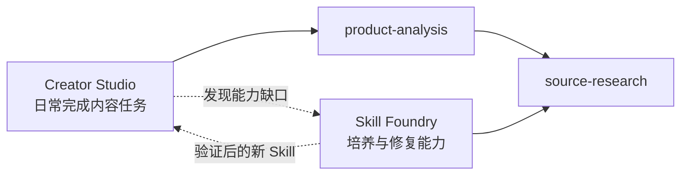

<p align="center">
  
</p>

<h1 align="center">ASL Harness</h1>

<p align="center">
  <strong>把个人 Skill 库，变成真正能进入工作状态的 AI 工作环境。</strong>
</p>

<p align="center">
  Modes, not workflows. One skill library, many ways to work.
</p>

<p align="center">
  <a href="https://github.com/qihangzhang-272/asl-harness/stargazers"></a>
  <a href="https://github.com/qihangzhang-272/asl-harness/actions/workflows/test.yml"></a>
  <a href="LICENSE"></a>
  
</p>

<p align="center">
  <a href="#我为什么做这个">为什么做</a> ·
  <a href="#为什么是-mode">为什么是 Mode</a> ·
  <a href="#mode-之间是什么关系">Mode 的关系</a> ·
  <a href="#怎么接入你自己的工作环境">开始使用</a>
</p>

---

## 我为什么做这个

我最开始维护 Agent Skill Library 时，想法很简单：在 GitHub 上找到好用的 Skill，拉到本地，改成适合自己的版本，然后继续积累。

这件事一开始很爽。写作、投研、产品分析、排版、搜索……能力越装越多，Agent 看起来也越来越强。

但很快我发现，**Skill 多，不等于工作状态好。**

写公众号时，Agent 还背着估值和尽调规则；做产品分析时，又带着排版和配图要求。每个任务都能做，但上下文越来越重，Agent 开始把注意力花在理解工具、遵守流程和维护各种 YAML 上。

我也试过 Workflow。把研究、写作、排版拆成一条固定链，看起来稳定，实际任务稍微变化，就要加条件、补分支、重新解释节点之间的关系。最后维护 Workflow 本身，反而成了新的工作。

我真正想要的不是第二个 Agent，也不是更复杂的调度器。

我想要的是：

> 当我要写作时，AI 进入我的写作工作台；当我要投研时，它进入投研工作台。它知道这里有哪些能力，但仍然能根据眼前的目标自己判断怎么做。

这就是 ASL Harness 想解决的问题。

## 使用前后，有什么变化？

| 以前 | 使用 ASL Harness 之后 |
|---|---|
| 所有 Skill 堆在同一个全局目录 | 每种工作只看见当前 Mode 的能力 |
| 换一个 Agent，要重新安装和解释 | 一份本地真源投影到三个 Host |
| Workflow 规定任务必须怎么走 | Host 根据 Goal 动态选择 Skill |
| 新能力直接塞进正式工作区 | 先试用和验证，再进入 Mode |
| Skill 越多，上下文越重 | Mode 只携带少量能力根和必要依赖 |

如果把 Skill Library 比作仓库，Mode 就是已经收拾好的工作台。

仓库里可以有很多东西，但坐到写作桌前，不应该同时摆着估值表、测试框架和十几把暂时用不到的工具。

## 为什么是 Mode

因为一个人的工作不是一条固定流程，而是几种反复进入的状态。

写作 Mode 里，我会研究材料、形成判断、写稿、配图和排版，但每篇文章的顺序不完全一样。投研 Mode 也有自己的事实核验、产品判断和估值能力，但不同公司会走出不同的研究路径。

所以 Mode 不保存步骤，只保存三件事：

1. **这是一个什么工作场；**
2. **这里可以使用哪些完整 Skill；**
3. **这个 Mode 能不能修改长期能力库。**

一个最小 Mode 只有这些内容：

```yaml
metadata:
  id: creator-studio
spec:
  skills:
    - product-analysis
  permissions:
    mutateEnvironment: false
```

`skills` 不是执行顺序。它只是告诉 Host：进入这个 Mode 后，你拥有这些能力。

真正执行任务的仍然是 Codex、Claude Code 或 DeepSeek Harness。ASL Harness 不接管它们的思考，也不在背后再跑一套 Agent loop。

## Mode 之间是什么关系

Mode 不是彼此隔离的文件夹，也不复制 Skill。它们是同一张个人能力图上的不同视角。



这里有三个我很喜欢的设计。

### 1. Mode 可以共享同一个 Skill

`source-research` 可以同时服务写作、产品分析和投研。它只在本地维护一份，不需要为每个 Mode 复制一遍。

Mode 之间的联系，不靠继承关系或复杂配置表达，而是自然地体现在它们共享了哪些能力。

### 2. Mode 只选择能力根

示例里的 `creator-studio` 只写了 `product-analysis`，但产品分析本身依赖资料研究，所以 Harness 会自动把 `source-research` 一起带进来。

这意味着 Mode 不会随着 Skill 变多而变成一张越来越长的清单。你只需要说清楚自己真正想用的能力，必要依赖由 Skill 自己说明。

### 3. 工作 Mode 和 Skill Foundry 会形成循环

普通 Mode 负责完成真实任务。任务中发现缺能力、能力不好用，或者用户给出明确反馈时，再进入 `skill-foundry`。

新能力先被本地化、试用和验证，通过后才加入一个或多个 Mode。于是每一次真实工作，都可能让下一次的工作环境更好一点。

这不是 Agent 在运行中随意改自己，而是一个人和 AI 共同维护、Git 可以追溯的能力进化过程。

## 怎么接入你自己的工作环境

ASL Harness 不要求你把个人 Skill 上传到这个公开仓库。你的 Skill、Mode 和 Profile 应该继续留在自己的私有目录或 Git 仓库里。

### 第一步：安装 Harness

```bash
git clone https://github.com/qihangzhang-272/asl-harness.git
cd asl-harness
python -m pip install -e .
```

### 第二步：准备自己的 Environment

你可以复制 [`examples/personal-environment`](examples/personal-environment)，也可以把已有 Skill 库整理成下面这个最小结构：

```text
my-environment/
├── WORKSPACE.md
├── PROFILE.md
├── skills/
│   ├── source-research/SKILL.md
│   └── product-analysis/SKILL.md
└── modes/
    └── creator-studio/
        ├── MODE.md
        └── mode.yaml
```

先检查它是否完整：

```bash
asl-harness workspace.validate --workspace /path/to/my-environment
```

### 第三步：选择 Mode，接入当前项目

```bash
asl-harness host.project \
  --workspace /path/to/my-environment \
  --project /path/to/current-project \
  --mode creator-studio \
  --host-id codex-app
```

`--host-id` 可以换成：

| Host | 值 |
|---|---|
| Codex App | `codex-app` |
| Claude Code | `claude-code` |
| DeepSeek Harness | `deepseek-harness` |

投影完成后，直接在当前 Host 里描述目标即可。你不需要手动逐个调用 Skill，也不需要先写一条 Workflow。

```text
“分析这个 AI 产品，形成自己的判断，并整理成一篇公众号文章。”
```

Host 会看到当前 Mode、你的精简 Profile 和可用 Skill，再决定这次任务怎么完成。

## Harness 到底负责什么

它只做四件事：

- 检查你的 Skill 和 Mode 是否完整；
- 计算当前 Mode 真正需要的 Skill；
- 投影到 Codex、Claude Code 或 DeepSeek Harness；
- 当本地真源变化时，提醒投影已经过期。

它不执行业务任务，不保存对话，不建立状态树，也不替 Host 做意图判断。

<details>
<summary><strong>查看完整命令和 DeepSeek Agent Preset</strong></summary>

| 命令 | 作用 |
|---|---|
| `workspace.validate` | 检查 Environment、Skill 和 Mode |
| `workspace.view.sync` | 刷新人机共读的能力地图 |
| `host.project` | 把一个 Mode 接入当前项目 |
| `host.verify` | 检查投影是否完整或过期 |
| `deepseek.preset.export` | 导出 DeepSeek Agent Preset |

DeepSeek Harness 可以把一个 Mode 导出成长期可选择的 Agent Preset：

```bash
asl-harness deepseek.preset.export \
  --workspace /path/to/my-environment \
  --mode creator-studio \
  --base-preset /path/to/known-good-preset \
  --output /path/to/deepseek/user-presets/creator-studio
```

Harness 保留已知可运行 Preset 的工具和插件，只替换 Persona 与当前 Mode 的 Skill 集合。

</details>

## 当前状态

ASL Harness 目前是 **v0.3 Developer Preview**。

已经可以运行：Mode、Skill 依赖、三宿主项目投影、能力地图、漂移检查和 DeepSeek Preset 结构级导出。仓库有 17 项自动化测试，并在 Windows 与 Linux 上持续验证。

还没有完成大型个人能力库的长期使用验证，DeepSeek Preset 也仍缺真实会话的持续验收。它现在更适合愿意一起试验“个人 AI 工作环境”的开发者，而不是希望下载后立刻得到一个全能 Agent 的用户。

如果你也在维护自己的 Skill 库，或者已经被越来越长的 Workflow 折磨过，欢迎试试这个方向。觉得有价值，也欢迎点一个 Star。

## 开源边界

这个仓库只包含 Harness 源码、通用示例和宿主适配器。它不包含我的个人 Skill、Mode、Case、Profile、运行产物或凭据。

## License

[MIT](LICENSE)
