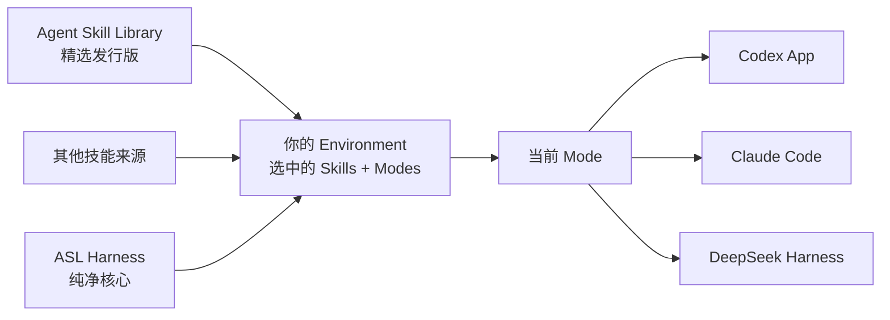
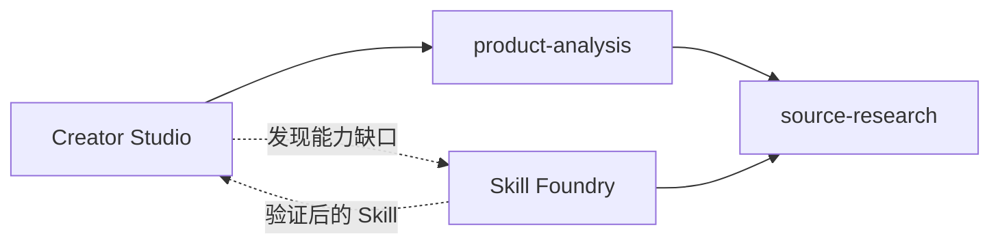

<p align="center">
  
</p>

<h1 align="center">ASL Harness</h1>

<p align="center">
  <strong>面向个人 Agent Skill 的 Mode 工作环境层。</strong>
</p>

<p align="center">
  一份 Skill 库，多种工作状态。运行在 Codex、Claude Code 与 DeepSeek Harness。
</p>

<p align="center">
  <a href="https://github.com/qihangzhang-272/asl-harness/stargazers"></a>
  <a href="https://github.com/qihangzhang-272/asl-harness/actions/workflows/test.yml"></a>
  <a href="LICENSE"></a>
  
</p>

<p align="center">
  <a href="#关于-asl">关于 ASL</a> ·
  <a href="#选择发行版">发行版</a> ·
  <a href="#推荐实践">推荐实践</a> ·
  <a href="#mode">Mode</a> ·
  <a href="#宿主接入">宿主接入</a>
</p>

---

> [!NOTE]
> 这是不包含个人技能和项目内容的 Harness 核心。需要开箱即用的精选技能，请使用 [Agent Skill Library](https://github.com/qihangzhang-272/agent-skill-library)。

## 关于 ASL

Agent Skill 库通常只会朝一个方向增长：更多 Prompt、更多工具、更多集成，以及每次任务都要加载的更多上下文。固定 Workflow 虽然容易重复，却也过早规定了任务必须怎么完成。

ASL Harness 把能力库和运行环境分开。**Mode** 描述一类工作的能力范围，当前 Host 继续理解目标、选择 Skill，并决定任务如何完成。

```text
个人 Skill 库 → Mode → Codex / Claude Code / DeepSeek Harness
```

Harness 负责校验本地真源、补齐 Skill 依赖、生成宿主原生投影并检查漂移。它不是另一个 Agent，也不会在背后运行第二套调度逻辑。

## 选择发行版

ASL 维护两个独立仓库。这样既能保留轻量、通用的原初架构，也不要求每个使用者从零培养全部 Skill。

| 仓库 | 定位 | 是否包含技能 | 适合谁 |
|---|---|---:|---|
| [ASL Harness](https://github.com/qihangzhang-272/asl-harness) | Mode 模型、校验、宿主投影与 DeepSeek Preset 导出 | 不包含个人 Skill，只带通用示例 | 想从原初架构搭建私有工作环境的人 |
| [Agent Skill Library](https://github.com/qihangzhang-272/agent-skill-library) | 写作、投资、资本市场、产品分析、编排与技能发现的精选发行版 | 包含已筛选和维护的 Skill | 想直接安装一套可用能力，再按自己需要修改的人 |

ASL Harness 是稳定核心，Agent Skill Library 是带有明确取舍的能力发行版。

发行版会随着真实使用不断替换和改进 Skill；核心只在 Mode 模型、校验规则或宿主集成发生变化时更新。两者分开维护，个人能力的变化不会把 Harness 重新变成一个庞大的技能仓库。

## 推荐实践

需要马上给 Codex 或 Claude Code 增加可用能力时，直接安装 Agent Skill Library。需要把能力改成自己的职业方法、团队规范或长期偏好时，Fork 它并在自己的仓库里维护。

当 Skill 已经多到需要区分不同工作状态时，再接入 ASL Harness。Harness 保持原样，选中的 Skill、Profile 和 Mode 留在独立的私有 Environment 中；当前项目只接收正在使用的 Mode。



这套结构允许上游持续更新。新 Skill 先在发行版中审查和验证，再按需要进入某个 Environment，并被一个或多个 Mode 使用。Harness 不需要被复制，个人仓库也不会因为接入新能力而失去边界。

Agent Skill Library 目前已经提供 Codex 与 Claude Code 的原生插件安装。完整技能库还没有作为现成 Mode 包随 Harness 发布；本仓库中的 [`personal-environment`](examples/personal-environment) 保持小而通用，只用于说明结构和验证运行方式。

## 快速开始

安装纯净核心并验证示例 Environment：

```bash
git clone https://github.com/qihangzhang-272/asl-harness.git
cd asl-harness
python -m pip install -e .
asl-harness workspace.validate --workspace ./examples/personal-environment
```

把示例中的 `creator-studio` Mode 接入一个 Codex 项目：

```bash
asl-harness host.project \
  --workspace ./examples/personal-environment \
  --project /path/to/current-project \
  --mode creator-studio \
  --host-id codex-app
```

精选技能的安装方式见 [Agent Skill Library：双端安装与验证](https://github.com/qihangzhang-272/agent-skill-library#双端安装与验证)。它现在可以独立安装；当全局技能库变得过宽时，再把需要的 Skill 组织进 Mode Environment。

## Mode

Mode 是 Skill 图上的具名视图。它说明当前是什么工作环境、这里有哪些根 Skill，以及这个环境是否有权修改长期能力库。

```yaml
metadata:
  id: creator-studio
spec:
  skills:
    - product-analysis
  permissions:
    mutateEnvironment: false
```

Skill 列表不是执行顺序。示例中的 `product-analysis` 依赖 `source-research`，Harness 会把两者一起带入当前环境；Host 仍然可以根据眼前的目标决定如何使用它们。

Mode 不互相继承，也不互相调用。它们通过共享 Skill 形成联系。



`Creator Studio` 与 `Skill Foundry` 共用同一份研究能力，不需要维护副本。生产 Mode 交付真实任务；Foundry Mode 可以获得修改 Environment 的权限。验证通过的新 Skill 可以进入任何需要它的 Mode。

固定 Workflow 把可复用对象定义成一条执行链。ASL 把完整 Skill 作为能力单位，把 Mode 作为可复用的工作环境，具体任务计划仍由 Host 根据目标生成。

## 宿主接入

| Host | Skill 投影 | Mode 入口 |
|---|---|---|
| Codex App | `.agents/skills/` | `AGENTS.md` |
| Claude Code | `.claude/skills/` | `CLAUDE.md` |
| DeepSeek Harness | `.dsh/skills/` | `AGENTS.md` 或 Agent Preset |

Harness 只处理能够确认属于自身的投影，不覆盖用户已有文件，也不把宿主生成目录当成第二份真源。

DeepSeek Harness 还可以把 Mode 导出为 Agent Preset。ASL 从一份已知可运行的 Preset 出发，只替换 Persona 与 Skill 范围，原有工具和插件保持不变。

<details>
<summary><strong>CLI 参考</strong></summary>

| 命令 | 用途 |
|---|---|
| `workspace.validate` | 校验 Environment、Skill 与 Mode |
| `workspace.view.sync` | 刷新人和 Agent 共读的能力地图 |
| `host.project` | 把 Mode 接入当前项目 |
| `host.verify` | 检查投影完整性与漂移 |
| `deepseek.preset.export` | 从已知可运行的基础导出 DeepSeek Agent Preset |

</details>

## 开发者预览

ASL Harness 当前是可运行的早期核心。Mode 校验、Skill 依赖解析、能力地图、宿主投影、漂移检查和 DeepSeek Preset 结构级导出已经实现，并在 Windows 与 Linux 上持续测试。

完整 Agent Skill Library 还没有发布为开箱即用的 Mode 发行包，DeepSeek Preset 也仍需要更长时间的真实会话验证。在这些集成完成前，接口可能发生不兼容变化。

## 开发

```bash
python -m pip install -e ".[test]"
python -m pytest
```

架构文档位于 [`docs/plans`](docs/plans)，宿主适配器位于 [`plugins/asl-environment-host`](plugins/asl-environment-host)。

## License

[MIT](LICENSE)
