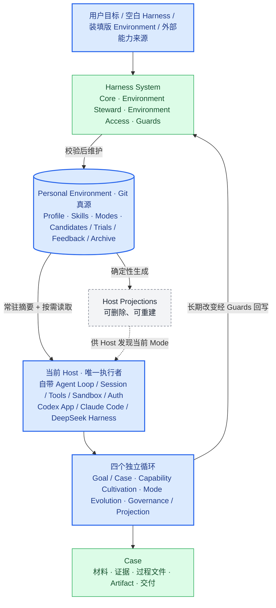

<p align="center">
  
</p>

<h1 align="center">ASL Harness</h1>

<p align="center">
  <strong>把一套不断增长的 Agent Skill，变成可以切换、可以维护、不会越用越乱的工作环境。</strong>
</p>

<p align="center">
  <a href="https://github.com/qihangzhang-272/asl-harness/stargazers"></a>
  <a href="https://github.com/qihangzhang-272/asl-harness/actions/workflows/test.yml"></a>
  <a href="LICENSE"></a>
  
</p>

> [!NOTE]
> 这是不包含个人 Skill 和项目材料的空白 Harness。需要已经装填、培养过的工作环境，请使用 [Agent Skill Library](https://github.com/qihangzhang-272/agent-skill-library)。

## 为什么是 Mode

Skill 库通常只会朝一个方向增长。写作、研究、开发、投资、视觉和自动化能力全都堆在一起，Agent 每次工作都要从整个仓库里猜“这次到底该用什么”。

固定 Workflow 能减少猜测，却把解决方式锁成了一条链。任务稍有变化，就要增加分支、状态和新的配置。

ASL Harness 选择 Mode：

- Skill 仍是一项完整能力；
- Mode 只选择当前工作状态需要看见的能力；
- 当前 Host 根据目标和材料动态工作；
- Harness 负责校验、投影和保护 Environment，不替 Host 执行业务。

```text
过去：全部 Skill → 巨型提示词或固定 Workflow → 任务
现在：Personal Environment → 当前 Mode → Host 动态组合 Skill → Case
```

## 空白框架与业务发行版

| 项目 | ASL Harness | Agent Skill Library |
| --- | --- | --- |
| 定位 | 原初架构 | 已培养的业务环境 |
| 包含内容 | 核心、示例和宿主适配 | 正式 Skill、业务 Mode 和来源记录 |
| 适合 | 从零维护自己的能力库 | 先拿一套经过使用的能力，再按自己需要修改 |
| 更新原因 | 领域模型、校验或宿主接入变化 | 真实 Case 促使 Skill 或 Mode 演化 |

两者不是两套协议。Agent Skill Library 是一份装入内容的 ASL Environment；ASL Harness 是维护这类 Environment 的空白框架。

## 总体架构

ASL 不是一条从头跑到尾的 Workflow，而是由本地真源、系统维护能力、当前 Host、四个信号循环和可重建宿主投影共同组成的工作环境。



完整的复杂总图，以及系统上下文图、组件图、两张时序图、生命周期状态图、Mode 能力图、演化决策图、三宿主部署图和当前迁移图，统一维护在 [ASL Architecture Views](docs/asl-architecture-views.md)。

颜色直接表达项目判断：

- **蓝色**：用户已经明确确认、后续实现不得走回头路的架构边界；
- **绿色**：当前代码或真实 Environment 已经实现并验证；
- **橙色**：架构不缺模块，但仍有内容迁移、真实运行验收或已确认清理；
- **红色**：当前错误分类或旧结构，迁移后删除，不建立兼容层；
- **灰色**：宿主投影或冻结归档，允许删除重建或只读追溯；
- **紫色**：外部来源，不是本地运行真源。

完整架构图同时包含发行关系、Harness 系统层、Environment 真源、四个运行循环、外部能力进入路径、演化影响半径、Case 和三宿主投影。图上的编号是阅读分区，不是执行顺序。

### 四个循环怎样协作

| 循环 | 进入条件 | 读取 | 保存 | 退出或转交 |
| --- | --- | --- | --- | --- |
| A · Goal / Case | 用户给出目标，或者当前 Case 需要返工 | 对话、材料、Profile、当前 Mode、正式 Skill | Case 证据、过程材料和最终 Artifact | 达标则交付；确认能力缺口转 B；确认工作场边界问题转 C；投影问题转 D |
| B · Capability Integration | 用户明确要求引入外部能力，或 Host 确认存在本地能力缺口、失效和重要上游变化 | 正式 Skill、可选 Candidate/Trial、Archive 和外部来源 | 直接本地化的正式 Skill，或用于解决不确定性的 Candidate/Trial | 用户明确指定时直接纳入；其他来源按不确定性决定是否隔离；需要进入长期工作场时转 C |
| C · Mode Evolution | 一类工作长期重复出现，或现有 Mode 的能力面、上下文、授权边界和产物表面已经不合适 | Profile、正式 Skill、真实 Case 和明确反馈 | `MODE.md` 与最小 `mode.yaml` | Mode 定义稳定后转 D；缺少能力转 B；普通执行问题回 A |
| D · Governance / Projection | Profile、Skill 或 Mode 变化；切换 Host；能力地图或投影发生漂移 | Environment 真源、依赖图和宿主 Adapter | `WORKSPACE.md` 与可重建宿主投影 | 校验通过后回 A；不评价业务内容 |

四个循环没有统一时钟，也不存在中央调度器。普通任务默认只进入 A；只有真实信号出现，当前 Host 才进入 B、C 或 D。

## 快速开始

```bash
git clone https://github.com/qihangzhang-272/asl-harness.git
cd asl-harness
python -m pip install -e ".[test]"

asl-harness workspace.validate \
  --workspace ./examples/personal-environment
```

把一个 Mode 接入 Codex 项目：

```bash
asl-harness host.project \
  --workspace ./examples/personal-environment \
  --project /path/to/current-project \
  --mode creator-studio \
  --host-id codex-app
```

同一个 Environment 也可以投影到 Claude Code 或导出为 DeepSeek Harness Agent Preset。投影只是宿主视图，可以删除和重建；Environment 才是真源。

## 一个 Mode 长什么样

```yaml
apiVersion: asl-wep/v0.3.0
kind: ModeProjection
metadata:
  id: creator-studio
spec:
  skills:
    - product-analysis
```

这里只保存 Skill 根，不保存执行顺序、用户编号、手写 revision 或环境修改权限。Harness 会补齐正式 Skill 的依赖闭包；当前 Host 决定如何完成当前任务。

Mode 不互相调用，也不通过隐式继承获得能力。多个 Mode 需要同一项能力时，分别显式选择同一个 Skill。

## Harness 应该硬在哪里

Harness 只对可以确定的错误做硬阻断：

- Environment、Skill 或 Mode 结构不合法；
- Skill 依赖缺失或循环；
- Mode 引用不存在的正式 Skill；
- Candidate、Trial、正式 Skill 与 Case 边界混用；
- 删除仍被 Skill、Mode 或活动投影引用的能力；
- 路径或链接逃出 Environment；
- 投影覆盖无法证明属于 ASL 的用户文件；
- 密钥、缓存、Git 元数据或可重建依赖进入投影；
- 固定 Workflow、Run 状态树或第二调度器回流到活动 Environment。

下面这些只提醒，不阻断任务：

- `WORKSPACE.md` 视图过期；
- 宿主投影需要刷新；
- 上游能力有新版本；
- Candidate 尚未决定是否采用；
- 两个 Skill 可能重合。

是否需要新 Mode、外部能力值不值得吸收、两个 Skill 是否应该合并，仍由当前 Host 和用户判断。Harness 不把语义判断伪装成一组僵硬规则。

## Mode 与 Skill 如何变化

文件和 Git 就是真源，不需要额外数据库。

用户明确说“寻找这个外部能力并融入”时，当前 Host 直接完整读取来源，判断是采用、吸收、合并、依赖、变体、Adapter、Clean-room 重构还是拒绝，然后写成完整正式 Skill；不强制建立 Candidate、Trial、示例或效果 Case。来源或采用方向仍不确定时，才使用 Candidate；安全、重合、运行方式或价值需要隔离判断时，才使用 Trial。

复制或改编上游文字、代码、脚本、模板或独特资产时，必须保留来源、许可和第三方声明。只借鉴“这个需求值得解决”或个人仓库的组织思路时，不复制它的实现，而是从本地需求、官方接口和许可清楚的公共基础能力独立重构。

无论走哪条路径，外部能力都不能在任务中裸调用：正式使用前必须成为本地完整 Skill，并保留必要来源记录。删除 Skill 前检查依赖、Mode 和活动投影。新建 Mode 只用于会反复出现、确实需要独立能力边界的广域工作状态，不用于包装一次任务。

普通 Case 的材料和产物不会自动改写 Environment。只有用户明确反馈、明确采用或明确授权，才会进入维护流程。

## 宿主接入

| Host | Skill 投影 | Mode 入口 | 当前状态 |
| --- | --- | --- | --- |
| Codex App | `.agents/skills/` | `AGENTS.md` | 投影机制已实现；当前生成快照需按最新 Environment 刷新 |
| Claude Code | `.claude/skills/` | `CLAUDE.md` | 投影机制已实现；当前生成快照需按最新 Environment 刷新 |
| DeepSeek Harness | `.dsh/skills/` | `AGENTS.md` 或 Agent Preset | 项目投影和 4 个 Mode Preset 的生成/验证机制已实现；当前快照待刷新，真实长会话待验收 |

<details>
<summary><strong>CLI 参考</strong></summary>

| 命令 | 当前职责 |
| --- | --- |
| `workspace.validate` | 校验 Environment、正式 Skill、依赖图和 Mode |
| `workspace.view.sync` | 刷新人和 Agent 共读的能力地图 |
| `host.project` | 把一个 Mode 投影到当前项目 |
| `host.verify` | 检查宿主投影完整性和来源漂移 |
| `deepseek.preset.export` | 从已知可运行基础导出 Mode Preset |
| `deepseek.preset.verify` | 检查 Agent Preset 完整性、Skill 闭包和来源漂移 |

</details>

## 当前状态

ASL Harness 目前是可运行的开发者预览：六个确定性命令和 25 项自动化测试已经存在。最小 Mode schema、Skill 依赖闭包、Candidate/Trial 边界、Secret 文件名、缓存提醒、能力视图、Codex App / Claude Code / DeepSeek 项目投影，以及 DeepSeek Preset 导出与漂移验证已经实现。投影刷新也会清理 Manifest 中登记但源 Skill 已经归档的断链 Junction，同时继续拒绝删除用户自有目录。

就 v0.3 的架构范围而言，系统边界、真源、Mode/Skill 关系、四个循环、外部能力进入路径、维护入口、确定性门禁和三宿主投影已经闭环。Agent Skill Library 也已经迁移为同一 Contract 下的 Mode-native Environment。

当前状态颜色和验证证据统一维护在 [ASL Architecture Views](docs/asl-architecture-views.md#view-9--当前状态与迁移图)。已完成的实施计划已经移到 `docs/archive/implementation-plans/`，不再占用活跃架构入口。

当前有三类橙色状态：两份 Environment 的 `WORKSPACE.md` 视图与可重建缓存待维护；12 份项目投影和 4 个 Preset 能够通过结构验证，但现存快照落后于最新 Environment；DeepSeek Harness 真实长会话验收后置。它们都不改变已经成立的 Mode-only 架构。

下一阶段只计划增加一个深接口：在两份合法的本地 Environment 之间显式同步一个完整 Skill，并可选绑定一个目标 Mode。`environment.sync` 当前尚未实现；它不会变成后台订阅、共享 Skill 目录、自动覆盖、自动提交或第二调度器。

Environment Steward 与 Access 已由同一个宿主管理 Skill、现有 CLI、投影规则和 Git diff 组成，不再计划增加 CRUD 服务、授权状态机或第二个索引。Case、反馈、Archive 和 Git 是按需读取面，不建立新的“统一访问数据库”。

## 开发

```bash
python -m pip install -e ".[test]"
python -m pytest
```

## License

[MIT](LICENSE)
