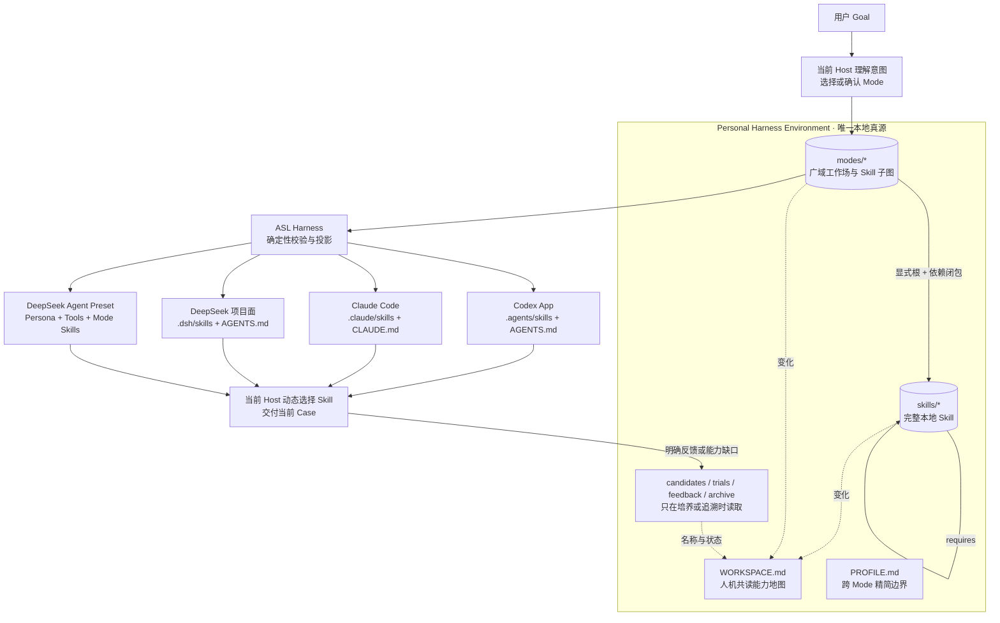

# ASL Harness

ASL Harness 把一个人的本地 Skill 库组织成多个可切换的工作环境，并投影到 Codex App、Claude Code 与 DeepSeek Harness。

它不执行固定 Workflow，也不是第二个 Agent。用户给出 Goal 后，当前 Host 在选定 Mode 的能力面内动态组合完整 Skill；Harness 只负责五件事：校验本地真源、维护能力地图、计算 Skill 依赖闭包、生成宿主原生投影、检查投影漂移。

当前版本是 **v0.3 可运行核心**：Mode-only 领域模型、三宿主项目投影、DeepSeek Agent Preset 导出和 17 项自动化测试已经实现。它尚未经过大型个人能力库和真实 DeepSeek 会话的长期验收，因此不能称为成熟成品。

## 开源边界

本仓库只包含 Harness 运行代码、通用示例、测试和宿主适配器。它刻意不包含任何人的 `PROFILE.md`、正式 Skill、Mode、Candidate、Trial、Feedback、Case、Artifact、运行记录、凭据或 `.env`。使用者应在自己的私有 Environment 中培养能力；Harness 只读取、校验和投影这些内容。

## 总体架构



这张图没有隐藏的顺序执行链。Mode 是覆盖一组能力节点的具名子图；Skill 之间只有“使用该能力前还必须能发现哪个完整 Skill”的依赖关系。具体任务先研究还是先写提纲，由当前 Host、Goal 和 Skill 内容共同决定。

## 唯一真源长什么样

```text
personal-environment/
├── WORKSPACE.md                 # 人与 Agent 共读的当前地图
├── PROFILE.md                   # 跨 Mode 的精简身份、偏好与治理边界
├── skills/
│   └── <skill-id>/
│       ├── SKILL.md             # 必需；完整能力与完成标准
│       ├── SOURCE.md            # 外部来源本地化时建议保留
│       ├── references/          # 可选
│       ├── scripts/             # 可选
│       └── assets/              # 可选
├── modes/
│   └── <mode-id>/
│       ├── MODE.md              # 工作场目标、边界和使用语义
│       └── mode.yaml            # 只保存 Skill 根与环境修改权
├── candidates/                  # 找到但尚未可信的外部能力
├── trials/                      # 已本地化、等待真实 Case 验证
├── feedback/                    # 只记录用户明确反馈
└── archive/                     # 退出活动面的历史材料
```

没有 `workspace.yaml`、`workflow.yaml`、Run、手写 revision、用户 plane、事件流或状态树。目录本身绑定当前用户，Git 保存历史。

最小 `mode.yaml`：

```yaml
apiVersion: asl-wep/v0.3.0-design
kind: ModeProjection
metadata:
  id: creator-studio
spec:
  skills:
    - product-analysis
    - visual-storytelling
  permissions:
    mutateEnvironment: false
```

`skills` 是能力根，不是执行顺序。Harness 会递归加入每个 Skill 在 frontmatter 中声明的 `metadata.asl.requires`，但不会顺便加载整个个人能力库。

## 安装与第一次验证

```powershell
cd "C:\path\to\asl-harness"
python -m pip install -e ".[test]"

asl-harness workspace.validate `
  --workspace .\examples\personal-environment
```

返回值会列出正式 Skill、Mode、每个 Mode 的依赖闭包，以及 `WORKSPACE.md` 的能力地图是否最新。

刷新能力地图：

```powershell
asl-harness workspace.view.sync `
  --workspace C:\path\to\personal-environment
```

它只替换 `WORKSPACE.md` 中一个带标记的受管理区域，用户自己写的说明不会被覆盖。视图过期只是一条维护信号，不阻断用户继续做当前工作。

## 接入 Codex App、Claude Code 或 DeepSeek 项目

Codex App 与 Claude Code 可以直接运行下面的 CLI，也可以加载仓库内的 [`plugins/asl-environment-host`](plugins/asl-environment-host) 薄插件。插件只提供同一份 `asl-environment` 管理 Skill，不携带业务能力、不复制 Environment。DeepSeek 使用后文的原生项目投影和 Agent Preset，不再套一层同质插件。

```powershell
asl-harness host.project `
  --workspace C:\path\to\personal-environment `
  --project C:\path\to\current-case `
  --mode creator-studio `
  --host-id codex-app
```

`--host-id` 可选：

| Host | Skill 原生目录 | Mode 规则入口 |
|---|---|---|
| `codex-app` | `.agents/skills/` | `AGENTS.md` |
| `claude-code` | `.claude/skills/` | `CLAUDE.md` |
| `deepseek-harness` | `.dsh/skills/` | `AGENTS.md` |

Harness 优先创建目录链接；Windows 无符号链接权限时使用 junction；仍不可用才创建带标记的受管理副本。项目中同一宿主一次只保持一个当前 Mode。切换 Mode 时只移除旧清单里能够证明属于 ASL 的投影，用户自有同名文件会导致明确失败，不会被覆盖。

检查投影：

```powershell
asl-harness host.verify `
  --workspace C:\path\to\personal-environment `
  --project C:\path\to\current-case `
  --mode creator-studio `
  --host-id codex-app
```

验证会检查目录、规则块、权限和派生来源指纹。即使 Git HEAD 没变，Skill、Profile 或 Mode 的本地内容变化也会提示重新投影。该指纹只是生成视图校验值，不是另一份 revision 真源。

## DeepSeek Harness：为什么多一个 Agent Preset

DeepSeek Harness 原生把两类东西分开：

- Profile / Bundle 决定整个部署有哪些宿主级插件和依赖；
- Agent Preset 决定一个会话得到哪些工具、提示词段和 Skills。

所以 ASL Environment 的宿主级依赖可以以后进入 Profile/Bundle，而 **ASL Mode 必须映射为 Agent Preset，不能映射成 Profile**。

DeepSeek 官方的 Preset 创作模型是“复制一个已知可运行的 Preset，再编辑整份目录”，没有 `standard + patch` 继承。ASL 遵守这个约束：

```powershell
asl-harness deepseek.preset.export `
  --workspace C:\path\to\personal-environment `
  --mode creator-studio `
  --base-preset C:\path\to\known-good-preset `
  --output "$env:USERPROFILE\.dsh\.agent-presets\creator-studio"
```

`--base-preset` 应指向你已经确认能启动的 DeepSeek Preset 整目录。导出器保留其工具、插件和资产，只替换两处：

1. `persona`：加入精简 Profile、Mode 边界和 ASL 不变量；
2. `skill-filesystem`：只扫描这个 Mode 的自包含 Skill 闭包。

输出直接放进 DeepSeek 的 user preset root 后，新会话便可选择它。运行中的会话不热切换 Preset，这是 DeepSeek 自己为工具历史一致性设置的边界。导出器不会覆盖未知目录，只能刷新带有相同 Environment 与 Mode 标记的旧投影。

导出只携带可追溯源码、说明、资产与依赖声明；`node_modules`、Git 元数据、Python 缓存、测试缓存和 `.env` 等本机生成内容不会进入 Preset。这样 Skill 仍是完整安装单元，但不同 Mode 不会重复打包几十 MB 的可重建依赖。

项目投影适合“在某个项目里马上使用一个 Mode”；Agent Preset 适合“把这个 Mode 变成 DeepSeek 里可长期选择的工作状态”。两者都来自同一份 Environment，不互相充当真源。

## 五个命令

| 命令 | 唯一职责 |
|---|---|
| `workspace.validate` | 校验 Environment、Skill 图和 Mode，并输出当前能力摘要 |
| `workspace.view.sync` | 刷新 `WORKSPACE.md` 的受管理能力地图 |
| `host.project` | 把一个 Mode 切换并投影到宿主项目 |
| `host.verify` | 检查宿主投影完整性和来源漂移 |
| `deepseek.preset.export` | 从已知可用 base 导出 Mode 专属 Agent Preset |

Harness 没有业务执行命令。当前 Host 看到 Mode、Profile 与 Skill catalog 后，直接完成用户目标。

## 外部能力如何进入

外部 Skill、GitHub 仓库、Prompt、MCP、API、Agent、模型或脚本不能在任务中途裸调用。需要使用时，先走同一条能力培养闭环，把它变成可检查的完整本地 Skill：

```text
当前 Environment 内没有合适能力
→ 搜索本地、已安装生态、官方文档与可追溯上游
→ Candidate（只保存来源，不可作为正式能力调用）
→ Trial（包装为完整本地 Skill，记录 SOURCE.md）
→ 用真实 Case 比较、合并或拒绝
→ 正式 skills/
→ 明确加入一个或多个 Mode
→ 重新投影
```

如果外部仓库的价值只是已有 Skill 的新方法，就吸收到已有 Skill；如果是独立能力，才保留新 Skill；如果价值来自多项能力的长期组合和边界，才修改 Mode。来源仓库不是本地运行真源。

## 强校验与不阻断原则

会直接拒绝：

- Mode 引用不存在的正式 Skill；
- Skill 依赖缺失或循环；
- `mutateEnvironment` 之外的权限字段；
- package 符号链接逃出当前 Environment；
- 旧 `workspace.yaml`、`workflows/` 或 `.asl/runs/` 回流；
- 投影试图覆盖用户文件；
- DeepSeek base 缺少唯一顶层 `persona` 或 `skill-filesystem`。

只提醒、不阻断：

- `WORKSPACE.md` 能力地图过期；
- 投影后 Environment 内容或 Git HEAD 改变。

这符合 ASL 的基本边界：运行用户 Goal 时优先继续工作；只有无法安全确定“这是不是我们的生成物”时才拒绝写入。

## 当前尚未完成

- 还没有把一个大型真实 Agent Skill Library 迁移成单一 Personal Harness Environment；
- DeepSeek Preset 已做结构级导出测试，但尚未在真实 DSH 进程里完成启动验收；
- 还没有 Hook 安装器自动绑定 Git pre-commit 或宿主生命周期；当前命令已经可以被这些 Hook 直接调用；
- Mode 自动创建/修改仍由当前 Host 在 `skill-foundry` Mode 中根据明确反馈判断，Harness 不自作主张。

这些是下一阶段真实验收项，不需要为它们提前增加服务、数据库或第二套协议。

## 开发验证

```powershell
python -m pytest
python -m asl_harness.commands workspace.validate `
  --workspace .\examples\personal-environment
```

实现方案与分步计划见：

- [三宿主 Mode 投影设计](docs/plans/2026-08-30-three-host-mode-projection-design.md)
- [三宿主 Mode 投影实施计划](docs/plans/2026-08-30-three-host-mode-projection-plan.md)

本仓库以 README、通用示例和测试共同说明当前可运行约束；个人 Environment 始终留在使用者自己的仓库中。

## License

[MIT](LICENSE)
