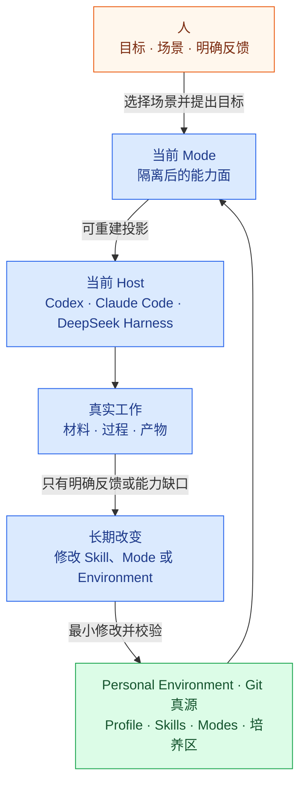

<p align="right">
  <strong>简体中文</strong> · <a href="README_EN.md">English</a>
</p>

<p align="center">
  
</p>

<h1 align="center">ASL Harness</h1>

<p align="center">
  <strong>给越来越多的 Agent Skills，一个真正属于人的工作环境。</strong>
</p>

<p align="center">
  管理你的技能，按工作场景隔离它们，并把同一套个人能力带进 Codex、Claude Code 与 DeepSeek Harness。
</p>

<p align="center">
  <a href="https://github.com/qihangzhang-272/asl-harness/stargazers"></a>
  <a href="https://github.com/qihangzhang-272/asl-harness/actions/workflows/test.yml"></a>
  <a href="LICENSE"></a>
  
</p>

<p align="center">
  <a href="#问题不在于没有-skill">为什么需要它</a> ·
  <a href="#mode把场景放在-skill-之前">Mode</a> ·
  <a href="#quick-start">Quick Start</a> ·
  <a href="#host-support">Host Support</a> ·
  <a href="docs/asl-architecture-views.md">Architecture</a> ·
  <a href="https://github.com/qihangzhang-272/agent-skill-library">Starter Environment</a>
</p>

---

Agent Skills 正在变成 AI 的通用能力格式。一个 Skill 可以带着说明、脚本、参考资料和模板，在需要时进入模型上下文。

但当一个人开始长期使用 AI，新的问题很快会出现：Skill 从几项变成几十项、几百项；它们来自不同仓库，服务不同工作，彼此还有重合。格式解决了“能力怎样封装”，却没有回答“一个人怎样管理这些能力，以及 AI 在当前场景里究竟应该看见哪些能力”。

ASL Harness 为这个缺口而生。它在 Agent Skills 和具体 Agent 之间建立一层本地、可读、可维护的个人工作环境：

- 所有长期能力进入同一份 Git 管理的 Environment；
- Mode 把技能组织成可反复进入的工作场景；
- 每次只向宿主投影当前 Mode 的能力面；
- Codex、Claude Code 或 DeepSeek Harness 继续使用自己的模型、工具和 Agent Loop 完成任务；
- 用户和 AI 在真实工作中共同修改 Skill 与 Mode，让环境逐渐长成自己的样子。

## 问题不在于没有 Skill

今天发现 Skill 很容易：GitHub、技能市场、KOL 推荐、团队仓库和 AI 自己生成的内容，都可以成为来源。真正缺少的是收藏之后的管理机制。

### 技能有地方安装，却没有地方长期管理

同一个 Skill 可能被复制进多个 Agent 目录，也可能随着某个项目一起消失。来源、版本、本地修改、依赖和替代关系散落在不同位置。技能越多，越难回答下面这些问题：

- 这项能力从哪里来，当前使用的是哪个版本？
- 两个名字不同的 Skill 是否解决同一个问题？
- 哪些内容已经被本地修改，哪些仍然跟随上游？
- 删除一项能力会影响哪些工作场景？
- 换到另一个 Agent 后，怎样继续使用同一套能力？

### 场景与技能之间缺少稳定映射

人不会在每次工作前从全部工具里重新选择一遍。写作、研究、开发、运营和投资，本来就是不同的工作状态；每种状态有自己的材料、语言、工具和质量标准。

普通 Skill 目录通常把所有能力平铺在一起。即使宿主使用渐进式加载，它仍然需要先从越来越长的名称和描述中判断什么与当前任务相关。技能池越大，主动召回越容易被相似描述、跨场景能力和偶然关键词干扰。

### 全部加载和固定 Workflow 都不是答案

把全部 Skill 都放进当前上下文，会带来噪音和注意力竞争。把它们写成固定 Workflow，又会把复杂工作锁进一条顺序链：任务稍微变化，就要继续添加分支、状态和配置。

ASL 选择保留 Agent 的智能，只收窄它工作的环境。

| 常见做法 | 它解决了什么 | 长期使用时的问题 |
| --- | --- | --- |
| 把 Skill 全部装进宿主 | 随时都能访问 | 召回面持续膨胀，跨场景内容互相干扰 |
| 每个项目复制一套 Skill | 项目内相对独立 | 重复、漂移，来源和修改难以同步 |
| 用固定 Workflow 编排 | 执行路径容易预测 | 复杂任务被流程绑死，分支不断增长 |
| 只依赖全局搜索或路由 | 安装简单 | 缺少人的长期场景边界和使用习惯 |

## Mode，把场景放在 Skill 之前

**Mode 是一种可反复进入的工作状态，也是当前 Agent 的能力可见面。**

人先进入场景，Agent 再选择工具。ASL 把这件自然的事情做成两级召回：

```mermaid
flowchart LR
    ALL["个人 Environment<br/>全部正式 Skill"]
    MODE["当前 Mode<br/>场景级能力边界"]
    PROJECT["Host Projection<br/>只包含该 Mode 的 Skill 闭包"]
    DISCOVERY["宿主原生 Skill Discovery<br/>名称与描述的渐进式召回"]
    TASK["当前任务<br/>按需读取完整 Skill"]

    ALL -->|选择显式 Skill 根| MODE
    MODE -->|解析依赖并生成| PROJECT
    PROJECT --> DISCOVERY
    DISCOVERY --> TASK

    classDef truth fill:#dcfce7,stroke:#16a34a,color:#14532d;
    classDef mode fill:#dbeafe,stroke:#2563eb,color:#1e3a8a,stroke-width:2px;
    classDef host fill:#f3f4f6,stroke:#6b7280,color:#1f2937;
    class ALL truth;
    class MODE mode;
    class PROJECT,DISCOVERY,TASK host;
```



第一层由 Mode 回答“这是什么工作场景”；第二层由宿主回答“这个任务需要哪个具体 Skill”。AI 不必在资本市场任务里评估公众号排版能力，也不必在内容创作时浏览数据库迁移规范。

### 这是一种可见性隔离

Mode 之间共享同一份 Skill 真源，但不会互相继承或互相调用。投影到目标项目时，Harness 只复制当前 Mode 选择的 Skill 及其必要依赖。切换 Mode 后，上一种场景的 ASL 受管 Skill 会退出当前宿主发现面。

这种隔离减少的是**召回噪音和上下文污染**，不是操作系统级安全沙箱。真正的文件权限、网络权限、MCP 授权和执行沙箱仍由宿主负责。

### Mode 不是 Domain，也不是 Workflow

- Domain 按知识分类，Mode 按人的工作状态组织能力；
- Workflow 规定任务怎样走，Mode 只决定当前有哪些能力可用；
- Mode 可以覆盖很宽的工作面，而不是包装一次任务；
- 多个 Mode 可以显式选择同一个 Skill，但不复制它；
- Mode 不保存顺序、状态树、条件分支或另一个调度器。

一个 Mode 的活动配置因此可以保持很短：

```yaml
apiVersion: asl-wep/v0.3.0
kind: ModeProjection
metadata:
  id: research-desk
spec:
  skills:
    - web-research
    - source-verification
    - report-writing
```

当前 Agent 可以先搜索再验证，也可以先阅读材料再决定是否搜索。Mode 不替它写死路径。

## 从工具集合到长期成长的工作环境

ASL 的目标不是提供更多 Skill，而是让 Skill、场景和人的长期反馈形成同一个可维护系统。



Environment 是普通文件夹，也是本地 Git 真源。人可以直接阅读和修改，Agent 也可以在授权下维护。普通任务不会自动改写长期环境；只有用户明确反馈、明确采用外部能力，或者真实 Case 暴露出稳定缺口时，才进入长期变化。

随着使用积累，Environment 会越来越像它的主人：保留常用判断，淘汰无效能力，把反复出现的工作组织成 Mode，而不是把每一次对话都永久写进系统。

## Quick Start

### 使用空白 Environment

```bash
git clone https://github.com/qihangzhang-272/asl-harness.git
cd asl-harness
python -m pip install -e ".[test]"

asl-harness state \
  --workspace ./examples/personal-environment

asl-harness workspace.validate \
  --workspace ./examples/personal-environment
```

把示例 Mode 接入一个 Codex 项目：

```bash
asl-harness host.project \
  --workspace ./examples/personal-environment \
  --project /path/to/current-project \
  --mode creator-studio \
  --host-id codex-app

asl-harness host.verify \
  --workspace ./examples/personal-environment \
  --project /path/to/current-project \
  --mode creator-studio \
  --host-id codex-app
```

完成后直接用 Codex 打开目标项目。Codex 看到的是当前 Mode、对应的 Skill 闭包和简短边界说明；ASL 不接管它的模型、工具、MCP 或权限。

### 使用已经培养好的 Environment

如果你希望先从一套真实使用过的工作环境开始：

```bash
git clone https://github.com/qihangzhang-272/agent-skill-library.git

asl-harness workspace.validate \
  --workspace ./agent-skill-library
```

[Agent Skill Library](https://github.com/qihangzhang-272/agent-skill-library) 是 ASL Harness 的装填版参考环境，包含内容创作、AI 产品分析和投资研究等 Mode。clone 后，本地检出就是你可以删改和继续培养的真源。

## What ASL Manages

### 一个可读的 Skill 真源

正式 Skill 只在 `skills/` 保存一份。每个 Skill 是完整能力包，可以包含：

```text
skills/<skill-id>/
├── SKILL.md              能力说明与运行依赖
├── SOURCE.md             来源、版本、许可和本地变化
├── scripts/              确定性执行脚本
├── references/           按需读取的专业资料
└── assets/               模板和资源
```

MCP、命令、环境变量名称或必要宿主插件由责任 Skill 按需声明；安装、登录和权限继续交给宿主原生机制。

### 场景与能力的显式关系

Mode 只保存 Skill 根。Harness 解析依赖闭包，检查不存在的引用与循环，并生成当前能力地图。删除或替换 Skill 前，可以看见它影响哪些 Mode。

### 外部能力的本地化入口

Skill 可以来自 GitHub、官方文档、技能市场、公开推荐或另一份 ASL Environment。进入长期环境前，当前 Host 必须完整读取来源并判断它与现有能力的关系：

- 直接采用为新的完整 Skill；
- 吸收进已有 Skill；
- 合并重合能力；
- 作为显式依赖或变体保留；
- 为宿主差异建立 Adapter；
- 仅借鉴需求，基于官方接口独立实现；
- 拒绝或归档。

用户明确要求引入时，不强制建立表演性的 Candidate、Trial 或效果 Case。只有来源、许可、安全、重合关系、运行方式或采用方向仍不确定时，才使用隔离的培养区。

先预览一次 Environment 间的同步：

```bash
asl-harness environment.sync \
  --source ./source-environment \
  --target ./personal-environment \
  --skill skill-id \
  --mode research-desk \
  --check
```

确认后去掉 `--check`。目标已有不同内容时默认拒绝覆盖，只有明确接受替换时才增加 `--replace`。

### 人和 Agent 共读的能力地图

`WORKSPACE.md` 从当前真源确定性生成，显示 Environment 里有哪些 Mode、Skill 和培养状态。它不是第二份手写 Skill Index；内容变化后可以重建，Git 负责保存历史和差异。

## Host Support

同一份 Environment 可以进入不同 Agent，不需要为每个平台维护一套内容。

| Host | 当前 Mode 的 Skill 投影 | Mode 入口 | 执行边界 |
| --- | --- | --- | --- |
| Codex App | `.agents/skills/` | `AGENTS.md` | Codex 原生执行 |
| Claude Code | `.claude/skills/` | `CLAUDE.md` | Claude Code 原生执行 |
| DeepSeek Harness | `.dsh/skills/` | `AGENTS.md` / Agent Preset | DeepSeek Harness 原生执行 |

把 `host-id` 换成 `claude-code` 或 `deepseek-harness` 即可生成对应项目投影。DeepSeek Harness 也可以从本机一份已经能够运行的 Agent Preset 导出 Mode：

```bash
asl-harness deepseek.preset.export \
  --workspace ./agent-skill-library \
  --mode creator-studio \
  --base-preset /path/to/known-good-preset \
  --output /path/to/.dsh/.agent-presets/asl-creator-studio
```

ASL 只替换 Persona 与 Skill 面，不重新猜测 DeepSeek 的模型、存储、工具、插件、凭据和沙箱配置。

### Optional Hooks

Mode 投影本身完成后就可以工作。需要在宿主会话开始和受管写入后自动检查投影状态时，再安装可选 Plugin：

```bash
# Codex
codex plugin marketplace add /path/to/asl-harness

# Claude Code
claude plugin marketplace add /path/to/asl-harness
claude plugin install asl-environment-host@asl-harness
```

Hook 复用同一套 CLI 校验，只处理结构、来源、Secret 和投影漂移。没有 ASL 投影时静默退出，不评价内容质量，也不阻断普通业务任务。

## Guardrails

Harness 对机器可以确定的错误保持严格，对语义判断保持克制。

**拒绝相应写入或投影：**

- Environment、Skill 或 Mode 结构不合法；
- 正式 Skill 缺少来源记录；
- Skill 依赖缺失或循环；
- Mode 引用了不存在的 Skill；
- Candidate、Trial、正式 Skill、Case 和 Archive 混用；
- 投影试图覆盖非 ASL 管理的用户文件；
- Secret、缓存、Git 元数据或可重建依赖进入投影；
- 受管内容指纹不一致；
- 固定 Workflow、Run 状态树或第二调度器回流到活动 Environment。

**提醒但不阻断当前任务：**

- 能力地图或宿主投影需要刷新；
- Candidate 尚未决定是否采用；
- 上游 Skill 出现新版本；
- 两项能力可能重合。

是否需要新 Mode、外部能力值不值得留下、两个 Skill 应合并还是共存，仍由当前 Agent 提出判断，由用户决定长期方向。

## Repository Layout

```text
personal-environment/
├── PROFILE.md             跨 Mode 的精简长期边界
├── WORKSPACE.md           自动生成的能力地图
├── skills/                正式 Skill 的唯一活动真源
├── modes/                 工作场景与 Skill 根
├── candidates/            尚未决定是否采用的来源
├── trials/                需要隔离判断的能力
├── feedback/              用户明确反馈
└── archive/               已退出活动面的历史内容
```

Harness 自己由确定性 Core、Environment 维护契约、Guards、Host Adapters、Hooks 和 CLI 组成。完整组件关系、变更时序、生命周期和三宿主部署图统一维护在 [ASL Architecture Views](docs/asl-architecture-views.md)。

## Blank Harness and Starter Environment

| | [ASL Harness](https://github.com/qihangzhang-272/asl-harness) | [Agent Skill Library](https://github.com/qihangzhang-272/agent-skill-library) |
| --- | --- | --- |
| 定位 | 创建和维护个人工作环境的空白框架 | 已经装入真实业务能力的参考环境 |
| 内容 | CLI、约束、示例、Host Adapter 和 Hook | 正式 Skill、业务 Mode 与来源记录 |
| 使用方式 | 从零定义自己的 Mode | 先运行，再删除、替换和培养成自己的环境 |
| 本地真源 | 你创建或选择的 Environment | clone 后的本地 Agent Skill Library |

两者使用同一种 Environment Contract。装填版不是另一个产品，也不是远程技能市场。

## Who Is This For

ASL 适合已经开始长期使用 Agent Skills，并遇到下列情况的人或团队：

- 技能收藏持续增长，已经难以追踪来源和版本；
- 同时使用多个 Agent，希望能力可以迁移而不是反复复制；
- 工作横跨多个场景，需要明确的能力隔离面；
- 不希望复杂任务被固定 Workflow 锁死；
- 希望 AI 能在真实反馈中持续改善自己的工作环境；
- 希望所有长期能力都保留在本地、可读、可回退的 Git 仓库中。

如果只有少量 Skill，直接使用宿主原生目录通常已经足够。Mode 的价值会随着技能数量、工作场景和长期维护需求增长而出现。

## FAQ

<details>
<summary><strong>Mode 和文件夹分类有什么区别？</strong></summary>

文件夹主要帮助人浏览。Mode 会被 Harness 解析为显式 Skill 子图，并投影到宿主原生发现目录，从而真正改变当前 Agent 可以召回的能力面。

</details>

<details>
<summary><strong>Mode 会不会变成另一种 Workflow？</strong></summary>

不会。Mode 不保存顺序、分支、状态或执行器。它只选择当前场景需要的完整 Skill，具体路径仍由宿主 Agent 根据任务决定。

</details>

<details>
<summary><strong>ASL 会替换 Codex、Claude Code 或 DeepSeek Harness 吗？</strong></summary>

不会。当前 Host 始终是唯一执行者。ASL 只维护 Environment、校验边界并生成宿主投影。

</details>

<details>
<summary><strong>一个 Skill 可以属于多个 Mode 吗？</strong></summary>

可以。多个 Mode 显式选择同一份 Skill 真源即可；它不会被复制，也不会通过隐式继承进入其他 Mode。

</details>

<details>
<summary><strong>切换 Mode 会删除我的文件吗？</strong></summary>

Harness 只管理带有 ASL 归属记录的投影内容。如果目标路径存在无法证明属于 ASL 的用户文件，投影会拒绝覆盖。

</details>

## Documentation

- [Architecture Views](docs/asl-architecture-views.md)
- [Host Plugin and Hooks](plugins/asl-environment-host/README.md)
- [Filled Agent Skill Library](https://github.com/qihangzhang-272/agent-skill-library)

<details>
<summary><strong>CLI Reference</strong></summary>

| Command | Purpose |
| --- | --- |
| `state` | 查看 Environment、Mode、Skill、Git 与投影状态 |
| `workspace.validate` | 校验 Environment、Skill 依赖与 Mode |
| `workspace.view.sync` | 重建人和 Agent 共读的能力地图 |
| `environment.sync` | 在两份 Environment 之间同步一个完整 Skill |
| `host.project` | 把一个 Mode 投影到当前项目 |
| `host.verify` | 检查宿主投影完整性和来源漂移 |
| `deepseek.preset.export` | 从已知可运行基础导出 Mode Preset |
| `deepseek.preset.verify` | 校验 DeepSeek Agent Preset |

</details>

## Developer Preview

ASL Harness 仍处于快速演进阶段，可能出现破坏兼容性的变化。当前已经实现三宿主项目投影、DeepSeek Agent Preset、Skill 同步、结构校验、来源与依赖检查、内容指纹和轻量 Hook；Windows 与 Ubuntu CI 均已通过。

动态数量、真实宿主验收证据与未完成项只维护在 [Architecture Views · Current Status](docs/asl-architecture-views.md#view-9--当前项目状态)，避免 README 成为第二份状态台账。

## Contributing

欢迎通过 [Issues](https://github.com/qihangzhang-272/asl-harness/issues) 提交宿主兼容问题、真实使用反馈和可复现的架构缺口。ASL 优先删除、合并和复用；新增层级必须证明它能降低技能管理、场景隔离或宿主接入的复杂度。

## License

[MIT](LICENSE)
