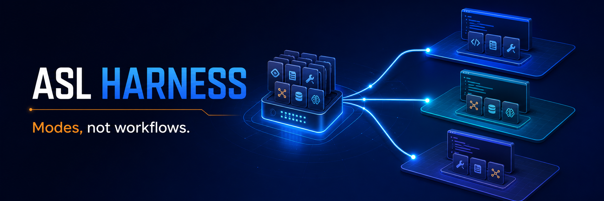
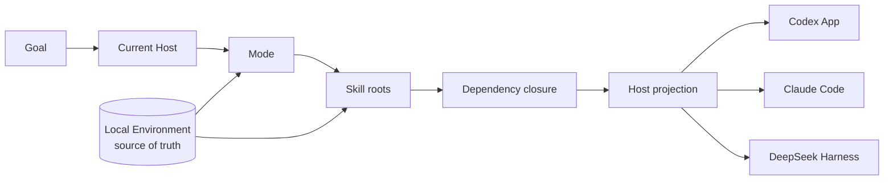

<p align="center">
  
</p>

<h1 align="center">ASL Harness</h1>

<p align="center">
  <strong>把散落的 Agent Skills，变成可切换、可验证、可迁移的工作环境。</strong>
</p>

<p align="center">
  Mode-first personal skill environments for Codex, Claude Code, and DeepSeek Harness.
</p>

<p align="center">
  <a href="https://github.com/qihangzhang-272/asl-harness/stargazers"></a>
  <a href="https://github.com/qihangzhang-272/asl-harness/actions/workflows/test.yml"></a>
  <a href="LICENSE"></a>
  
  
</p>

<p align="center">
  <a href="#快速开始">快速开始</a> ·
  <a href="#mode-不是-workflow">核心概念</a> ·
  <a href="#三个宿主一份本地真源">宿主接入</a> ·
  <a href="#项目状态">项目状态</a>
</p>

---

## 为什么需要 ASL Harness？

你的 Agent 已经装了很多 Skill。但 Skill 越多，工作环境不一定越好：

- 写公众号时，它同时背着估值模型、尽调模板和代码审查规则；
- 做投研时，它又把排版、配图和社交媒体语气一起加载进来；
- 同一套个人能力换到 Codex、Claude Code 或 DeepSeek Harness，要重复安装和维护；
- 新找到的 Prompt、MCP、API 和开源 Skill，容易直接塞进工作区，最后没人知道它从哪里来、是否验证过；
- 为了稳定，很多系统开始增加 Workflow、事件总线和第二套调度器，Agent 反而把注意力花在跑流程上。

**ASL Harness 把这件事收敛成一个简单模型：**

```text
一份本地 Skill 真源
        ↓
多个 Mode（不同工作的能力面）
        ↓
投影到当前 Host
        ↓
Host 根据 Goal 动态使用 Skill
```

Harness 不替 Agent 工作。它只保证 Agent 在正确的工作场里，看见正确的能力。

> 如果这个方向对你有用，欢迎点一个 Star。它能帮助更多维护个人 Skill 库的人找到这个项目。

## 快速开始

```bash
git clone https://github.com/qihangzhang-272/asl-harness.git
cd asl-harness
python -m pip install -e .

asl-harness workspace.validate \
  --workspace ./examples/personal-environment
```

你会得到当前 Environment 的 Skill、Mode、依赖闭包和能力地图状态。

然后把一个 Mode 投影到正在工作的项目：

```bash
asl-harness host.project \
  --workspace ./examples/personal-environment \
  --project /path/to/current-project \
  --mode creator-studio \
  --host-id codex-app
```

切换到 Claude Code 或 DeepSeek Harness，只需更换 `--host-id`：

```text
codex-app | claude-code | deepseek-harness
```

## Mode 不是 Workflow

Workflow 规定“第一步做什么、第二步做什么”。Mode 只规定“当前工作允许使用哪些能力”。

```yaml
apiVersion: asl-wep/v0.3.0-design
kind: ModeProjection
metadata:
  id: creator-studio
spec:
  skills:
    - product-analysis
    - visual-storytelling
  permissions:
    mutateEnvironment: false
```

这里的 `skills` 是能力根，不是执行顺序。Harness 会补齐它们声明的 Skill 依赖，但不会决定 Agent 先研究、先写提纲，还是先看材料。

用户仍然只需要给出 Goal：

```text
“分析这个 AI 产品，写成公众号文章并完成排版。”
```

当前 Host 负责理解意图、选择或确认 Mode，再根据任务动态组合 Skill。ASL Harness 不参与业务执行，也不创建隐藏的 Agent loop。

| | 固定 Workflow | ASL Mode |
|---|---|---|
| 定义什么 | 节点与执行顺序 | 一组工作的能力边界 |
| 谁做判断 | 预设流程 | 当前 Host |
| 任务变化时 | 修改流程或增加分支 | 在能力面内动态组合 |
| Skill 增长时 | Workflow 越来越长 | Mode 只保留必要能力根 |

## 它如何工作



只有四个动作：

1. **Validate** — 校验 Environment、Skill 依赖和 Mode 边界；
2. **Map** — 把当前能力生成一份人和 Agent 都能读的 `WORKSPACE.md`；
3. **Project** — 只把当前 Mode 的 Skill 闭包投影到宿主项目；
4. **Verify** — 检查投影是否缺失、被修改或已经落后于本地真源。

没有常驻服务、数据库、事件总线、状态树，也没有第二个调度器。

## 一份 Environment 长什么样

```text
personal-environment/
├── WORKSPACE.md        # 人与 Agent 共读的能力地图
├── PROFILE.md          # 跨 Mode 的精简身份与边界
├── skills/             # 已验证、可正式使用的完整 Skill
├── modes/              # 工作场与 Skill 子图
├── candidates/         # 找到但尚未验证的外部能力
├── trials/             # 已本地化、等待真实任务检验
├── feedback/           # 用户明确反馈
└── archive/            # 退出活动面的历史材料
```

目录本身就是当前用户的本地真源，Git 保存历史。Harness 不要求额外的 `workspace.yaml`，也不维护手写 revision、用户 plane、Run 状态或隐式上下文继承。

### 外部能力如何进入

```text
发现能力缺口
  → 搜索可追溯来源
  → Candidate
  → 本地化为完整 Trial Skill
  → 用真实任务验证、合并或拒绝
  → 正式 Skill
  → 加入合适的 Mode
```

外部 GitHub 仓库、Prompt、MCP、API 或 Agent 不能在任务中途变成不可追踪的裸调用。它们先沉淀为本地 Skill，再进入个人工作环境。

## 三个宿主，一份本地真源

| Host | Skill 投影目录 | Mode 规则入口 | 当前支持 |
|---|---|---|---|
| Codex App | `.agents/skills/` | `AGENTS.md` | 项目投影 |
| Claude Code | `.claude/skills/` | `CLAUDE.md` | 项目投影 + 薄插件 |
| DeepSeek Harness | `.dsh/skills/` | `AGENTS.md` | 项目投影 + Agent Preset 导出 |

Harness 优先创建目录链接；环境不允许时才创建带来源标记的受管理副本。切换 Mode 时，它只删除能够证明由自己生成的旧投影，不覆盖用户已有文件。

### DeepSeek Harness Agent Preset

DeepSeek Harness 的 Agent Preset 天然适合承载 ASL Mode：工具和插件来自一个已知可运行的 base preset，ASL 只替换 Persona 与当前 Mode 的 Skill 闭包。

```bash
asl-harness deepseek.preset.export \
  --workspace /path/to/personal-environment \
  --mode creator-studio \
  --base-preset /path/to/known-good-preset \
  --output /path/to/deepseek/user-presets/creator-studio
```

这样，一个 Mode 可以成为 DeepSeek Harness 中可长期选择的工作状态，而不是一条固定任务链。

## 五个命令

| 命令 | 作用 |
|---|---|
| `workspace.validate` | 校验 Environment、Skill 图和 Mode |
| `workspace.view.sync` | 刷新 `WORKSPACE.md` 能力地图 |
| `host.project` | 把一个 Mode 投影到宿主项目 |
| `host.verify` | 检查投影完整性与来源漂移 |
| `deepseek.preset.export` | 导出 Mode 专属 DeepSeek Agent Preset |

## 设计边界

ASL Harness **会拒绝**：

- Mode 引用不存在的 Skill；
- Skill 依赖缺失或循环；
- 投影覆盖用户自有文件；
- Skill package 通过符号链接逃出 Environment；
- 旧 Workflow、Run 或状态树重新进入运行核心。

ASL Harness **不会阻断**：

- `WORKSPACE.md` 能力地图只是过期；
- 已投影内容落后于本地 Skill 或 Git HEAD。

运行用户 Goal 时优先继续工作。只有无法安全判断“这是不是 Harness 生成的文件”时，才拒绝写入。

## 项目状态

ASL Harness 当前是 **v0.3 Developer Preview**，不是成熟产品。

已经完成：

- Mode-only 领域模型；
- Skill 依赖闭包与漂移检查；
- Codex App、Claude Code、DeepSeek Harness 项目投影；
- DeepSeek Agent Preset 结构级导出；
- Windows 与 Linux CI；
- 17 项自动化测试。

仍需真实验收：

- 大型个人 Skill Library 的长期运行；
- DeepSeek Harness 真实会话启动与持续使用；
- Mode 创建、修改和淘汰的演化规则。

如果你希望的是已经包装好的通用 Agent，这个项目目前不适合你。如果你正在维护自己的长期 Skill 库，并希望它在多个 Host 之间保持清楚、轻量和可演化，欢迎试用并提交反馈。

## 开发

```bash
python -m pip install -e ".[test]"
python -m pytest
```

进一步阅读：

- [三宿主 Mode 投影设计](docs/plans/2026-08-30-three-host-mode-projection-design.md)
- [三宿主 Mode 投影实施计划](docs/plans/2026-08-30-three-host-mode-projection-plan.md)
- [宿主薄插件](plugins/asl-environment-host)

## 开源边界

本仓库只包含 Harness 源码、通用示例、测试和宿主适配器。它不包含任何人的正式 Skill、Mode、Case、运行产物、个人 Profile、凭据或 `.env`。个人 Environment 应保留在使用者自己的私有仓库中。

## License

[MIT](LICENSE)
