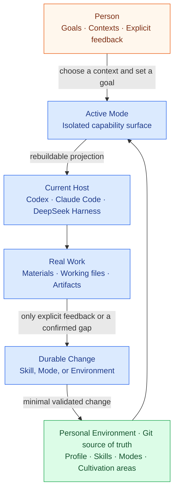

<p align="right">
  <a href="README.md">简体中文</a> · <strong>English</strong>
</p>

<p align="center">
  
</p>

<h1 align="center">ASL Harness</h1>

<p align="center">
  <strong>Give your growing collection of Agent Skills a workspace built around you.</strong>
</p>

<p align="center">
  Manage your skills, isolate them by work context, and carry the same personal capabilities across Codex, Claude Code, and DeepSeek Harness.
</p>

<p align="center">
  <a href="https://github.com/qihangzhang-272/asl-harness/stargazers"></a>
  <a href="https://github.com/qihangzhang-272/asl-harness/actions/workflows/test.yml"></a>
  <a href="LICENSE"></a>
  
</p>

<p align="center">
  <a href="#the-problem-is-not-a-lack-of-skills">Why ASL</a> ·
  <a href="#mode-puts-context-before-skill-selection">Modes</a> ·
  <a href="#quick-start">Quick Start</a> ·
  <a href="#host-support">Host Support</a> ·
  <a href="docs/asl-architecture-views.md">Architecture</a> ·
  <a href="https://github.com/qihangzhang-272/agent-skill-library">Starter Environment</a>
</p>

---

Agent Skills are becoming a portable format for AI capabilities. A Skill can carry instructions, scripts, references, and templates, and enter the model's context only when needed.

Long-term use creates a different problem. A handful of Skills turns into dozens or hundreds. They come from different repositories, support different kinds of work, and often overlap. The format answers how a capability should be packaged, but not how a person should manage a growing capability library or decide which capabilities an AI should see in the current context.

ASL Harness fills that gap. It adds a local, readable, and maintainable personal work environment between Agent Skills and the Agent that executes them:

- long-lived capabilities live in one Git-managed Environment;
- Modes organize capabilities into work contexts you can return to;
- only the active Mode's capability surface is projected to the Host;
- Codex, Claude Code, or DeepSeek Harness keeps its native model, tools, permissions, and Agent Loop;
- the user and the Agent can refine Skills and Modes through real work, allowing the Environment to gradually become personal.

## The Problem Is Not a Lack of Skills

Finding Skills is easy. GitHub, skill marketplaces, public recommendations, team repositories, and AI-generated packages are all potential sources. The missing layer is what happens after discovery.

### Skills have installation paths, but rarely a durable home

The same Skill may be copied into several Agent directories or disappear with a project. Its source, version, local changes, dependencies, and replacements are scattered. As the collection grows, basic questions become difficult to answer:

- Where did this capability come from, and which version is active?
- Do two differently named Skills solve the same problem?
- Which parts were modified locally, and which still follow upstream?
- Which work contexts will break if a Skill is removed?
- How can the same capability set move to another Agent without being rebuilt?

### Work contexts and Skills lack a stable mapping

People do not select from every tool they own before every task. Writing, research, engineering, operations, and investing are different working states with different materials, language, tools, and quality standards.

Most Skill directories flatten every capability into one pool. Progressive disclosure helps, but the Host must still choose from a growing list of names and descriptions. As the pool expands, active recall is increasingly affected by similar descriptions, cross-context capabilities, and accidental keyword matches.

### Loading everything and hard-coding a Workflow are both poor defaults

Exposing every Skill creates noise and competition for attention. Encoding them as a fixed Workflow turns complex work into a rigid sequence and encourages an expanding tree of branches, states, and configuration.

ASL keeps the Agent intelligent and narrows the environment in which it works.

| Common approach | What it solves | What happens over time |
| --- | --- | --- |
| Install every Skill globally | Everything is always reachable | The recall surface grows and unrelated contexts interfere |
| Copy Skills into every project | Each project appears isolated | Copies drift, and provenance becomes difficult to maintain |
| Encode a fixed Workflow | Execution is predictable | Complex work becomes rigid and branches multiply |
| Rely only on global search or routing | Installation stays simple | The user's durable work contexts and habits remain undefined |

## Mode Puts Context Before Skill Selection

**A Mode is a reusable working state and the capability surface visible to the current Agent.**

People enter a context before choosing a tool. ASL turns that natural behavior into two-stage recall:

```mermaid
flowchart LR
    ALL["Personal Environment<br/>All formal Skills"]
    MODE["Active Mode<br/>Context-level capability boundary"]
    PROJECT["Host Projection<br/>Only this Mode's Skill closure"]
    DISCOVERY["Native Skill Discovery<br/>Progressive recall by name and description"]
    TASK["Current Task<br/>Load full Skills on demand"]

    ALL -->|select explicit Skill roots| MODE
    MODE -->|resolve dependencies and generate| PROJECT
    PROJECT --> DISCOVERY
    DISCOVERY --> TASK

    classDef truth fill:#dcfce7,stroke:#16a34a,color:#14532d;
    classDef mode fill:#dbeafe,stroke:#2563eb,color:#1e3a8a,stroke-width:2px;
    classDef host fill:#f3f4f6,stroke:#6b7280,color:#1f2937;
    class ALL truth;
    class MODE mode;
    class PROJECT,DISCOVERY,TASK host;
```



The Mode answers, "What kind of work is this?" The Host then answers, "Which specific Skill does this task need?" An Agent working on capital markets does not need to evaluate public-account typography, and a writing session does not need to browse database migration conventions.

### Modes provide visibility isolation

Modes share one Skill source of truth, but they do not inherit from or invoke one another. When projected into a target project, Harness copies only the Skills selected by the active Mode and their required dependencies. When the Mode changes, the previous Mode's ASL-managed Skills leave the Host's discovery surface.

This isolates **recall and context visibility**. It is not an operating-system security sandbox. File access, network access, MCP permissions, and execution sandboxes remain the Host's responsibility.

### A Mode is neither a Domain nor a Workflow

- a Domain groups knowledge; a Mode groups capabilities around a human working state;
- a Workflow dictates how work proceeds; a Mode only defines what is available;
- a Mode can cover a broad surface and should not wrap a one-off task;
- several Modes may explicitly select the same Skill without copying it;
- a Mode stores no execution order, state tree, branch graph, or hidden scheduler.

The active configuration can therefore remain small:

```yaml
apiVersion: asl-wep/v0.3.0
kind: ModeProjection
metadata:
  id: research-desk
spec:
  skills:
    - web-research
    - source-verification
    - report-writing
```

The Agent may search before verification or begin with supplied material and search only when evidence is missing. The Mode does not hard-code that path.

## From a Tool Collection to a Living Work Environment

ASL is not designed to produce more Skills. It is designed to place Skills, contexts, and explicit human feedback in one maintainable system.



An Environment is an ordinary folder and a local Git source of truth. A person can read and edit it directly, and an Agent can maintain it with permission. Ordinary tasks do not automatically rewrite the durable environment. Lasting changes begin only when the user gives explicit feedback, explicitly adopts an external capability, or real work exposes a stable gap.

Over time, the Environment becomes more like its owner: it retains useful judgment, removes ineffective capabilities, and turns recurring work into Modes without permanently absorbing every conversation.

## Quick Start

### Start with the blank Environment

```bash
git clone https://github.com/qihangzhang-272/asl-harness.git
cd asl-harness
python -m pip install -e ".[test]"

asl-harness state \
  --workspace ./examples/personal-environment

asl-harness workspace.validate \
  --workspace ./examples/personal-environment
```

Project the example Mode into a Codex project:

```bash
asl-harness host.project \
  --workspace ./examples/personal-environment \
  --project /path/to/current-project \
  --mode creator-studio \
  --host-id codex-app

asl-harness host.verify \
  --workspace ./examples/personal-environment \
  --project /path/to/current-project \
  --mode creator-studio \
  --host-id codex-app
```

Open the target project in Codex. Codex sees the active Mode, its Skill closure, and a concise boundary statement. ASL does not take over its model, tools, MCP configuration, or permissions.

### Start with a cultivated Environment

To begin with a real working environment instead of the blank example:

```bash
git clone https://github.com/qihangzhang-272/agent-skill-library.git

asl-harness workspace.validate \
  --workspace ./agent-skill-library
```

[Agent Skill Library](https://github.com/qihangzhang-272/agent-skill-library) is a filled reference Environment with Modes for content creation, AI product analysis, and investment research. Once cloned, the local checkout is your source of truth to prune, modify, and cultivate.

## What ASL Manages

### One readable source of truth for Skills

Each formal Skill is stored once under `skills/` and can carry everything needed for a complete capability:

```text
skills/<skill-id>/
├── SKILL.md              Instructions and runtime requirements
├── SOURCE.md             Provenance, version, license, and local changes
├── scripts/              Deterministic scripts
├── references/           Professional material loaded on demand
└── assets/               Templates and resources
```

MCP servers, commands, environment variable names, or required Host plugins are declared by the responsible Skill only when needed. Installation, authentication, and permission grants remain native to the Host.

### Explicit relationships between contexts and capabilities

A Mode stores only Skill roots. Harness resolves the dependency closure, rejects missing references and cycles, and generates the current capability map. Before deleting or replacing a Skill, you can see which Modes depend on it.

### A local entry path for external capabilities

Skills may come from GitHub, official documentation, skill marketplaces, public recommendations, or another ASL Environment. Before a capability becomes durable, the current Host reads the full source and determines its relationship to existing Skills:

- adopt it as a new complete Skill;
- absorb it into an existing Skill;
- merge overlapping capabilities;
- keep it as an explicit dependency or variant;
- create an Adapter for a Host-specific boundary;
- borrow only the requirement and independently implement it against official interfaces;
- reject or archive it.

When the user explicitly requests adoption, ASL does not force a ceremonial Candidate, Trial, or demo Case. Isolation areas are used only when provenance, licensing, security, overlap, runtime behavior, or the adoption decision remains uncertain.

Preview a Skill transfer between Environments:

```bash
asl-harness environment.sync \
  --source ./source-environment \
  --target ./personal-environment \
  --skill skill-id \
  --mode research-desk \
  --check
```

Remove `--check` after review. Existing divergent content is not overwritten unless the user explicitly adds `--replace`.

### A shared capability map for people and Agents

`WORKSPACE.md` is generated deterministically from the active source of truth. It shows the Environment's Modes, Skills, and cultivation state. It is not a second hand-maintained Skill Index; it can be rebuilt whenever content changes, while Git preserves history and diffs.

## Host Support

The same Environment can enter different Agents without maintaining a separate library for each platform.

| Host | Active Mode Skill projection | Mode entry point | Execution boundary |
| --- | --- | --- | --- |
| Codex App | `.agents/skills/` | `AGENTS.md` | Executed natively by Codex |
| Claude Code | `.claude/skills/` | `CLAUDE.md` | Executed natively by Claude Code |
| DeepSeek Harness | `.dsh/skills/` | `AGENTS.md` / Agent Preset | Executed natively by DeepSeek Harness |

Change `host-id` to `claude-code` or `deepseek-harness` to generate the corresponding project projection. A DeepSeek Agent Preset can also be exported from a Preset already known to run on the local machine:

```bash
asl-harness deepseek.preset.export \
  --workspace ./agent-skill-library \
  --mode creator-studio \
  --base-preset /path/to/known-good-preset \
  --output /path/to/.dsh/.agent-presets/asl-creator-studio
```

ASL changes the Persona and Skill surface while preserving the original model, storage, tools, plugins, credentials, and sandbox configuration.

### Optional Hooks

A projected Mode works without a plugin. Install the optional Host Plugin only when you want session-start and managed-write checks:

```bash
# Codex
codex plugin marketplace add /path/to/asl-harness

# Claude Code
claude plugin marketplace add /path/to/asl-harness
claude plugin install asl-environment-host@asl-harness
```

Hooks reuse the same CLI validation and only check structure, provenance, Secrets, and projection drift. They exit silently outside ASL-managed projects, do not evaluate business content, and do not block ordinary work.

## Guardrails

Harness is strict about errors a machine can prove and deliberately restrained about semantic judgment.

**The corresponding write or projection is rejected when:**

- an Environment, Skill, or Mode is structurally invalid;
- a formal Skill has no provenance record;
- Skill dependencies are missing or cyclic;
- a Mode references a missing Skill;
- Candidate, Trial, formal Skill, Case, and Archive boundaries are mixed;
- a projection would overwrite user-owned files that cannot be proven ASL-managed;
- Secrets, caches, Git metadata, or rebuildable dependencies would enter a projection;
- managed content fingerprints no longer match;
- a fixed Workflow, Run state tree, or second scheduler re-enters the active Environment.

**The task continues with a warning when:**

- the capability map or Host projection needs a refresh;
- a Candidate is still awaiting an adoption decision;
- an upstream Skill has a new version;
- two Skills may overlap.

Whether a new Mode is necessary, an external capability is worth keeping, or overlapping Skills should be merged remains a judgment proposed by the current Agent and decided by the user.

## Repository Layout

```text
personal-environment/
├── PROFILE.md             Concise boundaries shared across Modes
├── WORKSPACE.md           Generated capability map
├── skills/                Single active source for formal Skills
├── modes/                 Work contexts and explicit Skill roots
├── candidates/            Sources not yet selected for adoption
├── trials/                Capabilities requiring isolated evaluation
├── feedback/              Explicit user feedback
└── archive/               Content removed from the active surface
```

Harness itself contains a deterministic Core, Environment maintenance contracts, Guards, Host Adapters, Hooks, and a CLI. Complete component relationships, change sequences, lifecycle states, and three-Host deployment views live in [ASL Architecture Views](docs/asl-architecture-views.md).

## Blank Harness and Starter Environment

| | [ASL Harness](https://github.com/qihangzhang-272/asl-harness) | [Agent Skill Library](https://github.com/qihangzhang-272/agent-skill-library) |
| --- | --- | --- |
| Purpose | Blank framework for cultivating personal work environments | Reference Environment filled with real business capabilities |
| Includes | CLI, constraints, examples, Host Adapters, and Hooks | Formal Skills, business Modes, and provenance records |
| Best starting point | Define every Mode from scratch | Run first, then prune, replace, and cultivate |
| Local source of truth | The Environment you create or select | Your local checkout after clone |

Both use the same Environment Contract. The filled version is not a separate product or a remote skill marketplace.

## Who Is This For

ASL is designed for people and teams who use Agent Skills over time and encounter one or more of these conditions:

- the collection keeps growing and provenance or versions are difficult to track;
- several Agents are in use, and capabilities should move without repeated copying;
- work spans several contexts that require explicit capability isolation;
- complex tasks should remain adaptive instead of being trapped in fixed Workflows;
- the Agent should improve its work environment through real, explicit feedback;
- long-lived capabilities should remain local, readable, reviewable, and reversible in Git.

If you only have a few Skills, the Host's native Skill directory is usually enough. The value of Modes appears as the number of capabilities, work contexts, and long-term maintenance needs grows.

## FAQ

<details>
<summary><strong>How is a Mode different from organizing Skills into folders?</strong></summary>

Folders mainly help people browse. Harness resolves a Mode into an explicit Skill subgraph and projects it into the Host's native discovery directory, changing the capabilities the current Agent can actually recall.

</details>

<details>
<summary><strong>Does a Mode become another Workflow?</strong></summary>

No. A Mode stores no order, branch, state, or executor. It only selects complete Skills for the active context; the Host Agent still decides how to complete the task.

</details>

<details>
<summary><strong>Does ASL replace Codex, Claude Code, or DeepSeek Harness?</strong></summary>

No. The current Host is always the only executor. ASL maintains the Environment, validates deterministic boundaries, and generates Host projections.

</details>

<details>
<summary><strong>Can one Skill belong to several Modes?</strong></summary>

Yes. Each Mode explicitly selects the same Skill source of truth. The Skill is not copied and does not enter other Modes through implicit inheritance.

</details>

<details>
<summary><strong>Will switching Modes delete my files?</strong></summary>

Harness only manages projection content carrying ASL ownership records. If a target path contains files that cannot be proven ASL-managed, projection refuses to overwrite them.

</details>

## Documentation

- [Architecture Views](docs/asl-architecture-views.md)
- [Host Plugin and Hooks](plugins/asl-environment-host/README.md)
- [Filled Agent Skill Library](https://github.com/qihangzhang-272/agent-skill-library)

<details>
<summary><strong>CLI Reference</strong></summary>

| Command | Purpose |
| --- | --- |
| `state` | Inspect Environment, Mode, Skill, Git, and projection state |
| `workspace.validate` | Validate Environment structure, Skill dependencies, and Modes |
| `workspace.view.sync` | Rebuild the human- and Agent-readable capability map |
| `environment.sync` | Transfer one complete Skill between Environments |
| `host.project` | Project one Mode into the current project |
| `host.verify` | Check projection integrity and source drift |
| `deepseek.preset.export` | Export a Mode Preset from a known-good base |
| `deepseek.preset.verify` | Validate a DeepSeek Agent Preset |

</details>

## Developer Preview

ASL Harness is evolving rapidly and may introduce compatibility-breaking changes. Three-Host project projection, DeepSeek Agent Presets, Skill transfer, structural validation, provenance and dependency checks, content fingerprints, and lightweight Hooks are implemented. CI currently passes on both Windows and Ubuntu.

Dynamic counts, real-Host acceptance evidence, and remaining work are maintained only in [Architecture Views · Current Status](docs/asl-architecture-views.md#view-9--当前项目状态) so the README does not become a second status ledger.

## Contributing

Use [Issues](https://github.com/qihangzhang-272/asl-harness/issues) to report Host compatibility problems, real-world feedback, or reproducible architecture gaps. ASL prefers deletion, consolidation, and reuse. Any new layer must demonstrably reduce the complexity of Skill management, context isolation, or Host integration.

## License

[MIT](LICENSE)
