# Master · 总架构图

回答：一个独立 App 怎样管理、分享并培养工作环境，又怎样让不同 Agent 真正使用它？

> **产品目标：切换的不是一组提示词，而是一套工作环境。** App 是用户入口；Environment 是可编辑、可带走的内容；Harness 是管理与适配底座；Codex、Claude Code、DeepSeek Harness 仍负责实际工作。下图的连线是所有权、数据与反馈关系，不是业务执行顺序。绿色为现有能力，橙色为本次补齐的设计、尚未实现的产品能力。

本机日常内容收敛到 `libraries/agent-skill-library`，直接保留原 GitHub 历史；Personal Harness 与旧写作检出不再是第二套活动真源。公共 GitHub 版本与本地未发布修改仍有边界，不自动上传。Mode 的多种 Mermaid 图型共用原生渲染、视觉规则与画布；语法表达不同视角，不新增业务对象或调度层。迁移及可读性验收事实见 View 9。

```mermaid
%%{init: {"theme":"base","themeVariables":{"fontFamily":"Microsoft YaHei","fontSize":"16px","clusterBkg":"#f8fafc","clusterBorder":"#cbd5e1"},"flowchart":{"nodeSpacing":35,"rankSpacing":55,"curve":"basis"}}}%%
flowchart TB
    USER["用户<br/>管理自己的工作环境，继续用熟悉的 Agent"]
    APP["独立 ASL App · Windows 便携版<br/>本机整理提示词 / 模式 / 技能图 / 编辑 / 导入 / 更新 / Agent 配置<br/>本地文件可读写；完整跨机运行验收待补"]

    subgraph SUPPLY["外部供给"]
        SOURCES["GitHub / 公开插件目录 / KOL 推荐<br/>Agent Skill Library 装填版 / 他人环境包"]
    end

    subgraph MANAGE["Harness 管理机制 · 不是第二个 Agent"]
        INTAKE["导入与安装协调 · 部分实现<br/>本机 / GitHub 发现 → 添加到 Mode<br/>配套内容提示；不自动安装或拆分"]
        UPSTREAM["公共库浏览与来源追踪<br/>公共项目以云端为准，连接即可浏览<br/>解析缓存不是工作副本；采用后本地 Mode 独立演进"]
        PORTABLE["可迁移包 · 内容往返已实现<br/>Mode + 完整 Skill + 指纹清单<br/>运行依赖安装与连接待补"]
        CORE["App / Agent 共用 Harness CLI<br/>契约发现 / 完整文件读取 / 隔离候选验收<br/>实际渲染、协作写锁、指纹与异常回滚"]
        EDIT["内容管理 · 验收范围见 View 9<br/>库路径 + Mode ID 隔离身份；列表可返回<br/>技能栏 + 画布原位编辑 / 独立文档标签<br/>Mode 创建 / 修改 / 复制 / 归档；完整包文件编辑"]
        STEWARD["当前 Agent 的环境整理<br/>通过 CLI 读取、组织并提交完整 Skill / Mode<br/>失败读取定位后修正；App 不启动第二个模型"]
        SETUP["本机配置交接 · 代码已有<br/>Mode + 原始 Skill + 本机缺项<br/>启动原生 Claude / Codex，结束后复查"]
        LOCAL["本机发现 · 已验证<br/>标准技能 / MCP 位置 + 已登记项目<br/>Mode 同名与同源分开；不扫描硬盘"]
        MCPEDIT["原生 MCP 管理 · 已验证<br/>Claude / Codex 用户与项目范围<br/>逐条编辑 / 停用 / 版本检查 / 备份"]
        CONNECTIONS["Agent 中的模式 · 配置级管理<br/>读取原生回执并核对实际文件<br/>查看 / 更新 / 停用；不影响非受管内容"]
        LEARN["培养与推荐 · 待开发<br/>相关经验召回、合并、更正与撤回<br/>没有积分或随机变异调度器"]
    end

    subgraph ENV["用户本地 Environment · 当前运行与维护内容，可用 Git 管理"]
        ROOT["本地工作内容 · 唯一运行真源<br/>当前为开放文件，空白版与装填版同结构<br/>已有业务数据库也应开放接口，不新增数据库"]
        MODES["Mode · 工作目的与场景环境<br/>不是个人 / 职业；同一人有多个 Mode<br/>选择完整 Skill 子图，不保存固定执行顺序"]
        SKILLS["完整 Skill 包 · 已有<br/>方法 / scripts / assets / references<br/>SOURCE / 必要原生依赖说明"]
        CONTEXT["个人边界、资料与明确反馈<br/>PROFILE / Mode 说明 / 培养区<br/>经验关联与管理界面待完善"]
        MAP["Mode 技能架构 · 验收见 View 9<br/>v0.4 范式成员；完整 Skill 是节点<br/>Mermaid 原文 → 官方画板；右键添加 / 拖动连线<br/>点击节点 → 主区域技能文件 + 右上悬浮原图<br/>双击原位修改 → 共用渲染门控；失败保留旧文件"]
        ROOT --> MODES
        MODES -->|范式或通用能力归属覆盖全部成员| MAP
        MODES -->|显式选择能力| SKILLS
        ROOT --> CONTEXT
        SKILLS --> MAP
        CONTEXT -.关联待完善.-> MAP
    end

    subgraph NATIVE["本机依赖与账号 · 不随包分享"]
        RUNTIME["原生包管理器 / MCP / Plugin<br/>安装可复用，Mode 可见范围单独控制"]
        MODEL["Model 配置入口 · 待开发<br/>复用本机提供商与账号<br/>调用、登录和授权归宿主"]
    end

    subgraph HOSTS["宿主适配 · 投影代码已有，完整应用与实机验收待补"]
        ADAPTER["同一环境，按宿主翻译<br/>不支持的能力明确提示"]
        DSH["DeepSeek Harness<br/>Mode → Preset<br/>依赖 → Profile / Bundle"]
        CC["Claude Code<br/>项目 / 当前用户的 Skills 与指令<br/>原生 Plugin / MCP / 模型配置"]
        CX["Codex App<br/>项目 / 当前用户的 Skills 与指令<br/>原生 Plugin / MCP / 模型配置"]
        WB["WorkBuddy<br/>项目 .codebuddy/skills + CODEBUDDY.md<br/>文件投影已测；原生会话待验收"]
        FUTURE["千问办公 / 豆包工作 / OpenCode / Cursor<br/>Hermes / OpenClaw 等目标宿主<br/>原生接口须逐个核实，尚未实现兼容"]
        PROJECTION["投影、Preset 与配置回执<br/>派生物，不是内容真源"]
        ADAPTER --> DSH
        ADAPTER --> CC
        ADAPTER --> CX
        ADAPTER --> WB
        ADAPTER -.后续.-> FUTURE
        DSH --> PROJECTION
        CC --> PROJECTION
        CX --> PROJECTION
        WB --> PROJECTION
    end

    HOST["当前 Host · 唯一业务执行者<br/>原生模型、工具、会话、权限和 Agent Loop"]
    CASE["当前任务与交付<br/>素材 / 工作文件 / 产物"]
    HOOK["已有原生 Hook 接线<br/>检查当前 Mode 与投影<br/>实际激活仍须验收"]
    DSH_UI["DeepSeek 内的 ASL 管理入口 · 后续<br/>作为原生插件使用同一环境和管理机制"]

    USER --> APP
    APP -->|管理操作| INTAKE
    APP -->|可取消读取，不锁住导航| LOCAL
    LOCAL -->|复用已有内容，提示配置位置| INTAKE
    APP -->|选定范围并确认| MCPEDIT
    MCPEDIT -->|仅改原生声明，登录仍归宿主| RUNTIME
    APP -->|来源与更新窗口| UPSTREAM
    UPSTREAM -->|完整目录直接呈现；缓存不是工作区| APP
    APP -->|按 Agent 查看真实配置| CONNECTIONS
    PROJECTION -->|用户 / 项目 / Preset 回执| CONNECTIONS
    CONNECTIONS -->|复用验证与受管修改| CORE
    CONNECTIONS -.配置核对不等于真实任务成功.-> APP
    SOURCES -->|公共项目以云端为准，不硬编码 Mode| UPSTREAM
    UPSTREAM -->|用户确认后，复用完整 Mode 包导入| PORTABLE
    MODES -->|只追踪来源，不交出本地修改权| UPSTREAM
    UPSTREAM -.有新提交时提醒，不自动覆盖.-> APP
    APP -->|已授权的内容修改| EDIT
    EDIT -->|验证 / 回滚 / 同步视图| CORE
    APP -->|导入与分享| PORTABLE
    APP --> MODEL
    APP -->|检查并交给原生 AI 配置| SETUP
    SETUP -->|安装 / 授权 / 实测仍由原生 Agent| RUNTIME
    RUNTIME -.本机复查，不以会话退出冒充通过.-> SETUP
    MAP -.校验后呈现；本地变更刷新.-> APP
    APP -.保留提示词交接；Agent 也可直接使用 CLI.-> STEWARD
    SOURCES -->|选择采用| INTAKE
    SOURCES -.发现与比较.-> STEWARD
    INTAKE -->|完整候选内容与绑定请求| CORE
    INTAKE -->|安装或复用| RUNTIME
    ROOT -->|选中 Mode 的闭包| CORE
    CORE --> ADAPTER
    MODEL --> ADAPTER
    RUNTIME -->|实际依赖| HOST
    PROJECTION -->|宿主发现并加载| HOST
    USER -->|正常工作| HOST
    HOST --> CASE
    HOST --> HOOK
    HOOK -.复用现有检查.-> CORE
    CASE -->|仅明确长期反馈| LEARN
    LEARN --> STEWARD
    STEWARD -->|最小候选变更；失败修正后重试| CORE
    CORE -->|同一门控通过后正式写入| ROOT
    ROOT -->|选择公开内容| PORTABLE
    PORTABLE -.分享后可再采用.-> SOURCES
    DSH_UI -.复用同一入口.-> INTAKE

    classDef locked fill:#dbeafe,stroke:#2563eb,color:#1e3a8a,stroke-width:2px;
    classDef done fill:#dcfce7,stroke:#16a34a,color:#14532d;
    classDef pending fill:#ffedd5,stroke:#ea580c,color:#7c2d12;
    classDef generated fill:#f3f4f6,stroke:#6b7280,color:#1f2937,stroke-dasharray:4 3;
    classDef external fill:#f5f3ff,stroke:#7c3aed,color:#4c1d95;
    class USER,HOST,ROOT,MODES locked;
    class SKILLS,CORE,EDIT,STEWARD,CASE,SETUP,UPSTREAM,LOCAL,MCPEDIT,CONNECTIONS done;
    class APP,INTAKE,PORTABLE,LEARN,CONTEXT,MODEL,ADAPTER,DSH,CC,CX,WB,FUTURE,HOOK,DSH_UI pending;
    class PROJECTION,MAP generated;
    class SOURCES,RUNTIME external;

```

**总图中的四个循环：**工作循环产出结果；安装循环把外部能力放进指定 Mode；迁移循环把同一环境交给另一台机器或另一种 Agent；培养循环把明确反馈变成适用范围更清楚的能力。四者互相连接，但不要求每次任务都走一遍。

**不可混淆的边界：**

- 空白 Harness 和 Agent Skill Library 使用同一环境结构，区别在内容，不维护两个架构分支。
- 一个 Mode 按工作目的、场景和环境定义，不按人、职业或人设定义；一个人有多个 Mode。环境内可以存很多能力，进入某 Mode 只提供它选择的 Skill 子图，同一完整 Skill 可以被多个 Mode 引用；这不是操作系统级安全隔离。
- 业务方法由完整本地 Skill 承载；插件执行代码、模型服务、登录与沙箱沿用宿主，不把基础设施硬包成伪业务 Skill。
- App 管理内容与接入，不替 Host 回答用户或调度业务。语义冲突归 Host 与具体 Skill，确定性结构错误才交 CLI / Hook。
- 公共库以云端为真源，可只浏览、不采用；所有采用到本地的 Mode 以本地持续使用和培养的版本为唯一真源，不是应当追平上游的镜像。来源记录只帮助比较与选择吸收，不授予自动覆盖权。宿主投影可重建；分享包或经授权发布的仓库可以传播 Mode，但不改变本地工作版本的真源地位。
- “一切皆市场”的首期实现是**可分享的环境与能力目录**，复用 GitHub、已有插件市场和来源记录，不先造交易平台、中心账号或积分。
- Mode、Model 分开：前者决定工作环境，后者决定哪个模型做事。切换 Mode 可以关联模型偏好，但不能假装所有宿主支持同一模型接口。

---
