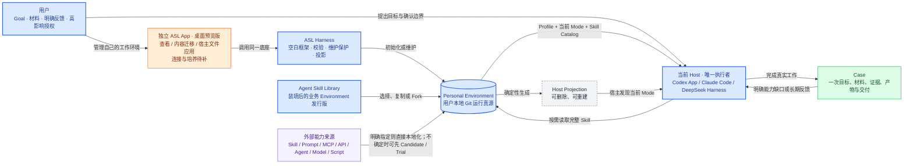

# View 1 · 系统上下文图

回答：ASL 在整个使用场景中处于什么位置，谁负责执行，什么是真源？

关键边界：Harness 不替 Host 执行业务 Goal。外部业务能力通过责任 Skill 本地化；宿主已有模型、工具和插件执行机制无需再包一层。用户明确要求“找来并融入”时，可以检查相关来源后直接采用，不必先跑 Trial 或效果 Case。具体阅读范围不由 Harness 统一规定。

---
