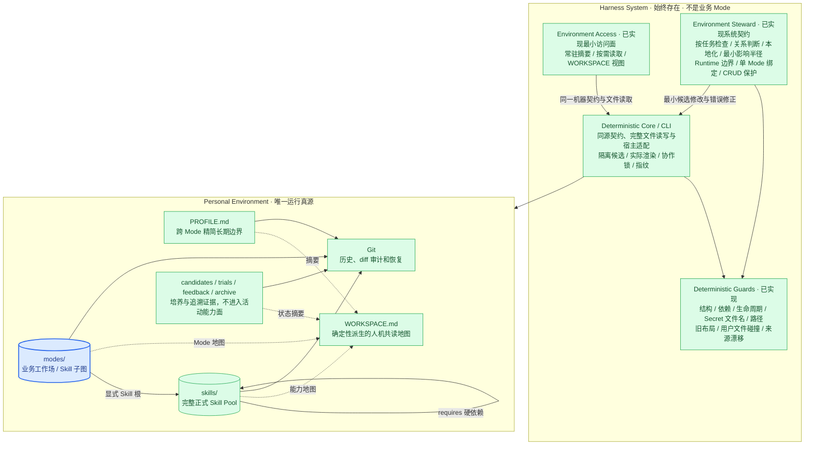

# View 2 · Harness 与 Environment 组件图

回答：空白 Harness 内有什么，个人 Environment 内有什么，两者怎样分工？

这里没有管理 Mode。能力发现、培养、增删改查保护和记忆访问属于 Harness 系统层；内容创作、产品分析和投资研究才属于业务 Mode。

CLI 是既有 Core 的机器接口，不是新增服务或业务调度层。App 与 Agent 的完整读写链和边界见 [View 2G](02g-agent-cli.md)；各内容 Environment 共用实现，但保持独立所有权。

Harness 的 Hook / Guard 只处理可确定的边界，不接管业务判断：

| 级别 | 处理方式 | 典型对象 |
| --- | --- | --- |
| 硬阻断 | 拒绝相应写入或投影，返回具体错误 | 结构非法、正式 Skill / Candidate 无来源、依赖缺失/循环、Trial 不完整、Secret 文件名、路径逃逸、覆盖非受管文件、受管内容指纹不符、固定 Workflow/Run 回流 |
| 软提醒 | 任务可继续，只提示应刷新或检查 | 缓存或可重建依赖、`WORKSPACE.md` 过期、宿主投影漂移、Candidate 未决定、上游出现新版本、两个 Skill 可能重合 |
| Host + 用户判断 | 不伪装成确定性规则；当前 Host 起草方案，高影响动作由用户授权 | 是否需要新 Mode、候选是否值得采用、Skill 应合并还是独立、是否发布或外部写入 |

这样既防止 Environment 漂移，也不会因为一个缺失字段、过期视图或语义不确定就阻断用户的普通 Goal。

---
