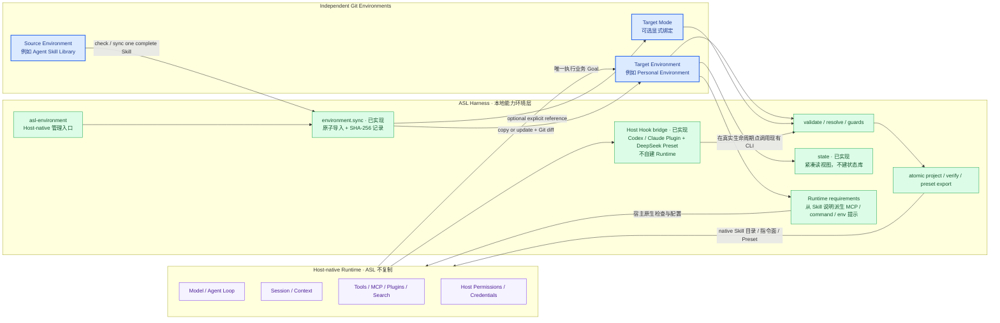

# View 2B · 原生 Harness 边界与 Environment Sync CLI

回答：ASL 怎样更像原生 Harness，而不是再造一个 Codex、Claude Code 或 DeepSeek Harness？两份 Environment 又怎样同步？



“更原生”不是让 ASL 拥有自己的 Agent Loop、会话数据库、工具执行器、权限系统或插件 Runtime，而是让 ASL 通过每个 Host 已经认可的 Skill、指令文件、项目目录和 Preset 接口工作。办公和研究场景里最常见的是 Skill、Tools、MCP、搜索和插件；模型、沙箱、凭据与授权继续使用宿主默认能力。ASL 只补宿主没有统一解决的个人能力环境、Mode、来源、本地采用、确定性校验和投影。

这套工作环境不是由一种技术单独完成，而是五个很薄的部分协作：

| 部分 | 在 ASL 中负责什么 | 不负责什么 |
| --- | --- | --- |
| Git Environment | 保存 Profile、Skills、Modes、来源和明确反馈，是可复制的个人能力真源 | 不运行 Agent |
| CLI | 安装、检查、同步、选择 Mode、生成或验证宿主视图 | 不理解业务、不调度工作流 |
| Host Adapter | 把同一 Mode 翻译成目标 Agent 能原生发现的 Skill、规则和 Preset | 不复制宿主已有 Tool、Agent、权限和模型 |
| Hook | 在会话开始、受管内容修改后或提交前调用现有 CLI 检查 | 不监控所有行为，不靠模型做 Review |
| GitHub Actions / CI | clone 或提交后运行同一组校验，保证仓库版本可用 | 不进入本地会话，不替代 Hook 或 Host |

以上是已有底座。产品入口已确定升级为独立 App：用户管理自己的多个工作环境，选择目标 Agent 并应用，或把培养过的环境分享出去。CLI 承担确定性操作，原生 Hook 提供检查时机，CI 守住仓库；它们是 App 复用的底层，不是要求普通用户自己操作的界面。

已有单 Skill 同步接口如下；本次仅更新架构设计，不增加后台服务：

```bash
asl-harness environment.sync \
  --source ./agent-skill-library \
  --target ./personal-harness \
  --skill x-post-card-studio \
  --mode creator-studio
```

| 行为 | 契约 |
| --- | --- |
| 来源与目标 | 都必须是可通过 `workspace.validate` 的本地 Environment；CLI 不负责全网搜索或 Git clone |
| 同步单位 | 一次同步一个完整 Skill package；不拆文件、不把 Prompt、脚本或 Runtime 裸同步 |
| Mode | `--mode` 可选；提供时只修改目标 Environment 的一个明确 Mode，其他 Mode 不变 |
| 相同内容 | 返回 no-op，不制造提交、投影或新版本号 |
| 目标不存在 | 完整复制 Skill，并保留 `SOURCE.md`、运行依赖说明、scripts、references、assets 与测试 |
| 目标已修改 | 默认拒绝静默覆盖并展示差异；只有用户显式选择替换时才更新 |
| 检查模式 | `--check` 只报告将新增、更新、冲突或保持不变的内容，不写文件 |
| 完成后 | 校验目标 Environment、刷新人机共读视图并输出来源/目标 HEAD、package SHA-256、受影响路径与 Git 状态；不自动 commit、push 或刷新所有宿主投影 |
| 失败 | Skill、Mode 引用与 `WORKSPACE.md` 作为一次事务回滚，不留下只复制一半的 Environment |

同步结束后，两份 Environment 仍是两个独立 Git 真源。再次运行命令可以显式吸收上游更新，但不会形成实时链接、共享 Skill 目录、后台 watcher 或自动升级关系。宿主投影仍由现有 `host.project` / `deepseek.preset.export` 单独负责。

### Skill 运行依赖与跨 Agent 接入

兼容信息留在责任 Skill 的正文和已有 package 文件内，不再保留独立连接层或空目录。跨 Agent 复用以完整 Skill、自带脚本、标准 MCP 服务为主。Skill 按需记录 MCP 名称、用途、检查方式、环境变量名称、宿主差异与缺失时处理。当前 Mode 的结构化配置只选择 Skill；后续 App 的可选模型偏好、内容关联与安装增量见 View 2E / 2F，不把设计中的配置说成目前可执行。

当前接入说明可识别 `SKILL.md` 的依赖/环境检查章节和 `SOURCE.md` 的 Runtime dependencies 记录，只提示去哪里看，不是依赖已安装、已登录或可执行的证明。Host 在实际使用某 Skill 时依据它自己的检查方法确认就绪；不批量安装，不运行集中式依赖调度器。尚未实现统一的自动就绪诊断。

Codex、Claude Code、DeepSeek Harness、OpenCode、Trae、ZCode 或其他 Agent 已经提供的模型、Tool、Agent、Plugin、沙箱和权限继续由各自管理。Harness 不复制它们，也不建立通用 Tool Registry。某个宿主能够原生接入 Skill 或 MCP 时，Adapter 只负责把同一份本地真源翻译到它认可的位置；不支持时给出可执行提示，不能伪装已经激活。GitHub Actions 不是交互式 Host，只复用 CLI 做仓库校验。

### 最小 Hook 接线

Hook 是宿主调用 Harness 检查的时机，不是新的工作流。会话开始、当前 Mode 相关文件写入后、停止前，复用当前 Mode 闭包校验与投影校验；全库 `workspace.validate` 留给维护与显式体检。候选、试验或无关 Skill 未写完不阻断日常 Mode。Codex 与 Claude Code 通过同一 Host Plugin 接线；DeepSeek Preset 装入官方 `@deepseek-ai/dsh-hooks-codex` 并通过命令参数指向自己的 Preset。没有 Hook 时可手动调用同一 CLI。

Hook 在写入工具完成后报告当前 Mode 的确定性结构错误，要求 Host 修复；不是事前撤销器，也不证明错误一定由本次写入造成。普通业务内容、可选 MCP、过期视图和语义问题不参与硬阻断。删除、发布、付费、登录、外部写入和权限继续由宿主原生门禁处理。

---
