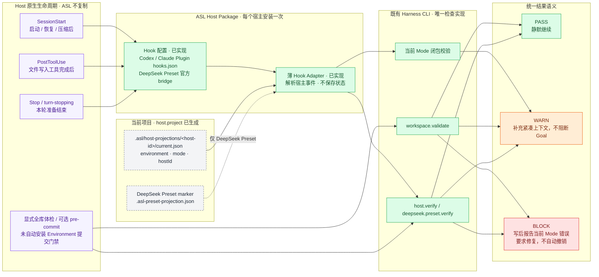
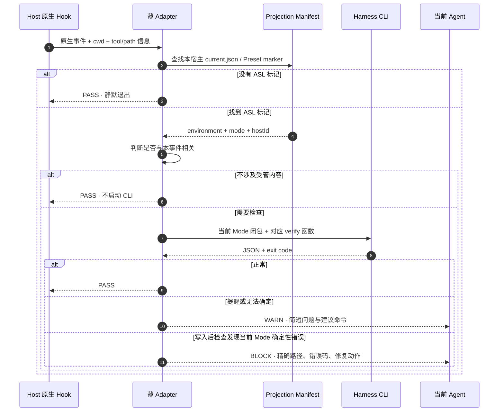

# View 2C · Host-native Hook 接线架构

回答：Hook 具体装在哪里、怎样找到当前 Environment / Mode、调用什么命令，以及结果怎样回到当前 Agent？

### 安装与激活边界

Hook 不属于业务 Mode，也不复制到每个 Skill。`asl-environment-host` 作为 Harness 的宿主包安装一次：Codex 和 Claude Code 由包内原生 Hook 配置调用同一薄 Adapter。DeepSeek Harness 不再重复实现一份 TypeScript Adapter；`deepseek.preset.export` 把同一命令 Hook 写进 Mode Preset，并用官方 `@deepseek-ai/dsh-hooks-codex` 将它接到 Cordis 生命周期点。Adapter 自身没有数据库、队列、事件日志或 Agent Loop。

项目入口从 cwd 向上查找 `.asl/host-projections/<host-id>/current.json`。DeepSeek Preset 导出时把已有 Preset 路径写入 Hook 命令的 `--preset` 参数，因此即使业务 cwd 在别处，也能读取 `.asl-preset-projection.json`；在 Preset 目录内也可直接发现该标记。没有项目标记时静默返回；显式指定的 Preset 标记缺失时提醒重建，不猜 Mode、不扫描电脑。仍只复用现有 environment、mode、hostId，不新增状态文件。

### 事件到检查的固定映射

| 原生时机 | Adapter 先判断什么 | 调用的既有命令 | 对当前 Agent 的结果 |
| --- | --- | --- | --- |
| `SessionStart`：启动、恢复、压缩后 | 项目标记或显式 Preset | 当前 Mode 闭包 + 对应 `verify` 函数 | 注入 Mode、Skill 数量和漂移提醒；失败不阻断启动 |
| `PostToolUse`：明确文件写入完成后 | 目标是否在当前 Mode 的 Skill、Mode、Profile、WORKSPACE 或投影 | 当前 Mode 闭包 + 对应 `verify` 函数 | 当前 Mode 确定性错误返回退出码 2；无关 Skill、培养区和普通产物不检查 |
| `Stop`：本轮准备结束 | 是否有 ASL 标记 | 一次当前 Mode 闭包 + 对应 `verify` 函数 | 只提醒，不循环阻止停止；没有跨事件状态、Shell 追踪或增量缓存 |
| 显式全库体检 / 用户自接 `pre-commit` | 用户主动运行 | `workspace.validate` | 仍严格检查全部正式与培养结构；未自动安装 Git Hook，现有仓库 CI 只运行 Harness 测试 |

不接 `UserPromptSubmit`、`PreToolUse`、`SubagentStart`、`SubagentStop`：意图识别和任务路由属于当前 Host；删除、Shell、发布与登录的授权属于宿主权限；子 Agent 继承项目表面即可。除非出现已经被真实任务证明无法覆盖的故障，否则不增加更多 Hook 点。

### 单次事件处理时序

### 三宿主实现映射

| Host | 原生安装面 | ASL 使用的事件 | 实现约束 |
| --- | --- | --- | --- |
| Codex App / CLI | `asl-environment-host` Plugin 的 `hooks/hooks.json` | `SessionStart`、写入工具的 `PostToolUse`、`Stop` | 使用 Codex 原生信任与 matcher；Hook 命令只调用薄 Adapter，不写 `config.toml`，不接管 PermissionRequest |
| Claude Code | 同一宿主包的 Claude Plugin Hook | `SessionStart`、写入工具的 `PostToolUse`、`Stop` | 使用 Claude 原生项目目录与退出码语义；不安装全局后台进程，不改用户已有 Hook |
| DeepSeek Harness | Mode Preset 内的 `@deepseek-ai/dsh-hooks-codex` | `agent/session-start`、`tools/post-execute`、`agent/turn-stopping` | `deepseek.preset.export` 写入专用 `asl-hooks.json`，命令显式指定 `deepseek-harness`；每个 Preset 在加载时绑定自己的配置，不依赖尚未实现的跨 Session 自动发现 |
| 无 Hook 的 Agent | 无 | 无 | 用户或 CI 手动运行同一 CLI；Adapter 不伪装自动保护已经启用 |

Codex 与 Claude Code 的 Hook 包装只负责把原生 stdin / 环境变量转换为 Adapter 参数；DeepSeek 的官方 bridge 把 Cordis typed event 转成同一套 Codex 命令 Hook 载荷。三者共享“定位投影 → 选择既有检查 → 映射 PASS / WARN / BLOCK”这条逻辑，没有新造跨宿主 Hook 语言。

### 门禁与失败语义

| 情况 | 结果 | 理由 |
| --- | --- | --- |
| 没有 ASL 标记、CLI 暂时不可用、可选 MCP 未登录 | PASS 或 WARN | 不能因为辅助 Harness 让普通工作无法开始 |
| Environment 已改变但投影尚未刷新、视图过期 | WARN | 给出 `host.project` 或视图刷新命令，由当前 Agent 或用户决定何时执行 |
| 当前 Mode 相关写入后发现非法引用、路径逃逸、Secret、损坏受管投影 | 退出码 2，要求修复 | 写后校验，不撤销已写内容，也不做语义裁决 |
| 内容质量不好、是否创建 Mode、Skill 是否值得采用 | 不判定 | 属于业务与用户判断，不是机械 Hook 能证明的事实 |
| Hook 自身超时、命令缺失或异常 | 依宿主原生 Hook 机制处理 | 尚未逐宿主验证全部异常语义，不能宣称统一 WARN 已验收 |

Hook 不单独保存运行记录。Codex、Claude Code、Cordis 使用自己的 Hook / Session 日志；ASL 仍以现有 CLI JSON、Projection Manifest 和 Git diff 作为可追溯证据。实现依据以宿主原生接口为准：[Codex Hooks](https://developers.openai.com/codex/hooks)、[Claude Code Hooks](https://code.claude.com/docs/en/hooks)、[DeepSeek Harness Hook Bridge](https://github.com/deepseek-ai/deepseek-harness/blob/master/packages/hooks/hooks-claude-code/README.md) 与 [Cordis Plugin Primer](https://github.com/deepseek-ai/deepseek-harness/blob/master/docs/cordis-primer.md)。

### 状态与操作记录

`state` 只汇总当前 Environment 的 Git HEAD、Skill / Mode 数量、Mode 闭包规模、培养区、提醒和能力视图状态。导入命令的 stdout JSON 是导入记录；项目的 `current.json` 与 Preset 的 `.asl-preset-projection.json` 是导出记录。三者复用 Git 与现有 manifest，不增加事件日志、数据库、watcher 或第二状态树。

`host.project --mode <id>` 切换的是项目磁盘上的 Skill 面和指令块，不保证正在运行的旧会话清除了旧上下文。Git HEAD 只记录来源；只有当前 Mode 的内容指纹变化才提醒重建。当前 Host 能唯一判断时可选择 Mode，实质歧义才询问用户，但完整的自然语言选 Mode 与会话刷新体验尚未验收。
