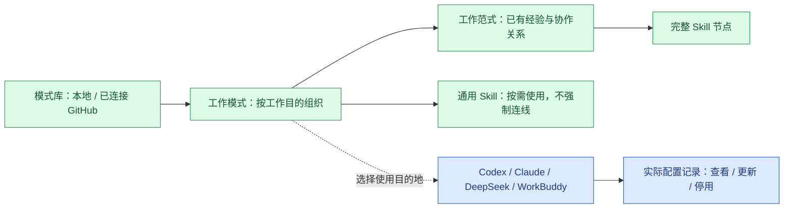
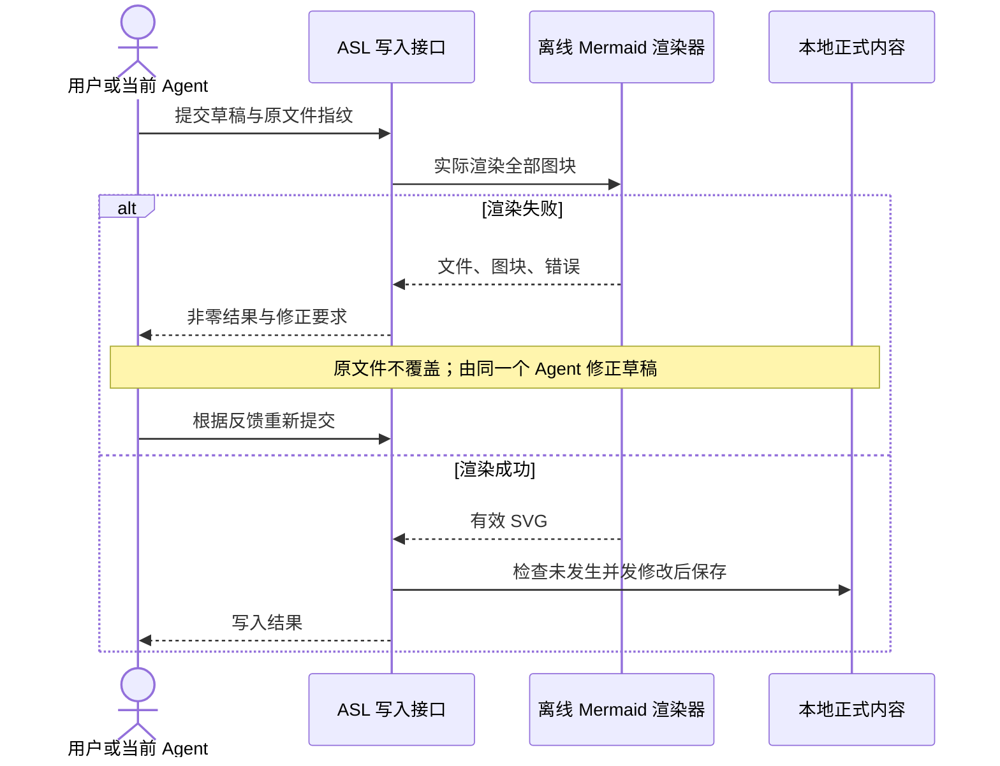
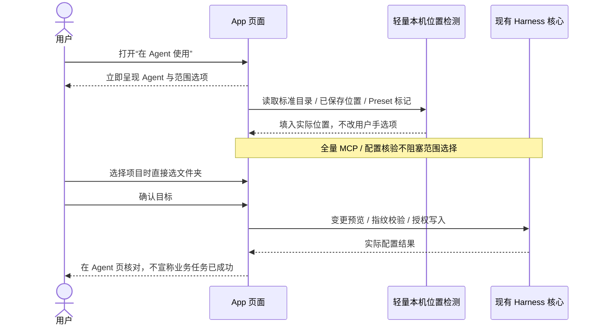
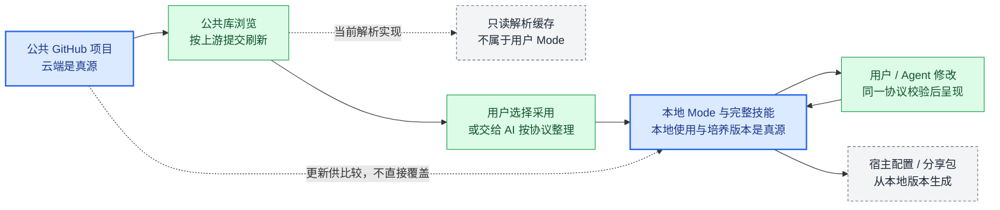
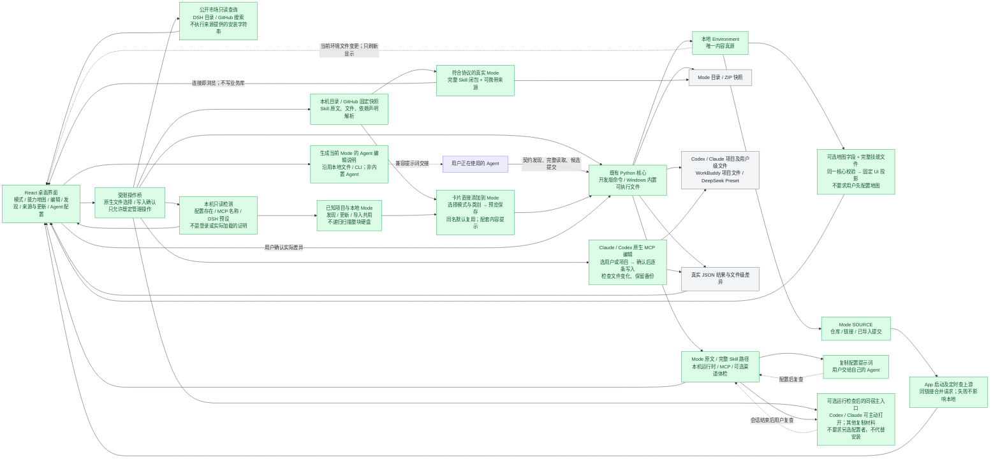
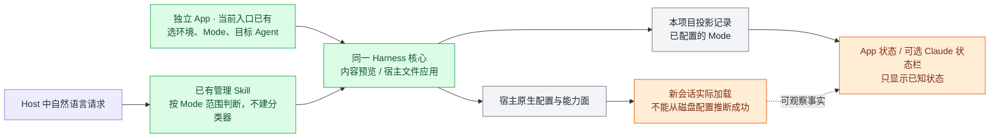

# View 2D · App 入口与 Mode 可见状态（同步及配置入口已有，完整运行验收与培养待补）

**用户不需要理解配置目录。** 打开 App 应先看到自己的工作场，以及每个工作场能做什么、有哪些资料和经验、哪个 Agent 能用、还缺什么连接。可以从空白环境开始，也可以导入已经培养过的 Mode；两者进入同一界面。

### 层级、浏览与使用是不同关系

**统一编辑入口：**新建、旧格式和已有 Mermaid 的 Mode 都进入 `ModeWorkspace`，技能成员及归属由现有协议模型维护，图由同一个原生 Mermaid 组件编辑。旧 YAML 关系只在草稿中投影，打开或取消不写盘；已有图保留原文。退出旧 React Flow 编辑器和专用布局器，不再自动生成坐标。切换与范式唯一同名的图时同步当前归属；无法明确匹配的原文图不猜分类。图中移出与 Mode 成员移除分别处理：最后一个成员引用移除时清理可无损处理的流程图节点；复杂语法无法安全处理则要求修改原文，不留下不可打开的技能引用。撤销重做包含图和成员，右键浮层属于当前编辑页，不触发离页保护。

**本机收敛：**实际迁移后只登记 `libraries/agent-skill-library` 为活动工作库，历史 Personal Harness 与写作检出退出日常入口；以下多库身份规则仍用于用户明确添加的其他库，不意味着重新要求两套本地真源。

**多图型与可读性：**流程图、时序图、状态图和思维导图沿用同一浅蓝视觉、字体及线条规则，仍由 Mermaid 原生布局；分组标题可以说明分类，但不是虚构的执行 Skill。默认采用可阅读原始字号，大图滚动浏览，用户主动“适应宽度”时才缩小为总览；悬浮缩略图按原有规则适应小窗。文字不能偏出节点，标签不能掩盖连线关系；拥挤时先缩短标签、调整原生方向或按主题分图，不叠加第二套图层。已用明确 Skill ID 关联的时序参与者、状态节点及思维导图节点可打开同一完整技能面板；复杂图原文编辑与基础流程图的原位编辑范围仍分别说明。

侧栏以模式库为父层、真实 Mode 为子项；进入 Mode 后查看范式和完整技能。范式是对工作方式的整理，同一技能可以参加多个范式，不为显示层级复制 Skill 文件；通用技能独立列出。Agent 是使用目的地，不是技能类别或新的 Mode 所属层。

**库身份与分类语义：**运行对象用完整 Environment 路径和 Mode ID 定位。本机内容目标是一套工作真源对应 GitHub，不强制个人库/公开库双份维护；历史 Personal Harness 与 Agent Skill Library 尚未合并前仍按真实目录隔离，不能按同名静默覆盖。从侧栏切库要同时切换数据身份和页面选择，不允许等待新库时继续操作旧库。工作模式导航和面包屑都回到列表，空选择不自动进入首个 Mode。会话缓存只复用该路径的已读目录，随后重新核对；保存仍受指纹保护，缓存不是内容真源。工作范式标签不跨 Mode 继承。通用能力只来自显式 shared，按可打开的技能卡呈现；无架构定义显示待定义，不把所有技能归为通用。Product Lab 的 Agent Reach 是跨场景检索能力，材料归档属于研究范式；不由前端关键词分类。

**侧栏稳定性：**注册顺序与最近使用分开，点击只改变选中项；后台发现的其他目录留在“发现”，不自动恢复已撤下的侧栏库。本地检出的真实 Git origin 与已连接 GitHub 唯一匹配时，云端入口归在对应库下，仍标明 GitHub；不同本地目录对应同一远端时先保持区分，不能以名称或导入的某个 Mode 来源冒充整库关系。该关联只负责浏览，不触发同步覆盖或上传。

连接公开仓库后直接显示其中的 Mode、技能关系与原文；仅浏览不创建业务副本。用户选择“保存到本地”或“在 Agent 使用”时才保存：同源本地 Mode 优先复用，多份同源副本让用户选择；没有同源副本则采用按仓库隔离的本地目录。只同名不当作同源。App 偏好仅记住所连接的仓库与上次浏览位置，缓存快照不成为可编辑真源。普通 Skill 仓库仍显示技能添加入口，不伪造 Mode。

仓库内 README、Skill 说明的语言及 Markdown 链接在 App 内浏览，可返回上一文档。完整解析后只读取已登记的只读快照；早期 README 沿同一仓库的公开文档接口读取，不允许链接变成任意本机文件访问。其他站点仍使用外部链接。来源页分别展示已连接仓库与本地 Mode 的上游关系：前者来自连接记录，后者来自 Mode 来源，不因尚未采用 Mode 而显示“未连接”。

启动时预读本机技能、模式位置、Agent 配置和 Mode 更新；已连接仓库用有界队列预读，与点击共享进行中的请求和最近成功快照。刷新失败保留原内容，不覆盖本地 Mode；未访问过的网络资料仍可能等待，不承诺离线实时更新或所有冷启动零延迟。

本机发现复用宿主标准目录、已登记项目和现有投影回执中的 Environment 引用。活动窗口定时有限刷新，不做全盘遍历；“发现文件”“核对配置”“真实任务成功”分别表达。添加本地或云端库统一放在“发现”；侧栏云端条目可右键移除连接，仅改偏好，不删除已采用的 Mode 或 Skill。Agent 页面按宿主列出真实位置及作用范围，更新使用该记录的原宿主和原目录，不进入默认 Codex 安装向导。已识别且完整的旧版 DeepSeek ASL 配置允许原位升级并保留备份；受管内容被改过仍需检查。项目与 Preset 停用走 `host.disconnect --check` 及指纹确认：仅归档已验证的 ASL 副本，去除对应指令区块，保留原库和其他原生配置；用户级停用复用 `host.user.sync --remove`。

界面保持固定导航与对齐的目录行；选中、悬停不改变缩进。复杂编辑和 Agent 配置进入独立页面。页面过渡仅作用于内容区，可立即继续操作；减少动态效果设置停用位移动效。参考 [Apple Design](https://github.com/emilkowalski/skills/tree/main/skills/apple-design) 的空间一致性与即时反馈，及 [OneTake](https://github.com/feitangyuan/onetake) 的连续性思路；不引入后者的非商业授权代码或电影式长转场。本轮视觉调研还参考 [Open Design](https://github.com/nexu-io/open-design) 的材质分区、[Taste Skills](https://github.com/leonxlnx/taste-skill) 的反模板化取舍，以及 Apple 官方 HIG 的 [layout](https://developer.apple.com/design/human-interface-guidelines/layout) / [motion](https://developer.apple.com/design/human-interface-guidelines/motion) 与 [Anthropic frontend-design](https://github.com/anthropics/skills/blob/main/skills/frontend-design/SKILL.md) 的版式与动效原则；只借鉴原则，不复制其代码、设计资产或品牌。具体设计推导不作为产品内文案展示。

**当前定义：一个 Skill 就是一个节点。** v0.4 用工作范式描述用途与协作方式；每个范式有名称、说明、技能成员及带含义的关系。图呈现已沉淀的组织逻辑，不是强制工作流。范式内一个完整技能只出现一次，多个关联连接同一节点；同一技能可参加不同范式，通用能力在独立标签下用无关系的原生节点呈现，不造固定顺序。名称和说明放在图外，不制造类别节点或虚拟执行步骤。

**阅读视图直接使用 Mermaid。** `MODE.md` 中的 Mermaid 代码块按标题呈现场景图；没有原文图时，只投影已有 v0.4 技能关系，不猜工作顺序，用户显式修改时才物化为同一文档的代码块。支持当前安装 Mermaid 版本的时序、思维导图、流程等原生图型；“发现 → 图示”提供明确标记的语法示例，不写入用户业务库。“全部技能”的范式入口展示对应关系图，不再重复一组技能卡。Skill 原文中的 Mermaid 直接渲染，没有语义图时可提供明确标注的“文档结构”标题导图，它不冒充业务思路。蓝白半透明外壳和缩放工具不改写图语义，不新增图数据库、运行层或强制 Workflow。

**复用官方实现，不自造 Mermaid 替代品。** App 与离线验收页共用已安装的 [Mermaid](https://github.com/mermaid-js/mermaid) 和同一安全渲染函数。正式内容写入先取得实际 SVG，不能只做语法解析或接收 Agent 自报通过。严格安全模式、外链与脚本限制、大小及时间限制保护渲染边界；异常不执行来源代码。原生图型不等于所有复杂图都已验收，实测范围见 View 9。

**人和 Agent 编辑同一份本地定义。** 中心显示官方 Mermaid SVG。单击已关联节点查看技能，双击节点或右键“修改名称”在原标签改字；未关联的可编辑节点及连线可直接点击改字。回车或离焦提交，Esc 取消，中文输入法组合期间回车不提交。空白右键搜索和添加已有技能；基础流程图四面连接点拖动连线，右键提供连接和移出，连线右键可删除。左下角缩放、适应及全屏工具操作同一画板。修改只回写选中的 Mermaid 语句，保留 ID、其他图及文档，不保存另一份自由坐标。Mode 图保存在 `MODE.md`，Skill 图保存在包内 Markdown 或 `.mmd` / `.mermaid` 文本；Skill 文件仍经文件编辑器修改。v0.4 YAML 定义正式成员、范式归属与通用能力；从库中添加已有技能将图和成员归属一起提交，不再复制文件。外部本机技能先经完整包导入门控，再加入 Mode；若后一阶段失败，已导入的库成员保留，不能宣称跨步骤原子写入。从图中移出只改图，不删除 Skill 或解除 Mode 成员。

**拖拽修改结构，由 Mermaid 重新排版。** 这是用户确认的编辑语义，不把任意图当成自由坐标画布；复杂语法和不能精确定位的语句保留原文入口，不猜测后重写。图中的工作关系不是强制执行流程。

| 图型 | 可视编辑范围 | 安全边界 |
| --- | --- | --- |
| 基础流程图 | 节点与连线文字、添加/移出、四面拖线 | 未支持的子图等复杂语法在原文修改 |
| 时序图 | 显式参与者左右重排、同分支消息/单行备注顺序、名称/消息/备注/条件原位修改 | 不跨分支搬移；含激活或动态创建/销毁时不拖动；参与者删除关联多条语句，须改原文 |
| 思维导图 | 节点名称、整个子树拖入新父节点；按 Shift 拖动调整同级顺序；右键添加子技能、移除分支 | 不移动/删除根节点，不形成祖先环；重复 ID 不猜对应节点 |
| 状态图 | 显式 `state "名称" as ID` 名称原位修改 | 不把位置变化冒充状态转移；转移结构仍改原文 |

编辑后的原文先经官方实际渲染，再交同一核心校验与指纹门控；编辑页复用原有撤销重做。缩放保持，背景刷新只更新数据，不因函数引用变化取消进行中的拖拽；主内容区进度浮层不参与排版，避免刷新提示把目标推走。具体发布及验收状态见总览 View 9。

**技能主视图与悬浮原图同处一页。** 点已关联节点后，完整文件目录、正文、脚本及包内架构在主区域打开；同一张图保持挂载，缩小到右上层并悬浮覆盖面板，不为其另留一整行。浮图仍可切换技能，“技能逻辑架构”恢复居中大图；减少动态效果时取消位移动效。复用完整包编辑器，不新增详情数据库。正文或脚本双击进入编辑，经指纹与 Mermaid 渲染门控保存，不执行脚本。无语义图时的标题结构默认折叠且排除 YAML 元数据；不臆造技能思路。仅有 `skill_<技能ID中连字符换成下划线>` 标识的作者图节点关联正式 Skill，其他普通 Mermaid 节点不凭名称猜测包身份。未保存内容离开前确认；初始读取不会阻断其他导航。写入期间暂停旧 SVG 操作与自身文件变化触发的重复读取，随后回读新指纹，避免刚保存又报过期。

**失败必须反馈，而非仅标记。** App 与 Agent CLI 均调用 `environment.edit`；包采用调用 `mode.import`。无效图返回非零退出码及 `error.details`（文件、图序号、代码块起始行、原始错误、修正动作），有效原文件不覆盖，草稿留给调用者修正并重试。Agent 指引明确要求处理反馈，不能删图、改成截图或直接写磁盘绕过门禁。ASL 不代替宿主启动模型；如果 Agent 直接使用其他工具覆盖文件，文件变化可被发现，但无法凭空知道或唤回原会话，不能承诺通用自动追问。渲染器不可用属于环境故障，不把它报告为图已经合格。

| 本地字段 | 用户 / Agent 可以改什么 | App 的固定边界 |
| --- | --- | --- |
| `spec.skills` | Mode 的本地技能成员 | 核心检查完整闭包；图中每个成员对应一个真实 Skill 节点 |
| `spec.architecture.nodes`（可选） | `skill` 引用，及可选 `title`、`note`、`icon`、`color` | 只保存显示覆盖；没有覆盖的技能仍显示。不得重复引用、引用其他 Mode 的技能或添加非技能节点；不接受 `parent`、另一个节点 `id` 或执行脚本 |
| `spec.architecture.shared` | 当前 Mode 各范式按需使用的通用技能 | 不与范式成员重复，不强制连线；与范式成员共同覆盖完整技能闭包 |
| `spec.architecture.paradigms` | 范式 ID、名称、工作说明、技能成员和关系 | 范式非空且全部引用本 Mode 技能；一个技能可参加多个范式，底层文件不复制 |
| `paradigms[].edges` | `from`、`to` 引用该范式的技能，`label` 说明关联含义，可选 `condition`（1–160 字）、`sourceHandle` / `targetHandle`（上、右、下、左） | 两端不同、有序对不重复；允许反馈环；`condition` 不存在或为 1–160 字，不接受只有空白的值。移出成员清理失效关联和空范式，不删除 Skill 包。旧版全局 edges 仅用于读取待升级定义 |
| `architecture.layout`（可选） | 按范式或 `shared` 保存技能坐标 `{x, y}`，可选，只为视图 | 只决定节点摆在哪，不编码执行顺序；成员移出后对应坐标一并清理；核心检查坐标范围并拒绝非成员键 |
| `spec.capabilities`（可选） | 类别 `title`、`skills`、`icon`、`color` | 可选分类数据；不产生架构节点、连线或执行顺序，条目仍在单一技能入口内显示 |
| `icon` / `color` | emoji、内置图标、基础 SVG；六位十六进制颜色 | SVG 拒绝脚本、事件、外链及任意 CSS。图标作为隔离图片；节点文字与边标签按文本渲染，不执行用户图代码，画布不加载外部图形运行时 |

不保留 `spec.presentation.layout` 或两套图类型配置；架构与成员保存在同一份 `mode.yaml`。新 Mode 必须具有结构定义，可由人或 Agent 编辑，不要求用户亲自画图。旧 Mode 可读取，明确提示待定义，不伪造范式。

这些定义随 Mode 导入、导出和复制，不锁在 App 偏好中。App 的独立编辑页面先通过同一核心检查；不合法时给出错误并保留输入。直接改文件后，打开的 App 监听当前环境的 `modes/`、`skills/` 与 `PROFILE.md`，合并通知并重新读取；不做全盘扫描，不修改文件。编辑页面打开时延后刷新，原文件已改变则拒绝旧草稿覆盖。无效结构保留上次有效界面并提示修正，不伪装成已经生效。App 关闭后没有额外常驻监听服务。

“交给 AI 整理”是提示词入口：用户可补充工作目的、勾选本机技能目录、添加允许参考的项目或记录目录，再复制给正在使用的 AI。它提供现有 Mode / Skill 文件路径与字段定义，按需读取，不把全库原文一次塞进上下文。全局入口可整理多个场景或建立新 Mode，图内入口只调整当前 Mode；空环境提供最小文件结构。附 `environment.catalog`、`skill.files`、`environment.edit --check` 和校验修正方式。便携版直接指向随包核心，避免误用旧 CLI。App 不自动启动模型、CLI 或整理任务，不默认读取私人日志；AI 直接修改本地文件后，App 监听或手动刷新呈现。复制提示词不代表 AI 已整理成功。

**在工作模式里增减技能。** “添加技能”内提供本地库成员管理、GitHub 解析与本机技能扫描；从此入口发现的技能预选当前 Mode。移出 Mode 只解除引用，保留 Skill 文件。技能详情的“文件与结构”显示包内说明、脚本、参考资料和资产；可以查看及编辑不超过 1 MB 的 UTF-8 文本，二进制 / 大文件只显示文件信息并保留。保存经过完整包结构检查与过期指纹保护，不执行脚本，也不在此新增文件删除入口。Windows 纯 CRLF 文件编辑时保留其换行格式。

**入口与本地维护：**首屏主入口“从这台电脑开始”提供上述整理提示词；连接模式库支持 GitHub、本地目录与分享包，先支持 Agent Skill Library 和现有 ASL 包，不扩建市场。不预装个人模式，也不注入开发者电脑的技能库路径。公开仓库固定一个提交后直接浏览真实 Mode、能力类别和完整技能闭包；选择保存或使用才导入。云端保存按仓库分开本地目录；已有同源 Mode 可复用。普通包仍可导入现有环境，空环境使用 App 用户目录下的 `workspace/`。取得整理提示词本身不创建业务文件。普通 Skill 仓库仍走选择技能、添加到现有 Mode 的入口，不把任意仓库猜成工作模式。

**公共库与本地 Mode 是两条更新路径（2026-09-29）：**蓝色是用户确认的所有权边界，绿色是已有操作，灰色是可重建内容。连线表示内容流转，不是业务执行顺序。

**公共库浏览：**打开即读取所选云端来源，不要求先导入本地工作环境；正在浏览且未编辑时每 5 分钟检查，回到窗口时超过该间隔也检查，新提交更新云端视图，不写本地 Mode。网络失败保留上次结果并可重试。当前解析仍使用只读下载缓存，尚非完全无磁盘缓存的远端读取，也不是 GitHub 推送式实时通知。公共库不必本地优先；缓存不得改变这一边界。

**本地 Mode 的来源追踪：**每个从云端采用的 Mode 在可选 `modes/<id>/SOURCE.md` 内保存一个受管区块：仓库、原始链接、采用时的 commit。保留文件已有来源与许可文字；不增加数据库或每技能附属配置。该记录随 Mode 分享包一起迁移；`MODE.md` / `mode.yaml` 的业务语义与本地真源地位不变。启动、运行期间每 15 分钟及从休眠恢复后检查上游；同链接的 Mode 合并请求，也可手动刷新。检查仅查询提交，不每次下载整库；界面区分没有新提交、上游新提交、网络失败，失败不影响本地使用。固定 commit 链接继续固定该版本，不擅自改跟默认分支。App 关闭后不启动额外常驻服务。

**实现参考：**[Claude Code 插件市场](https://code.claude.com/docs/en/discover-plugins)将市场更新与当前会话加载版本分开；ASL 借鉴这种分离，不把它的插件自动更新规则照搬成本地 Mode 自动覆盖。陌生仓库的提示词传递来源 URL、固定提交、只读文件线索、目标 Environment 和 ASL 校验入口；用户确认目的后由现有 Agent 理解与整理，App 不启动新模型、不执行仓库安装命令。「查看整理结果」读取真实目标并校验，失败留在编辑页供修复。

**更新与本地修改：**“上游有新提交”不是“这个 Mode 已变化”的保证，用户查看 Mode 差异时才下载并生成实际包预览。预览显示变化的 Mode / Skill 与受影响模式，内容一致的部分不重写；同名差异默认不替换，用户明确勾选才采用云端版本。导入计划包含指纹，确认前本地内容或包发生变化要重看预览。不会自动三方合并、推送用户修改、删除上游已移除的本地技能，或连带刷新已应用的宿主；更新后需再次应用到所选 Agent。源码仓库删除 Mode 时也不静默删除本地副本。

比较时区分正文变更、增加文件、本地独有文件、纯换行差异与仅 Mode 上游记录更新。CRLF / LF 差异不再触发替换冲突，也不重写本地文件；其他文本显示文件级差异，长差异明确截断，二进制 / 大文件提示本地核对。用于拒绝过期编辑的指纹仍按原始字节计算，不因为比较忽略换行而放松覆盖保护。

**默认安装体验：**Codex / Claude Code 默认选择当前用户范围，自动定位宿主标准目录；项目配置入口直接选择文件夹，自定义用户目录收进高级设置。配置完成后进入对应 Agent 页核对记录，不自动弹出安装助手。DeepSeek 优先使用本机非 ASL 的标准基础 Preset，可展开更换；未发现时明确要求选择。新预设写入 `.dsh/.agent-presets/asl-<mode>/`，同名非受管预设不会覆盖。WorkBuddy 只支持项目范围。用户级安装不保证隔离宿主其他已有技能。

**当前桌面版实际可以做：**连接现有技能库或内置示例，显示真实 Mode、完整技能与引用关系；创建、编辑、复制、归档 Mode，编辑 Skill、添加完整 Skill 并加入 Mode。能力类别可新增、改名、删除、重新归类，删除类别不删除技能。保存前显示涉及的模式，过期编辑拒绝覆盖，归档保留完整目录。还可预览并导入 / 导出 ASL 环境包；浏览 DeepSeek 社区插件目录、GitHub 搜索结果；扫描本机技能目录；粘贴 GitHub 链接后读取文件、原文与依赖声明，从卡片直接选择 Mode 添加。配套内容保留提醒，同名默认复用库内版本。选择项目可生成 Codex / Claude / WorkBuddy 文件投影，或基于已有 DeepSeek Preset 导出新 Preset。未检测的连接不显示为零，文件配置不等于会话生效。标准 Skill 不必具有 ASL 专用的“完成标准”标题；仅在导入副本补充来源，不改上游方法正文。复杂仓库的自主拆分、安装和对话式融合尚未实现。

**归类不是自动匹配。** 产品展示与验收使用真实 Agent Skill Library，不把人工准备的演示分类当成 App 的理解能力。以下机制必须分开：

| 用户看到什么 | 当前实际来源与检查 | 不代表什么 |
| --- | --- | --- |
| 一个 Mode 包含哪些技能 | 读取 `modes/<id>/mode.yaml` 的 `spec.skills`，再解析 Skill 的 `metadata.asl.requires`；核心检查技能存在、依赖完整与路径边界 | 不是 App 根据任务自动选好了技能；成员最初由人或被授权的 Agent 明确维护 |
| 技能列表、直接加入 / 依赖带入 | 原样呈现核心返回的成员与依赖；架构图只画本地明确维护的技能关系，不把软件依赖转换成工作关系 | 不推测执行顺序，不用关键词改变成员 |
| 全部技能与可选分类 | 全部技能读取 Mode 的 `paradigms` 与 `shared`；辅助类别读取 `spec.capabilities`，未定义则显示未分类 | 不根据关键词猜分类，不把手工定义说成 App 自动理解；定义随 Mode 分享，没有额外清单文件 |
| 本机能否使用 | 检查原始依赖声明、工具路径、配置文件和受支持的体检结果 | 不把文件存在、目录存在或导出成功等同于实际任务成功 |

例如真实 `creator-studio` 显式列出 19 个技能，包括 Agent Reach、宝玉配图及公众号排版；`product-lab` 列出 6 个技能，其中也有 Agent Reach。共享来自两份 Mode 的明确选择，不是 App 临时跨模式召回。当前没有“理解需求 → 自动归类 → 自动加入 Mode”的产品功能。内置小示例仅用于初次查看且只读；编辑前须导入为独立技能库，不在安装目录改示例。

**当前用户同步：**应用弹窗可选“仅这个项目”或“我的所有项目”；后者不是整台机器所有用户。一个宿主选择一个 ASL 默认 Mode，但项目显式 Mode 与用户当前请求优先，宿主已有其他技能不会被屏蔽。预览新增、更新、移出与冲突；只管理自己复制的完整包，切换或停用不删原技能源。同名未受管内容或被修改的副本会拒绝覆盖。修改技能源后需主动再同步，不运行后台全盘监听器。

**安装位置：**项目级选择项目文件夹，ASL 写入该项目的原生技能目录与指令文件；用户级显示当前 Agent 的真实用户技能目录，并允许另选文件夹。Codex 默认是 `~/.agents/skills`（共享原生目录，其他支持它的 Agent 也可能读取），Claude 默认是其配置目录下的 `skills`。`CODEX_HOME` / `CLAUDE_CONFIG_DIR` 用于识别宿主配置位置，不把项目路径当成用户配置。另选技能文件夹只改变 Skill 副本位置，原生指令仍在真实配置目录；界面显示“还需关联”，配置助手再核对宿主的原生关联方法。已有受管 Mode 时先停用原目录，避免静默留下两份启用副本。存放成功、原生可发现、实际可用是不同状态。

安装交互参考 [Vercel Skills](https://github.com/vercel-labs/skills)：先选 Agent，再选项目 / 用户范围；`npx skills add` 的项目范围默认是执行命令的当前目录，App 则用文件选择器明确选择，不要求用户掌握终端。目录识别参考 [CC Switch 的技能同步实现](https://github.com/farion1231/cc-switch/blob/main/src-tauri/src/services/skill.rs)，但不引入另一套技能登记库。原生目录依据 [Codex host roots](https://github.com/openai/codex/blob/main/codex-rs/ext/skills/src/host_roots.rs) 与 [Claude 配置目录](https://code.claude.com/docs/en/claude-directory)；不将“只选 Codex”承诺成共享目录的跨 Agent 强隔离。

**WorkBuddy 项目入口：**选择项目后，完整 Skill 写入该项目的 `.codebuddy/skills/`，Mode 指令写入 `.codebuddy/CODEBUDDY.md`，沿用已有投影校验和受管文件保护。原生目录与 [WorkBuddy 项目文档](https://www.codebuddy.cn/docs/workbuddy/From-Beginner-to-Expert-Guide/Function-Description/Project) 及本机 5.1.0 CLI 的 SkillsProvider 已核对；不显示用户级安装选项，不接管 `.workbuddy-ai` 的账号或模型。项目记录可以保留，但不能据此声称 WorkBuddy 已执行过任务。

**发现与添加的边界：**本机只扫描已知 Agent 技能目录或用户选择的目录，按真实路径去重；不扫描整块磁盘，不把同名当成同版本。GitHub 读取仓库 / 目录链接，先固定 commit，再只读解包；识别 ASL 仓库时默认只展示正式 `skills/`，不混入归档。每张技能卡片都有“添加到 Mode”，选择目标 Mode 和可选类别，预览影响后保存；“查看解析”只是辅助入口。脚本、终端命令、安装声明和共享依赖只触发配套内容提醒，不再隐藏添加按钮；只导入所选 Skill 目录，不自动复制目录外依赖、拆分仓库或运行安装脚本，既有路径、链接和结构校验仍保留。添加不等于可运行；连接 Agent 后仍需重新应用模式和检查运行环境。库中有同名 Skill 时默认复用库内版本，不覆盖已有修改；用户可以显式选择本次发现的版本替换，预览所有受影响 Mode。卡片显示库内版本所在的 Mode，点击名称进入管理；这不是两份内容相同的证明。解析是静态线索，不是完整语义理解、独立性证明或运行验收；当前不做对话导入 Agent。下载暂存不成为技能真源，不进入分享包；来源保留具体 commit 与许可记录。

**安装与运行检查分开。** App 核心直接把 Mode 配置到所选 Agent，无需另选 AI 代为安装。“检查依赖”是可选后续操作，检查原始依赖声明、工具路径与 MCP 名称，支持 Agent Reach 的渠道 doctor；不会把“存在”当作“可用”。需要 AI 处理时，只提供目标 Agent 自己的入口，不借另一个宿主代配。Windows Codex / Claude 的原生启动入口已有；DeepSeek / WorkBuddy 当前仅能复制材料给相同目标，直接启动尚未接通，不能写成已支持。继承宿主的模型、账号与权限，不迁移秘密、升级宿主或接管登录。会话结束仍须检查实际结果。

界面没有远程页面、Node 权限或任意 Shell 入口；主进程核对调用来源与用户选择的路径，业务执行仍归目标 Agent。无需一个常驻后端服务，也没有另建索引数据库。

**App / CLI 同源：**机器调用契约、文件读取与正式写入详见 [View 2G](02g-agent-cli.md)。普通保存只调用一次正式 `apply`，避免丢弃一次验收结果后再次完整渲染；需要决策的导入、归档和宿主配置保留真实预览。CLI 的错误码、定位与修正信息传到 App，默认短提示、详情可展开，失败草稿保留。渲染成功与业务关系正确分别判断，不让界面创造未定义的技能关系。

| 界面 | 展示与操作 | 不让用户承担什么 |
| --- | --- | --- |
| 工作环境 | Mode 卡片、工作范围、当前项目；进入、复制、编辑、分享 | 不把工作环境强行画成顺序步骤 |
| 能力地图 | Mode 内 Skill、资料、明确经验；点开能看内容、来源、依赖和引用者 | 不展示后端事件树，不凭模型猜测生成关系 |
| 添加能力 | 粘贴仓库链接或描述所需能力；选择目标 Mode；预览安装、连接与影响 | 不要求手写每 Skill YAML；明确要求安装不先跑业务效果试验 |
| 模型与连接 | 识别宿主已有配置，选择可用模型，补缺失连接 | 不重新建立另一套账号或代理系统 |
| 分享与更新 | 选择内容、查看排除项、导出；更新看本地修改与上游差异 | 不导出整台电脑配置，不自动盖掉个人调教 |
| 培养记录 | 看见明确反馈改了哪里，接受、更正或撤回；按需寻找新能力 | 不把沉默、耗时或所有聊天变成永久记忆 |

**显示不等于生效。** Ponytail 的本机状态栏通过插件标记展示级别，给 ASL 的启发是“让工作状态可见”，不是复制一个全局开关。ASL 从现有项目投影读取 Mode，不能再造一份互相打架的活动状态。Claude 可选追加原生 statusLine，保留已有状态栏；DeepSeek 使用原生 Preset 名称；Codex App 的同等常驻展示需实机验证。独立 App 是三者共同的管理入口，不依赖它们都有相同状态栏。[Ponytail 状态栏实现](https://github.com/DietrichGebert/ponytail/blob/main/hooks/ponytail-statusline.ps1)、[Claude 原生状态栏](https://code.claude.com/docs/en/statusline)。

**旧会话不强行改造。** DeepSeek 已开始的会话不能换 Preset；Codex 插件安装后需要新会话加载。App 应提供“用此环境开始新会话”，让旧任务继续保留；宿主不提供启动接口时打开对应项目并给最短操作提示。可以携带用户选择的交接摘要，不声称迁移全部聊天历史或强行控制现有对话。[DeepSeek Preset 边界](https://github.com/deepseek-ai/deepseek-harness/blob/master/packages/preset/agent-presets/README.md)、[Codex 插件](https://learn.chatgpt.com/docs/plugins)。

---
