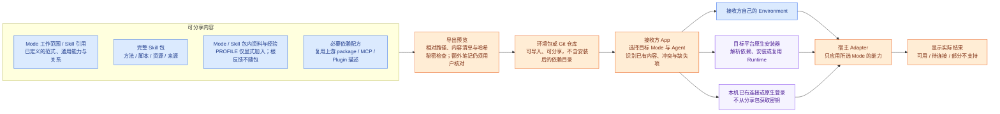

# View 2E · 可迁移环境包与复杂能力安装（内容往返已实现，原生安装待实现）

**分享的是“工作环境配方 + 用户选择的内容”，不是已安装电脑的备份。** 配方描述需要哪些能力以及怎样接到宿主；内容保留可编辑文件。接收者用自己的模型账号，在自己的电脑上装好实际依赖。

### 当前可运行的最小包

`mode.export`、`mode.inspect`、`mode.import` 已实现目录 / ZIP 往返。根目录采用 [Agent Plugins 1.0 的 manifest 与布局](https://agent-plugins.org/specification)：`plugin.json`、`skills/<id>/`；ASL 专有内容放入 `io.github.qihangzhang-272.asl/`，不污染通用字段。

```text
creator-studio.zip
├── plugin.json                 # 标准元数据；ASL 扩展记录版本、Mode、文件哈希和执行位
├── skills/<skill-id>/           # 仅当前 Mode 闭包，完整方法、来源、脚本与资产
└── io.github.qihangzhang-272.asl/
    ├── modes/creator-studio/    # 完整 Mode：定义、来源、图、参考资料与脚本
    └── PROFILE.md              # 默认没有；明确 --include-profile 才加入
```

```sh
asl-harness mode.export --workspace ./environment --mode creator-studio --output ./creator-studio.zip --check
asl-harness mode.export --workspace ./environment --mode creator-studio --output ./creator-studio.zip
asl-harness mode.inspect --source ./creator-studio.zip
asl-harness mode.import --source ./creator-studio.zip --target ./received --check
asl-harness mode.import --source ./creator-studio.zip --target ./received
```

- **内容不丢、范围明确：**依赖清单与脚本作为 Skill 内容保留；所选 Mode 的完整目录也随包保留，包括 `.mmd`、参考资料与笔记。不打包 `.git`、`node_modules`、虚拟环境、缓存或其他 Mode；Mode 内的额外内容不能被默认为公开，导出者须检查预览清单。PROFILE 仅在明确 `--include-profile` 时加入，导入已有环境也不覆盖接收者自己的 PROFILE；根目录 `feedback/`、`candidates/`、`trials/`、`archive/` 不在当前 Mode 包导出范围，不能把 App 的记录入口理解为自动分享记录。导出预览列出文件、依赖描述和疑似本机路径，不偷偷改写技能。
- **读已有声明，不另造配置：**包预览直接解析 `package.json`、`pyproject.toml`、`requirements.txt` 与 `mcp.json` / `.mcp.json`，显示基础直接依赖、MCP 服务名、环境变量名称和准备脚本名称；不返回账号值、服务地址或安装脚本正文。未支持的包管理格式与锁文件保留原文件供查看；动态、构建和可选依赖不冒充已完整解析。声明损坏只显示提醒，不阻断完整内容迁移。所有结果仍标为“未检测安装状态”，不执行 `postinstall` 或自行启动服务。
- **预览与写入分开：**`--check` 不改目标；同名不同内容列为冲突，只有显式 `--replace` 才替换；报告受影响的其他 Mode。已有目标采用携带预览 `fingerprint` 的 `--expected`；确需替换时，预检和采用均加 `--replace`，采用仍会验收最终候选。复用既有回滚保护，导入新目录先暂存，成功才落位；相同内容重复导入不制造变更。stdout JSON 是操作回执，不新增日志数据库。
- **可核对不等于可信：**逐文件 SHA-256 检查缺失、篡改和夹带；拒绝越界路径、符号链接、大小写冲突、恢复路径碰撞及明显秘密。ZIP 限 10,000 文件 / 512 MiB 展开内容，避免无界解包。哈希不是签名，文本秘密扫描也不是隐私认证；导出者仍需检查分享内容。旧版格式保持兼容，不靠增加一套包装版本解决完整目录往返。
- **兼容范围不夸大：**这是 ASL 快照读写器，采用通用包装，不是完整 Agent Plugins 客户端认证。不直接把 ZIP 交给 DSH 或 Claude；导入为本地 Environment 后继续走现有宿主适配。当前未实现通用第三方插件采用、MCP 转换或原生运行依赖安装，`runtimeStatus` 明确是 `not-checked`。

参考 [Hermes plugin_packs.py](https://github.com/NousResearch/hermes-agent/blob/main/hermes_cli/plugin_packs.py) 的预览、已有配置优先、秘密与权限不随包迁移；保留 ASL 本地完整内容，不照搬其只凭 Git 安装记录导出的限制。没有复制 Hermes 源码或加入其运行依赖。

公开仓库的持久只读快照只供浏览和续读，不作为可迁移 Environment 或本地 Mode 真源。采用时仍经解包、来源与完整包写入校验；目录阅读对局部坏条目的隔离不降低导出／采用门控。App 的“偏好与记录”与 CLI 编辑的是原有本地文件，不新增分享清单或自动发布入口。



### 内容与安装怎样分开

| 遇到的东西 | 放在哪里、怎样迁移 | 不做什么 |
| --- | --- | --- |
| 普通 Skill | 方法、脚本、资源、来源完整进入本地 Skill；Mode 显式引用 | 不只复制 SKILL.md，丢掉脚本和图片 |
| Agent Reach 一类复杂能力 | 本地 Skill 说明负责业务用法；Python/Node 包、命令、MCP、登录需求复用原生声明和检查；App 编排安装与连接提示 | 不把 node_modules、venv、浏览器登录态打进分享包 |
| DeepSeek Bundle | 保留包名、版本与必要配置，交 DSH 插件管理和包管理器处理；按需要装入所选 Profile | 不把 Cordis 专用代码说成可在所有 Agent 运行 |
| 已有宿主 Plugin / MCP | 先检查目标宿主是否已有并可用；缺失才提议原生安装；项目相关配置关联责任 Skill | 不复刻宿主内置工具，不另造 Bindings 资产层 |
| 个人资料与经验 | App／CLI 受控编辑原 PROFILE 与反馈；PROFILE 可显式加入包，根反馈当前不导出；Mode／Skill 内笔记随完整包保留，须主动检查 | 不默认分享个人偏好或根反馈，不自动筛选包内笔记的公开性，不迁移全部历史 Case 或聊天 |
| 模型（关联仍为设计） | 必要能力要求可写在现有说明中；机器可读模型偏好尚未接入，接收方沿用自己的提供商和账号 | 不分享 API Key，不承诺订阅账号可转成通用 API |

不新增每 Skill 必填 sidecar。优先读取现成的 package.json、pyproject、MCP / Plugin manifest；只有无法表达的必要宿主差异，才补进责任 Skill 的说明或原生配置片段。**自动安装不能靠任意自然语言直接变成 shell 命令**：管理 Agent 可起草安装方案，但执行端只接受已支持的包管理、配置和连接操作。未知安装方式显示“需人工步骤”，不编造成功。新包包含安装脚本时显示其本机执行影响；用户指定采用不需要先证明业务效果。

**同一个依赖可以装一次，但不因此在每个 Mode 都暴露。** 移除 Mode 中的能力先解除引用；仍有其他 Mode 使用的 Runtime 不随之卸载。对于只能全局启用的宿主插件，明确标为共享宿主能力，不能宣称已经实现 Mode 级强隔离。

**现有协议与后续增量分开：**沿用 Environment / Mode / Skill；当前 `mode.yaml` 的机器可读 `spec` 接受 `skills`、`capabilities` 与 `architecture`，`skills` 必填，`capabilities` 可选；v0.4 必须以 `spec.architecture.shared` 与 `spec.architecture.paradigms` 定义通用能力和范式，旧版按既有兼容规则读取。可选内容关联、模型偏好及更多宿主扩展仍是设计，不按已支持字段使用。导出沿用版本化文件清单、相对路径、内容指纹与原始依赖声明，不编造已安装版本或运行通过。业务 Mode 不增加 plane 或人工 revision 字段；分享者本机投影、绝对路径与登录配置不是可迁移真源。

### DeepSeek 的天然优势与不能直接复用的部分

- **Bundle 是可发布的插件包，Profile 是运行时装配配置，Preset 是会话工作环境。** ASL Mode 最接近 Preset；不把一个人的全部 Environment 或每一个 Mode 都等同于 Profile。Profile 能供多个 Preset 共用，只有原生依赖确实冲突时才考虑拆分。
- 官方通过 npm 包中的 dsh.bundle.patch 贡献插件组合，Profile 的 bundle 列表和本地补丁完成装配；普通依赖包安装后不一定激活。配置行替换并非通用深合并，适配器需遵循原生语义。优先使用预构建发布包，减少用户本机编译。[官方发布与安装设计](https://github.com/deepseek-ai/deepseek-harness/blob/master/docs/user/develop/basic/publish.md)
- Preset 可以复制完整目录并隔离每会话的能力组合，但复制后是快照，不自动吸收原版修改；插件热插拔也不等于已开始的会话可以随意换 Preset。ASL 的增量是跨宿主环境管理、差异更新和迁移，而不是重写 Cordis。[官方 Preset 设计](https://github.com/deepseek-ai/deepseek-harness/blob/master/packages/preset/agent-presets/README.md)
- 社区市场将插件目录与 UI 分离，显示安装、兼容与更新状态。可借用其目录维护方式，但“被收录”不代表安全或业务质量认证；其配置备份可能含敏感信息，不能作为我们的默认分享格式。[dsh-market](https://github.com/dsh-market/dsh-market)、[社区插件目录](https://github.com/awesome-dsh-plugin/awesome-dsh-plugin)
- 本机社区 DSH Desktop 公开了 desktopProfiles 与 desktopPnpm。可以做一个原生 ASL 管理入口，但 Profile 切换会重启，不是静默热切；包操作接口也不自动替我们做回滚和结果验证。这些是该 Desktop 的接口，不是所有 DSH 发行版都有。[公开插件服务](https://github.com/anywhere-labs/deepseek-harness-desktop/blob/master/dsh-plugin-desktop/docs/plugin-services.zh.md)

**本机投影与分享包已经分开。** `deepseek.preset.export` 继续生成带本机路径的 Preset；`mode.export` 不复制这些投影标记。已验证分享包导入另一个目录后重新投影到 Codex 项目，引用接收目录而非发送目录；这是文件接入验收，仍不等于新会话运行或复杂依赖已就绪。

---
