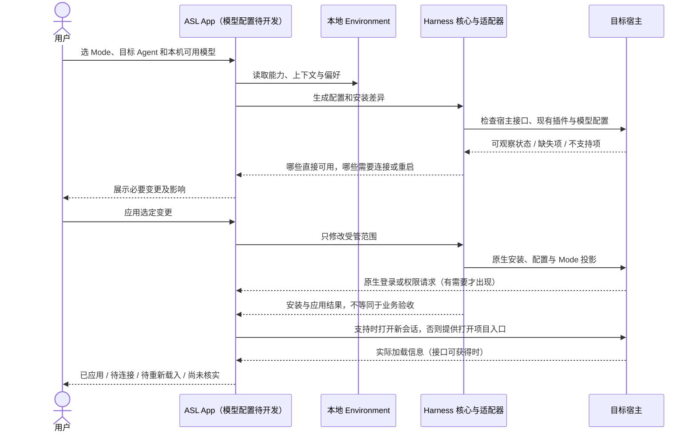

# View 2F · 模型配置与跨宿主应用时序（设计，待实现）

Mode 是“做什么工作、采用哪些能力”；Model 是“由哪个模型做”。用户在 App 里可以一起选，底层必须分清：

| 信息 | 归属 | 举例 |
| --- | --- | --- |
| 工作环境偏好 | Mode，可选随包分享 | 偏好某模型；确实需要看图或工具调用时说明 |
| 提供商、接口、可用模型与账号引用 | 本机连接，复用宿主既有配置 | 本机 DeepSeek API 或 Claude Code 已配置的提供商 |
| 当前会话实际模型 | 宿主会话，不靠 App 猜 | 未查询到就显示未知，不把“首选模型”标成“正在使用” |

ASL 不代理模型推理，也不建立 API 网关。DeepSeek 官方自定义提供商支持多种 API 协议，凭据与普通设置分开；模型列表查询可能为空，某些 OAuth 提供商尚不能走同一路径。因此 App 必须按宿主适配，允许选择已有模型或手动填写受支持配置，不承诺任意套餐通用。[DeepSeek 模型配置](https://github.com/deepseek-ai/deepseek-harness/blob/master/docs/user/guide/providers.md)、[Claude Code 模型配置](https://code.claude.com/docs/en/model-config)。

与 CC Switch 等已有配置工具共存时，每个配置项只能有一个明确维护方。默认识别并采用已有配置；修改前显示差异，发现外部修改先提示，不来回覆盖。未支持的某个可选能力只标注该项，不冻结整个工作环境。安装导致的外部副作用未必能完整撤销，界面应区分“文件配置已恢复”和“运行依赖需另行处理”。

---
