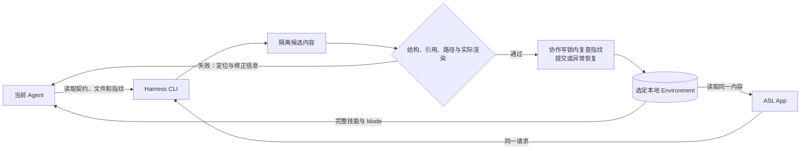

# View 2G · Agent CLI 与 App 同源管理

回答：不同 Agent 怎样发现、读取和组织技能库，并与 App 保持同一份有效内容？

## 管理入口

CLI 沿用 `asl-harness`；随 Windows 包提供 `resources/core/asl-harness.exe`。不要求打开 App 窗口，也不创建后台 Agent。完整功能的运行依赖由 `cli.describe` 报告；含图验收仍需要随包的离线 Mermaid 渲染器，单独安装 Python 核心不等于带齐渲染运行时。

- `cli.describe`：从真实命令和操作字段返回机器可读契约，不维护第二份命令注册表。
- `environment.discover` / `skill.scan`：有界发现；不遍历全盘账号和聊天记录。
- `environment.catalog` / `mode.files` / `skill.files`：读取选定 Environment 的目录、真实文件和指纹；二进制列出元数据，不伪装成可编辑正文。
- `environment.edit`：组织 Mode 成员与范式、修改正文与已有 Skill 文件；调用同一结构、引用与渲染门控。
- 完整新增资料或多文件修改：在库外草稿保留完整包，验收后重新导出并采用；不修改已带指纹清单的导出包来绕过验收。
- `environment.sync` / `mode.import`：采用完整内容；与普通编辑共用写入边界。Mode 包保留所选 Mode 的图文件、脚本、参考资料和必要许可，不只挑选三个定义文件；兼容旧包，但拒绝恢复路径碰撞。

前端不保存另一套 Skill / Mode 数据。界面偏好和云端解析缓存是非业务内容，不为了 CLI 化搬进业务库。

## 写入与反馈

失败使用非零退出码与 JSON 错误反馈，定位指向原始草稿文件或 `ZIP!/<成员路径>`，不指向已销毁的临时目录；当前 Agent 读取定位、修改同一草稿并重试。CLI 不调用另一个模型，不自动联系未知会话，也不接受调用者自报“已验证”。App 可用短提示呈现，但完整诊断保留。

锁协调遵守 CLI 的写入者，避免相同版本互相覆盖；不承诺禁止任意直接磁盘写入、断电恢复或多文件原子可见性。直接编辑不能被称为已通过门控。渲染成功只证明图能渲染，不证明业务关系合理，也不推断未定义的关系。

## 框架、内容版与发布

- `platform/asl-harness`：CLI、App 和校验实现的唯一开发真源。
- `libraries/agent-skill-library`：可分享的内容 Environment，共用 Harness，不内嵌第二份核心代码。
- `environment/personal-harness`：个人工作内容独立演进；与公开内容版的差异必须按实际字段和文件核对，不能整体覆盖。
- `C:\Users\Administrator\Desktop\AI\codex\asl-harness`：框架的机械发布检出，不独立设计。
- 公共 GitHub 来源以云端为准；采用后的本地 Mode 本地优先，上游更新不直接替换培养过的工作模式。

实现、测试、包内容和待验收事项只维护在[总览的当前状态](../asl-architecture-views.md#view-9--当前项目状态)。本图不另维护一套完成数字。
