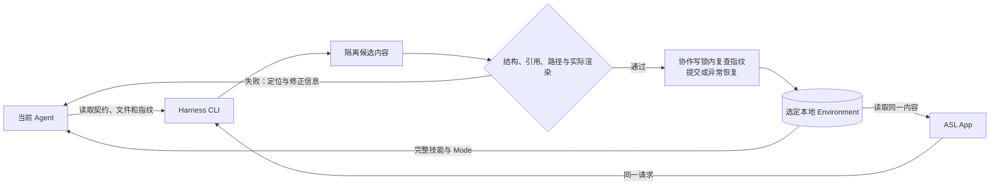

# View 2G · Agent CLI 与 App 同源管理

回答：不同 Agent 怎样发现、读取和组织技能库，并与 App 保持同一份有效内容？

## 管理入口

CLI 沿用 `asl-harness`；随 Windows 包提供 `resources/core/asl-harness.exe`。不要求打开 App 窗口，也不创建后台 Agent。完整功能的运行依赖由 `cli.describe` 报告；含图验收仍需要随包的离线 Mermaid 渲染器，单独安装 Python 核心不等于带齐渲染运行时。

- `cli.describe`：从真实命令和操作字段返回机器可读契约，不维护第二份命令注册表。
- `environment.discover` / `skill.scan`：有界发现；不遍历全盘账号和聊天记录。
- `environment.catalog` / `mode.files` / `skill.files`：显式只读加载，返回有效条目及 `issues` 定位；无关坏条目不阻断阅读，关联坏 Skill 的 Mode 也被隔离。请求坏项仍失败，根目录、路径、链接和秘密检查不放宽；二进制列出元数据，不伪装成可编辑正文。
- `environment.documents`：读取 `PROFILE.md` 或 `feedback/` 直属 Markdown，返回正文、字节指纹、目录与坏记录定位；不开放任意文件读取，也不要求无关 Skill 全部有效。
- `environment.edit`：组织 Mode 成员与范式、修改正文与已有 Skill 文件；调用同一结构、引用与渲染门控。`environment.file.save` / `environment.file.archive` 是其中的受控操作，只保存上述偏好／反馈文档，归档仅适用于反馈。
- `mode.create`：从普通完整 Skill 包建立首个 Mode，不需要预先安装 Agent。目标必须尚不存在；先 `--check`，再用预览指纹 `--expected` 提交同一 JSON。字段由 `cli.describe.createRequest` 返回；复用既有完整包导出／采用门控，不建立另一套初始化真源。新增副本保留正文、脚本与资料，必要来源只补在副本中。
- 完整新增资料或多文件修改：在库外草稿保留完整包，验收后重新导出并采用；不修改已带指纹清单的导出包来绕过验收。
- `environment.sync` / `mode.import`：采用完整内容；与普通编辑共用写入边界。Mode 包保留所选 Mode 的图文件、脚本、参考资料和必要许可，不只挑选三个定义文件；兼容旧包，但拒绝恢复路径碰撞。

前端不保存另一套 Skill / Mode 数据。界面偏好和云端解析缓存是非业务内容，不为了 CLI 化搬进业务库。

只读容错不改变默认严格加载。正式编辑仍检查工作区；导出与宿主投影仍严格检查其选定 Mode 闭包，不以部分目录结果证明可以写入。坏条目没有静默丢弃，调用者须呈现 `issues`，而不是将部分可读误报为整库有效。

## 当前 Agent 协作入口与授权

普通无 Mode 仓库通过 `cli.describe.organization` 发现 `environment.guide` 的共用整理指引：按用户目标逐层读取、核对同名版本与完整依赖、选择技能，再组织 Mermaid 与成员。行业判断属于当前 Host；CLI 不下载任意云端材料、不内置业务模板、不执行模型。App 仅补充用户目标及 URL／commit／本地只读快照，不另存一份专业规则。采用成功与上图成功分开核对；失败反馈对应草稿，不回滚删除已采用包。

App 的整理入口只接收可选目标，在已发现的 Codex CLI 或 Claude Code 原生会话中继续对话；复用既有启动器与所选本地库，不新建聊天后端、模型账号或执行循环。其他 Agent 可直接调用同一 CLI；提供契约不等于已验收其原生启动、登录或真实业务调用。完整内部任务材料仍可由 `environment.guide` 返回，但不再作为前端的提示词编辑／复制流程。

`cli.describe.writeBoundary.authorization` 与 `environment.guide.authorization` 共享同一授权说明：默认只组织 Mode；需要修改 Skill 正文、说明、脚本、资料或资产时，当前 Host 先列出具体文件、改动与影响，取得用户明确同意，再通过原有写入门控执行。用户要求整理 Mode、普通任务材料、来源说明与 Agent 自称已获批准，都不能代替该确认。

这是一条交给当前 Host 遵守的授权契约，不是 CLI 能独立证明的人类签名；不新增 `approved: true` 等可伪造字段，也不宣称能禁止任意直接磁盘写入。Skill 的受控编辑能力仍存在，不把须确认误写成永久不可编辑。打开会话、会话退出与校验通过分别报告；退出码不证明整理质量，App 重新检查结果后才更新视图，不冒称真实任务已完成。

`mode.save` 成功后附带同一已校验工作区的 `catalog`，供 App 直接更新视图，避免正常画板保存另开目录进程；预检不返回假装已写入的目录。仍使用原 `environment.edit` 契约和完整门控，不新增专用写入 API。

## 写入与反馈

失败使用非零退出码与 JSON 错误反馈，定位指向原始草稿文件或 `ZIP!/<成员路径>`，不指向已销毁的临时目录；当前 Agent 读取定位、修改同一草稿并重试。CLI 不调用另一个模型，不自动联系未知会话，也不接受调用者自报“已验证”。App 可用短提示呈现，但完整诊断保留。

首个 Mode 的图位于调用者的 `request.document`，反馈按此字段定位；来源 Skill 的图指向原始来源文件。两步添加中若 Skill 已完整采用、Mode 尚未保存，App 明确反馈这一部分成功，显式读取新版后重试；复用已采用包，不回滚删除、不重复导入，也不覆盖外部新版本。

渲染进程退出且没有有效报告时，返回 `MERMAID_RENDERER_UNAVAILABLE`，在 `error.details` 保留程序路径、十进制 / 十六进制退出码和限长 stderr；这属于运行环境故障，不要求 Agent 重写合法图。Windows 带 Low 完整性标签的运行副本可能启动失败；验收应使用正常权限的构建 Python 和出包目录，不自动更改权限、回退到另一个渲染器或关闭沙箱。打包冒烟必须由新包的冻结核心真实渲染并保存含图中文文档，再拒绝非法图且保持有效内容与工作区视图不变；仅保存无图文本不算渲染验收。

锁协调遵守 CLI 的写入者，避免相同版本互相覆盖；不承诺禁止任意直接磁盘写入、断电恢复或多文件原子可见性。直接编辑不能被称为已通过门控。渲染成功只证明图能渲染，不证明业务关系合理，也不推断未定义的关系。

偏好／反馈保存与归档先以严格 `Workspace.open` 验收工作区，复用写锁、文件指纹与路径边界；保存先实际渲染文内 Mermaid，再复查已观察的文件并写入，异常恢复受影响路径。反馈归档移动到 `archive/`，不删除原文；PROFILE 不可归档。App 的“偏好与记录”保留未保存草稿与离页确认，外部更新需显式重新读取。这里不启动学习任务、不自动修改 Skill，也不自动同步宿主；分享默认不携带 PROFILE 或根目录反馈，详见 [View 2E](02e-portable-environment.md)。

## 本地演变记录与归档

- `environment.history --workspace --mode` 分页读取真实 Git 记录；选中完整版本编号后返回该版本的 `MODE.md` 与 `mode.yaml` 结构快照，Agent 可按文件读取受限差异。不给前端另一套历史数据库。
- `mode.save` 以及采用 Skill 时明确绑定 Mode，保存前后记录这两个组织文件到 `refs/asl/modes/<id>`；不移动主分支、不动用户暂存区、不提交 Skill。没有 Git／作者身份时保存结果明确说明本次未记录；不自动安装 Git 或编造作者。
- `environment.history.note` 在标准 `refs/notes/asl` 中补充用户明确要求、外显决定和结果，指纹防止覆盖。Agent 先回顾有关记录，再写有依据的说明；不启动后台 Agent、不收集内部推理、不开自动推送。
- `mode.history.restore` 走现有 `mode.save` 写锁、指纹、协议与真实 Mermaid 渲染门控；回退产生新记录，不执行 Git reset。独立资料文件、外部直接磁盘编辑和整包采用未统一捕获，不将其冒充已自动记录。
- `environment.archive` 读取已有归档；未知身份只读。`archive.restore` 不覆盖现存目标、恢复原字节并重做结构与渲染校验。`environment.archive.cleanup` 仅返回精确路径、大小、指纹；桌面原生确认后再核对、交系统回收站，不提供永久删除回退。外部任意进程可以绕过协作锁，核对与系统移动不是原子事务。

App 的入口和视觉取舍见 [View 2D](02d-app-navigation.md#演变与归档)；真实实现与验收状态只见 View 9。

## 框架、内容版与发布

- `platform/asl-harness`：CLI、App 和校验实现的唯一开发真源。
- `libraries/agent-skill-library`：本机唯一活动内容 Environment，合入原个人库与旧写作检出的有效差异，保留原 GitHub 历史；共用 Harness，不内嵌第二份核心代码。
- 原 Personal Harness 与旧写作检出：只保留迁移恢复证据，不再作为日常使用或发布的第二套真源；物理清理另遵守删除门禁。
- `C:\Users\Administrator\Desktop\AI\codex\asl-harness`：框架的机械发布检出，不独立设计。
- 公共 GitHub 来源以云端为准；采用后的本地 Mode 本地优先，上游更新不直接替换培养过的工作模式。

实现、测试、包内容和待验收事项只维护在[总览的当前状态](../asl-architecture-views.md#view-9--当前项目状态)。本图不另维护一套完成数字。

## Harness 与 App 的覆盖边界

这张表解释接入关系，不把架构方案写成已实现功能。

| 已有底座或目标 | App 当前入口 | 仍需关注的边界 |
| --- | --- | --- |
| 完整技能、Mode 组织、校验与分享 | 工作模式画板、完整文件阅读、发现、导入／分享；首个 Mode 也走同一门控 | 不按聊天或关键词自动猜关系；默认组织 Mode，Skill 内容修改先确认 |
| 公共来源与本地内容 | 仓库原文浏览、来源与更新；已读取仓库的有界持久快照续读 | 云端版本用于浏览和比较；离线快照不保证最新，不成为 Mode 真源，采用仍重新校验 |
| 宿主投影、更新、停用、依赖检查 | Agent 配置结果、告警与运行检查；同时读取 SKILL／SOURCE 运行要求 | 文件配置或 Hook 命令存在不证明真实触发、登录或任务成功；更多专用宿主适配仍待完成 |
| Agent CLI 同源编辑 | “交给 AI 整理”打开已发现的 Codex／Claude；其他 Agent 使用 CLI | 原生启动和会话结束不证明任务质量；不建第二调度器，不遍历私有对话 |
| Mode 保存与原生 Git 记录 | “演变记录”以细时间轴回看同一架构，可回放、从历史继续编辑、确认恢复；Agent 说明附着原记录 | 只捕获 Mode 两个组织文件，Skill 正文不随回退；无 Git／作者时不伪造记录，不重写主分支 |
| 已有归档分区 | 本地库“归档”浏览、恢复及逐项移到回收站 | 未知身份只读，冲突不覆盖；清理须明确确认，不定时清空，不启动培养 |
| Profile、反馈与生命周期分区 | “偏好与记录”读取／保存 PROFILE，新建／编辑／归档反馈；与 CLI 共用原文件 | Candidate／Trial 完整操作链、经验关联与自动培养仍待完成；记录入口不等于培养闭环 |
| 原生 Hook 与投影核验 | 沿用宿主适配、CLI 校验和已有配置记录 | App 尚无完整逐事件追踪面；不为补界面新建事件总线或业务状态树 |
| 以 Skill 为单位演化、效果验收与反馈 | 现有文件、Git、来源和明确反馈可供 Host 使用 | 自动演化／评测闭环仍是目标；不把运行时间、沉默或退出码当成效果证据 |

后续优先打通可观察的缺口，而不是再复制 Harness：先让用户理解配置与使用状态，再考虑明确反馈的追溯。完整培养、新宿主适配与自动演化需要单独定义验收，不混入当前修复发布。
