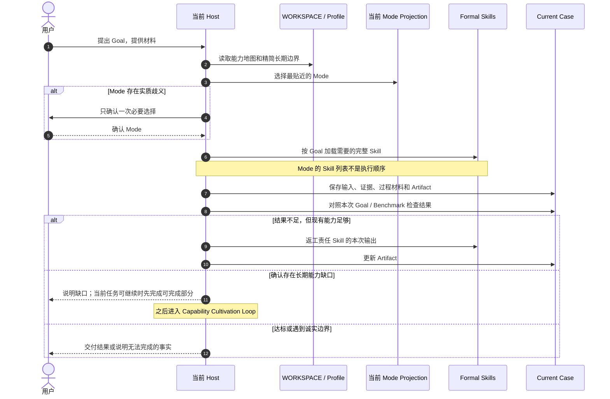

# View 3 · 普通 Goal 的执行时序

回答：用户只给一个目标时，系统怎样工作，什么时候会阻断？

```mermaid
sequenceDiagram
    autonumber
    actor U as 用户
    participant H as 当前 Host
    participant V as WORKSPACE / Profile
    participant M as 当前 Mode Projection
    participant S as Formal Skills
    participant C as Current Case

    U->>H: 提出 Goal，提供材料
    H->>V: 读取能力地图和精简长期边界
    H->>M: 选择最贴近的 Mode
    alt Mode 存在实质歧义
        H->>U: 只确认一次必要选择
        U-->>H: 确认 Mode
    end
    H->>S: 按 Goal 加载需要的完整 Skill
    Note over H,S: Mode 的 Skill 列表不是执行顺序
    H->>C: 保存输入、证据、过程材料和 Artifact
    H->>C: 对照本次 Goal / Benchmark 检查结果
    alt 结果不足，但现有能力足够
        H->>S: 返工责任 Skill 的本次输出
        H->>C: 更新 Artifact
    else 确认存在长期能力缺口
        H-->>U: 说明缺口；当前任务可继续时先完成可完成部分
        Note over H: 之后进入 Capability Cultivation Loop
    else 达标或遇到诚实边界
        H-->>U: 交付结果或说明无法完成的事实
    end
```

普通 Goal 不要求 Session key、Run token 或固定节点状态。视图和缓存提醒不阻断；确定的结构、Secret、路径与覆盖问题由 Harness 拒绝，高影响授权由当前 Host 的原生权限边界处理。

---
