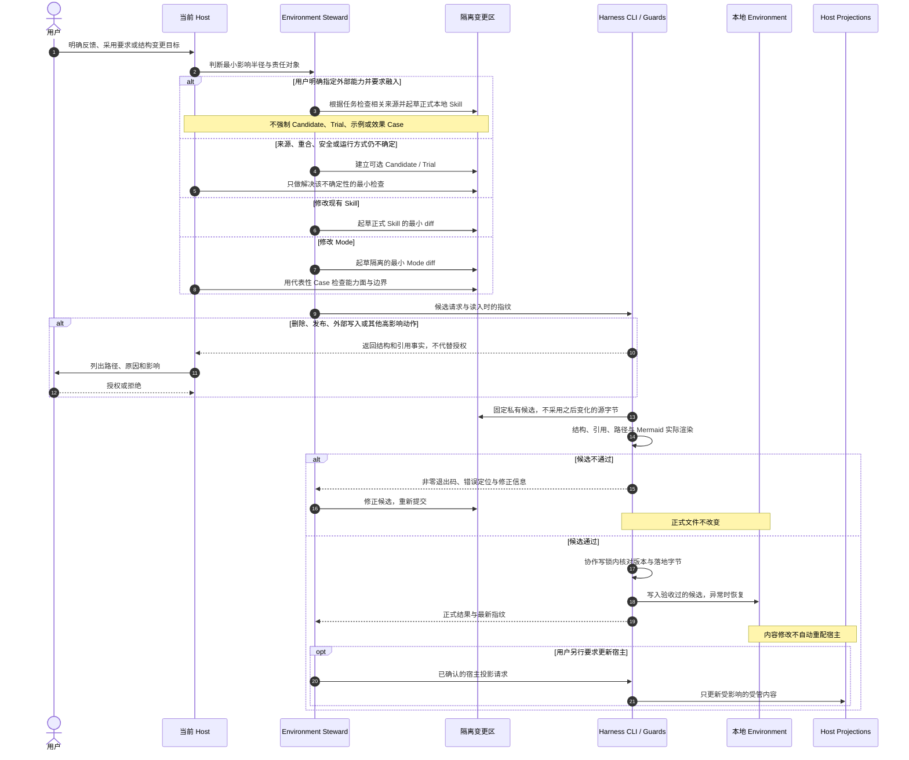

# View 4 · Skill / Mode 变更时序

回答：Mode 和 Skill 的增删改查如何与普通内容分开，谁负责起草、校验和授权？

AI 根据任务与具体 Skill 判断阅读深度，并起草完整本地能力包。用户明确指定引入时，可以直接进入正式 Skill Pool；确定性结构校验和高影响授权仍保留，但不再用 Trial、示例或效果测试拖延采用。普通任务材料不能在没有明确长期意图时自动修改正式 Skill 或 Mode。

App 与 Agent 共用这条内容写入链，具体契约见 [View 2G](02g-agent-cli.md)。协作锁约束遵守 CLI 的写入者，异常恢复不等于断电恢复或多文件原子可见性；绕过接口直接改磁盘不属于已验收提交。Git 保存历史的操作由用户或获得授权的 Agent 决定，不因一次保存自动提交。

---
