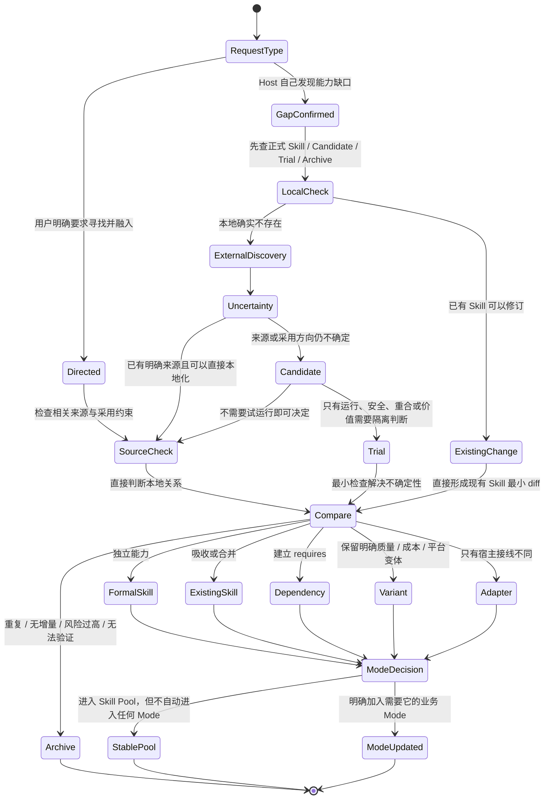

# View 5 · 外部能力生命周期状态图

回答：一个外部能力怎样进入本地，最终可能得到哪些处理结果？

上游更新在没有用户明确采用时只形成新的 Candidate，不能自动覆盖本地正式 Skill。用户明确要求升级或引入时，可以在检查相关来源后直接修改本地真源，阅读方式由当前 Host 依据具体 Skill 决定。

外部发现有两个入口：用户明确指定寻找或融入时立即执行；否则只有真实 Case 证明现有能力不够、正式 Skill 长期失效、上游发生重要变化，或安全问题要求替换时才进入。一次输出偷懒、一次模型错误和含义不明的行为不会自动触发搜索。

| 查找顺序 | 去哪里看 | 这一层解决什么问题 |
| --- | --- | --- |
| 1 | 本地正式 Skill、Candidate、Trial、Archive | 避免重复搜索、重复安装和遗忘历史拒绝原因 |
| 2 | 用户明确指定的仓库、作者、帖子或工具 | 尊重已知来源，不擅自换题 |
| 3 | 公开真实使用反馈与可信从业者推荐 | 发现“有人实际用过”的候选，而不是只看宣传 |
| 4 | GitHub 等代码仓库 | 检查关注度、维护活跃度、Issue、许可证、版本与实现体量 |
| 5 | 官方文档、官方生态与已安装宿主能力 | 确认接口、支持范围、平台约束和是否已有原生能力 |

对于 Host 主动发现的来源，这些信号只决定“值不值得进入 Candidate”，不自动决定采用；对于用户明确指定的来源，默认目标就是直接纳入。两条路径都先比较本地关系：重叠则吸收或合并，责任边界独立才成为新 Skill，只有硬依赖存在时才声明 `requires`，只有宿主接线不同才保留 Adapter。

---
