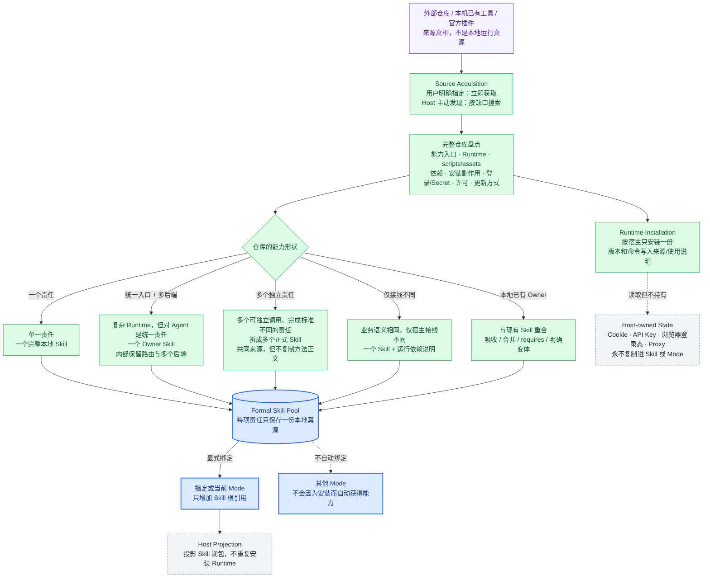

# View 5B · 复杂外部仓库拆解图（系统规则已实现，实例迁移按需）

回答：类似 Agent Reach 这种同时包含 Runtime、路由、安装器、多个后端和 Skill 入口的仓库，怎样融入 ASL 而不复制整仓、不污染所有 Mode？

> 本图的系统规则已经进入 Environment Steward。`environment.sync` 只负责在两个已合法的本地 Environment 之间显式同步完整 Skill，不负责搜索来源、自动拆仓或代替 Host 做语义关系判断。具体外部仓库是否迁移，不影响这套架构机制成立。

### Agent Reach 应该怎样映射

| 外部仓库里的内容 | ASL 中的位置 | 原因 |
| --- | --- | --- |
| Python CLI / library、channel 路由、doctor、installer | 一份宿主 Runtime；由 `agent-reach` Skill 说明如何安装和检查 | 这是统一的网络访问底座，不应复制到每个 Mode |
| 面向 Agent 的使用入口、平台选择、失败与回退规则 | `skills/agent-reach/SKILL.md` | 对 Agent 是一项完整的“公开网络发现与读取”能力 |
| 上游地址、观察到的 commit、许可、本地改动 | `skills/agent-reach/SOURCE.md` | 本地 Skill 是运行真源，上游只用于追溯和升级 |
| Twitter、GitHub、YouTube、小红书等后端 | `agent-reach` 内部路由，不拆成 Mode，也默认不拆成十几个 Skill | 它们共享同一责任和统一入口，只是访问表面不同 |
| Cookie、API Key、Proxy、浏览器登录态 | Codex / Claude / DeepSeek 的宿主设施 | Secret 和用户登录状态不能进入 Skill、Mode 或 Git |
| 四个业务 Mode 的使用权 | 每个 Mode 各自显式引用同一份 `agent-reach` | 一份能力、多处复用；Mode 不复制代码，也不隐式继承 |

如果复杂仓库确实包含多个可以独立交付、完成标准不同的能力，才拆成多个正式 Skill。仓库目录多、脚本多或支持平台多，本身都不是拆分理由。

---
