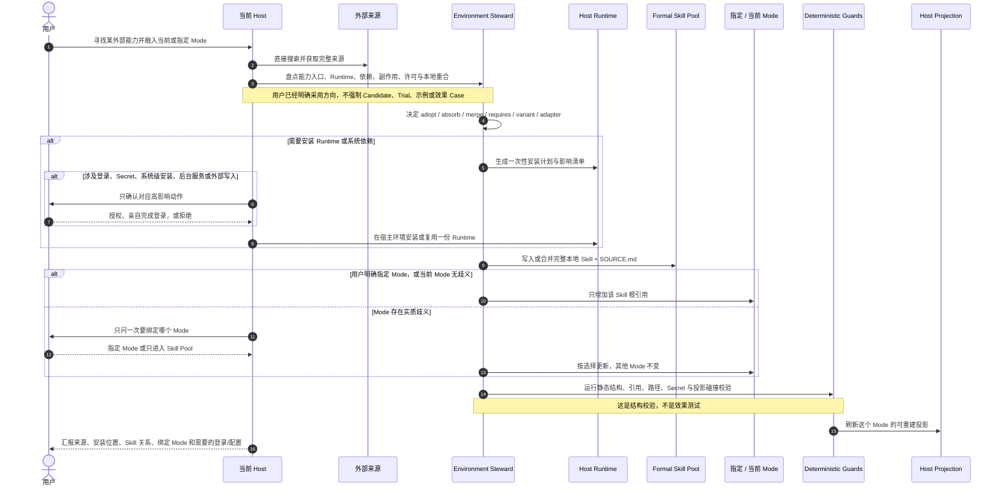

# View 5C · 外部能力安装与单 Mode 绑定时序图（系统规则已实现，实例迁移按需）

回答：用户直接说“去找这个技能，融入当前 Mode”时，Host、Harness、Runtime 和 Mode 分别做什么？

### 建议的硬门槛

| 门槛 | 必须保证 | 不应强制 |
| --- | --- | --- |
| 来源 | 保存可追溯 URL/路径、观察到的版本或 commit；不能假装知道未知版本 | 必须先建立 Candidate |
| 来源检查 | 根据具体 Skill 与任务检查相关说明、依赖、许可和安装副作用；不统一规定全部加载 | 跑作者提供的全部测试 |
| 本地能力 | 形成完整 `SKILL.md`；外部实现不能作为裸 Prompt/MCP/API 在业务中途偷跑 | 必须先跑示例或效果 benchmark |
| 重合关系 | 在 adopt、absorb、merge、requires、variant、adapter 中明确一个关系；同一责任只有一个 Owner | 因为仓库作者不同就保留重复 Skill |
| 安装安全 | Secret、Cookie、登录态不入 Git；系统安装、后台服务、外部写入和用户登录单独确认 | 因为缺少非关键配置就阻断整个 Goal |
| Mode 绑定 | 只修改用户指定或无歧义的当前 Mode；其他 Mode 不自动获得能力 | 安装后自动加入全部 Mode |
| 静态校验 | Skill/Mode 结构、依赖、路径、引用和宿主投影必须可解析 | 用真实 Case 证明写作、研究或业务效果后才允许采用 |

### 搜索入口与 Bootstrap

外部搜索优先使用当前 Host 已经可用的网络与代码仓库能力；如果 `agent-reach` 已安装，可以把它作为统一发现层。如果正在寻找或修复的恰好就是 `agent-reach`，Harness 不能形成“没有 Agent Reach 就不能寻找 Agent Reach”的死锁，此时直接使用 Host 原生 Web、GitHub、Git 或浏览器能力。

### 本地化重构的两条路线

| 路线 | 什么时候用 | 可以做什么 | 必须保留什么 |
| --- | --- | --- | --- |
| 派生式本地化 | 实际复制或修改了上游文字、代码、脚本、模板或独特资产 | 去掉个人触发词、绝对路径和上游工作区假设；按本地 Skill 契约重组 | 原作者、来源、commit、许可、第三方声明和本地修改 |
| Clean-room 重构 | 只确认“这个用户需求值得解决”，不需要上游实现 | 重新定义能力责任；从官方接口或许可清楚的公共基础能力独立实现 | 本地设计依据；不得把未复制的内容伪装成上游派生，也不得暗中搬运受限实现 |

两条路线都可以去作者耦合，但不能把“删除可调用界面里的个人品牌”误解为“删除实际使用过的来源”。没有复制实现时，外部个人仓库只是一份需求与组织方式的调研样本；复制了实现时，它的许可边界继续生效。

---
