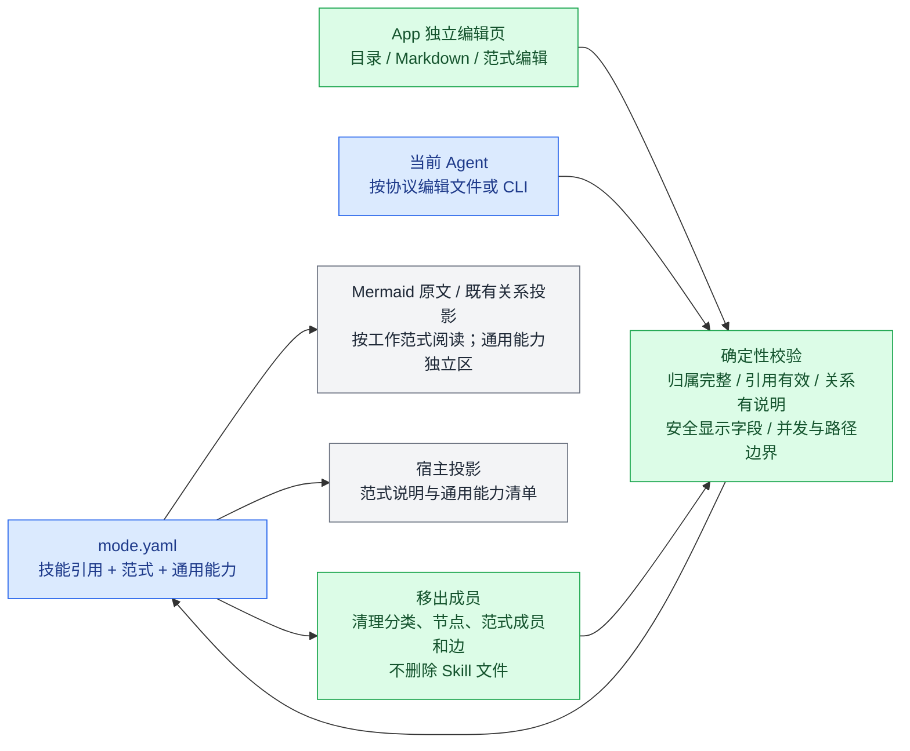

# View 6 · Mode 是能力子图，不是 Workflow

### 工作范式的结构与增删边界（v0.4）

Mode 是一个工作环境，范式是环境里积累的常用配合方式。通用能力服务这个 Mode，不是跨 Mode 的隐式召回。全部技能页面按这些真实定义分组，分类和图不再由前端关键词推断。

图中的边只是工作关系；允许分支、汇合、树和反馈环。软件 `requires` 的依赖检查仍独立存在，不能拿软件依赖替代工作经验。没有明确关联时不凭空补线。新增业务范式、修改显示名称、移除分类都只改内容文件，不生成组件、脚本或数据库字段。

v0.4 新建要求覆盖闭包成员；添加成员必须选范式或通用能力。旧 v0.3 可读但标记待定义。删除范式时若使成员无归属，编辑器要求重新归属后再保存；移出技能自动清理失效引用。纯通用工具 Mode 可以没有业务范式。

回答：不同 Mode 如何共享 Skill，又为什么不会跨 Mode 隐式调用？

**范围提示：**本图只说明 Mode 与 Skill 的成员关系，没有表达 Mode 内不同工作场景的逻辑架构。用户要求的“场景如何组织、技能如何协作”仍需补充；不能把本图或可展开的分类树当成完整工作架构。相关缺口统一记录在 View 2D。

```mermaid
flowchart TB
    AR["agent-reach<br/>共享底层研究能力"]
    DIAGRAM["baoyu-diagram<br/>共享结构表达能力"]
    VALUATION["investment-valuation-returns<br/>共享估值能力"]

    CREATOR["creator-studio<br/>业务 Mode"]
    PRODUCT["product-lab<br/>业务 Mode"]
    INVEST["investment-desk<br/>业务 Mode"]
    CAPITAL["capital-markets-desk<br/>业务 Mode"]

    WRITING["public-account-writing-style"]
    LAYOUT["qihang-wechat-layout"]
    PUBLISH["baoyu-post-to-wechat"]
    PRODUCT_JUDGMENT["ai-product-analyzer"]
    INVEST_RESEARCH["investment-research"]
    IC_MEMO["investment-ic-memo-writer"]
    COMPANY["financial-company-profile"]
    COVERAGE["public-equity-coverage-writer"]

    CREATOR --> AR
    CREATOR --> WRITING
    CREATOR --> LAYOUT
    CREATOR --> PUBLISH
    PRODUCT --> AR
    PRODUCT --> PRODUCT_JUDGMENT
    PRODUCT --> DIAGRAM
    INVEST --> AR
    INVEST --> INVEST_RESEARCH
    INVEST --> VALUATION
    INVEST --> IC_MEMO
    CAPITAL --> AR
    CAPITAL --> COMPANY
    CAPITAL --> VALUATION
    CAPITAL --> COVERAGE

    classDef mode fill:#dbeafe,stroke:#2563eb,color:#1e3a8a,stroke-width:2px;
    classDef shared fill:#dcfce7,stroke:#16a34a,color:#14532d;
    classDef skill fill:#f3f4f6,stroke:#6b7280,color:#1f2937;
    class CREATOR,PRODUCT,INVEST,CAPITAL mode;
    class AR,DIAGRAM,VALUATION shared;
    class WRITING,LAYOUT,PUBLISH,PRODUCT_JUDGMENT,INVEST_RESEARCH,IC_MEMO,COMPANY,COVERAGE skill;
```

蓝色节点是 Mode，其他节点是完整 Skill。箭头表示“这个 Mode 能看见这项能力”，不表示先后顺序。同一个正式 Skill 可以被多个 Mode 显式选择，但只保存一份正文。

---
