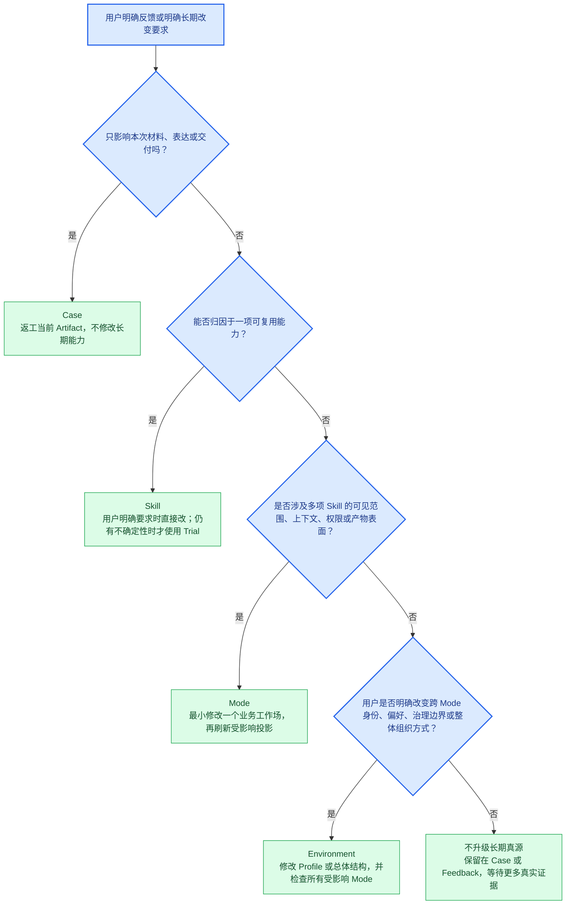

# View 7 · 演化影响半径决策图

回答：收到明确反馈后，应该改当前 Case、Skill、Mode 还是整个 Environment？

```mermaid
flowchart TD
    F["用户明确反馈或明确长期改变要求"] --> Q1{"只影响本次材料、表达或交付吗？"}
    Q1 -->|是| CASE["Case<br/>返工当前 Artifact，不修改长期能力"]
    Q1 -->|否| Q2{"能否归因于一项可复用能力？"}
    Q2 -->|是| SKILL["Skill<br/>用户明确要求时直接改；仍有不确定性时才使用 Trial"]
    Q2 -->|否| Q3{"是否涉及多项 Skill 的可见范围、上下文、权限或产物表面？"}
    Q3 -->|是| MODE["Mode<br/>最小修改一个业务工作场，再刷新受影响投影"]
    Q3 -->|否| Q4{"用户是否明确改变跨 Mode 身份、偏好、治理边界或整体组织方式？"}
    Q4 -->|是| ENV["Environment<br/>修改 Profile 或总体结构，并检查所有受影响 Mode"]
    Q4 -->|否| STOP["不升级长期真源<br/>保留在 Case 或 Feedback，等待更多真实证据"]

    classDef locked fill:#dbeafe,stroke:#2563eb,color:#1e3a8a,stroke-width:2px;
    classDef done fill:#dcfce7,stroke:#16a34a,color:#14532d;
    class F,Q1,Q2,Q3,Q4 locked;
    class CASE,SKILL,MODE,ENV,STOP done;
```

原则是最小范围优先。向上升级必须说明为什么较小一层已经不够，不能从点击、耗时、沉默或一次模型错误推断长期偏好。

---
