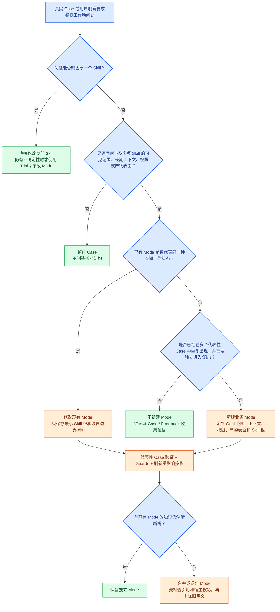

# View 7B · Mode 新建、修改与退出决策图

回答：什么时候应该创建 Mode，什么时候只改现有 Mode，什么时候根本不应该碰 Mode？

```mermaid
flowchart TD
    START["真实 Case 或用户明确要求暴露工作场问题"] --> Q1{"问题能否归因于一个 Skill？"}
    Q1 -->|是| SKILL["直接修改责任 Skill<br/>仍有不确定性时才使用 Trial；不改 Mode"]
    Q1 -->|否| Q2{"是否同时涉及多项 Skill 的可见范围、长期上下文、权限或产物表面？"}
    Q2 -->|否| CASE["留在 Case<br/>不制造长期结构"]
    Q2 -->|是| Q3{"已有 Mode 是否代表同一种长期工作状态？"}
    Q3 -->|是| MODIFY["修改现有 Mode<br/>只保存最小 Skill 根和必要边界 diff"]
    Q3 -->|否| Q4{"是否已经在多个代表性 Case 中重复出现，并需要独立进入/退出？"}
    Q4 -->|否| WAIT["不新建 Mode<br/>继续以 Case / Feedback 收集证据"]
    Q4 -->|是| CREATE["新建业务 Mode<br/>定义 Goal 范围、上下文、权限、产物表面和 Skill 根"]
    MODIFY --> VERIFY["代表性 Case 验证 + Guards + 刷新受影响投影"]
    CREATE --> VERIFY
    VERIFY --> Q5{"与现有 Mode 的边界仍然清晰吗？"}
    Q5 -->|是| KEEP["保留独立 Mode"]
    Q5 -->|否| MERGE["合并或退出 Mode<br/>先检查引用和宿主投影，再删除旧定义"]

    classDef locked fill:#dbeafe,stroke:#2563eb,color:#1e3a8a,stroke-width:2px;
    classDef done fill:#dcfce7,stroke:#16a34a,color:#14532d;
    classDef optimize fill:#ffedd5,stroke:#ea580c,color:#7c2d12;
    class START,Q1,Q2,Q3,Q4,Q5 locked;
    class SKILL,CASE,WAIT,KEEP done;
    class MODIFY,CREATE,VERIFY,MERGE optimize;
```

Mode 的判断单位是“长期工作状态”，不是主题名、项目名或一次任务。系统机制即使经常使用，也不能因此被包装成 Mode。

---
