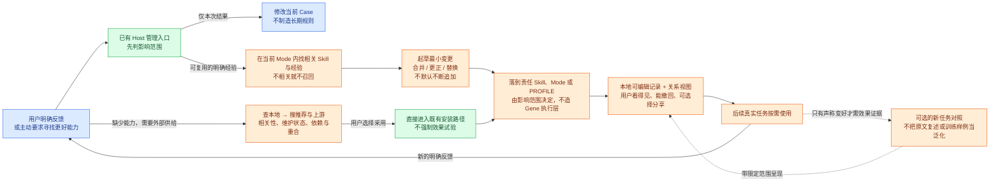

# View 7C · 工作环境怎样培养：EvoMap 的借鉴与边界（偏好与反馈记录已有，自动培养待实现）

**这里的“培养”不是训练模型权重，而是持续改进工作环境：选对能力、记住适用经验、减少无用规则，并让这些改进能被带走。** EvoMap 值得借鉴的是“经验怎样形成可复用资产”，而不是把其完整进化 Runtime 再安装成 ASL 的第二调度器。

当前开发实现仅补齐人工可见的记录入口：App 的“偏好与记录”和 `environment.documents` 读取原有 `PROFILE.md`、`feedback/` 直属 Markdown；`environment.edit` 的受控操作保存偏好／反馈或将反馈归档到 `archive/`。保存有指纹冲突、路径与实际 Mermaid 渲染检查，未保存内容与外部变化不互相覆盖。它不自动推断用户偏好、不读取私人对话、不触发模型，也不自动改写 Skill。Candidate／Trial 的完整操作链、经验召回与关系视图、效果评测和自动演化仍未完成；实现及发布状态见[View 9](../asl-architecture-views.md#view-9--当前项目状态)。

### 官网、研究、代码分别说明了什么

| 证据层 | 实际核对内容 | 对 ASL 的意义与限制 |
| --- | --- | --- |
| 官网功能与主张 | EvoMap 将能力经验发布、查找和复用组织成网络；GEP 区分策略、执行经验与演化记录。市场评分结合多个平台信号 | 借鉴可发现、可追溯、能反馈的能力供给；不把市场热度当个人适用性，也不自动上传私人环境 |
| 当前 Evolver 仓库 | 查看主分支 31b0691 的文件；selector、memoryGraph、solidify 等核心模块已混淆，所查历史快照也未取得可读实现 | 不能宣称完整审计了当前核心算法，或已复现服务端排名；本轮未运行 Evolver |
| 可读导出实现 | portable.js 将选定经验文件打包，生成统计与逐文件 SHA-256 清单；该文件只实现导出 | 可借鉴“内容自描述 + 可核对”，但它不等于 ASL 环境跨宿主导入实现 |
| 可读选择测试 | selector 与 memoryGraph 测试表达了相关性、记忆偏好、禁止项和重复失败抑制等预期；本轮阅读关键断言，未运行测试 | 说明设计意图，不代替当前源码验证；值得借用“不相关时不要强选”，不照搬阈值或随机探索 |
| AutoResearch 可读代码 | seed_ranking.py 保留未打分状态、返回评分覆盖情况，不把失败候选编成正常得分 | ASL 推荐可以说“尚未判断”，不能用默认高分营造优质市场 |
| Research 实验 | 策略经验可能改善特定科学编程任务；组合多条经验并不总比单条更好。LongWoF 的部分经验来自参考答案蒸馏 | 不把“规则更多”当进步；不能把含参考答案的成绩包装成自主学习或未知任务泛化 |

核对入口：[官网 Research](https://evomap.ai/research)、[GEP 定义](https://evomap.ai/wiki/16-gep-protocol)、[Evolver 源码](https://github.com/EvoMap/evolver/tree/31b0691acd97ba18878019312e646f1f2d970d43)、[导出代码](https://github.com/EvoMap/evolver/blob/31b0691acd97ba18878019312e646f1f2d970d43/src/gep/portable.js)、[选择测试](https://github.com/EvoMap/evolver/blob/31b0691acd97ba18878019312e646f1f2d970d43/test/selector.test.js)、[AutoResearch 排序实现](https://github.com/EvoMap/AutoResearch/blob/main/src/seed_ranking.py)。

Research 的可借鉴结论，不等于独立验证的产品效果：[策略经验论文](https://arxiv.org/html/2604.15097v1) 的实验对象主要是科学编程；[LongWoF 报告](https://evomap.ai/research/longwof-bench) 披露 778 项任务中，252 项经验来自成功轨迹、526 项使用参考答案回退蒸馏。两者都不能直接证明我们的公众号写作或全部办公任务会更好。[AutoResearch 研究说明](https://evomap.ai/research/autoresearch-evidence-loop) 对“本地检查通过不等于目标完成”的区分可保留，但不因此要求每次装 Skill 都跑多模型实验。

### 我们采用怎样的培养逻辑

下图描述后续培养目标，不是当前 App 已运行的学习循环。已有 Host 入口和安装路径可以复用；记录能够编辑，不等于系统已经会判断影响范围、合并经验或证明效果提升。

**算法建议保持可解释，而不是先造总评分：**

- **找能力时，先看适不适用，再看好不好。** Mode 范围、任务相关性、宿主兼容和依赖是首要条件；KOL 推荐、Stars、维护活跃度是发现线索。缺少信息明确标注，热门能力也不能越过 Mode 自动安装。
- **找经验时，先找同一类问题。** 优先当前 Mode / 责任 Skill 的明确经验，再按需要搜索用户允许使用的材料。记录“适用情境、有效做法、不适用情况、反馈依据”即可，这些可以是现有文档中的简短内容，不强制新文件或新执行单位。
- **改能力时，优先替换与合并，不无限累加。** 一次写作返工不推导出全环境新禁令；某个 API 临时掉线只记本次连接状态，不因此惩罚写作 Skill。明确反馈支持持久修改；客观诊断、沉默和运行耗时不自动成为个人偏好。
- **判断进步时，看新任务是否更好，不看改动有多少。** 只在用户要求评价“培养效果”时，选未用于改写的代表性任务做前后比较；评价者、预算和停止条件事先明确。安装验收、结构测试、业务效果是不同证据，不互相冒充。

**图结构可以有，图数据库先不需要。** Mode 与 Skill 的包含关系、Skill 的明确依赖、资料与经验的关联，已经能形成一张能力图；Mode 本身就把多种能力和上下文组合成一组关系，不需要为了“超图”再建运行节点系统。App 从真实文件生成视图，推测关系只能显示为建议。长期经验先本地 Markdown 与普通搜索；确有检索规模问题再增加可重建 RAG 索引，索引不是记忆真源。

**与市场结合：分享培养后的环境，不分享用户的隐私轨迹。** 用户可导出一个 Mode 的完整能力和经自己检查的包内笔记；PROFILE 默认不含，仅显式选择加入，根目录反馈与培养分区不在当前导出范围，详见 [View 2E](02e-portable-environment.md)。接收者本地采用后继续维护；上游更新展示差异，不覆盖个人改动。公开仓库快照仅供浏览，不是用户 Mode 的培养真源。首期不自动发布、不加入 EvoMap Hub，不引入积分、繁殖、随机变异或全天候自修改机制；也不要求把现有 Skill 变成 GEP 才能运行。

---
