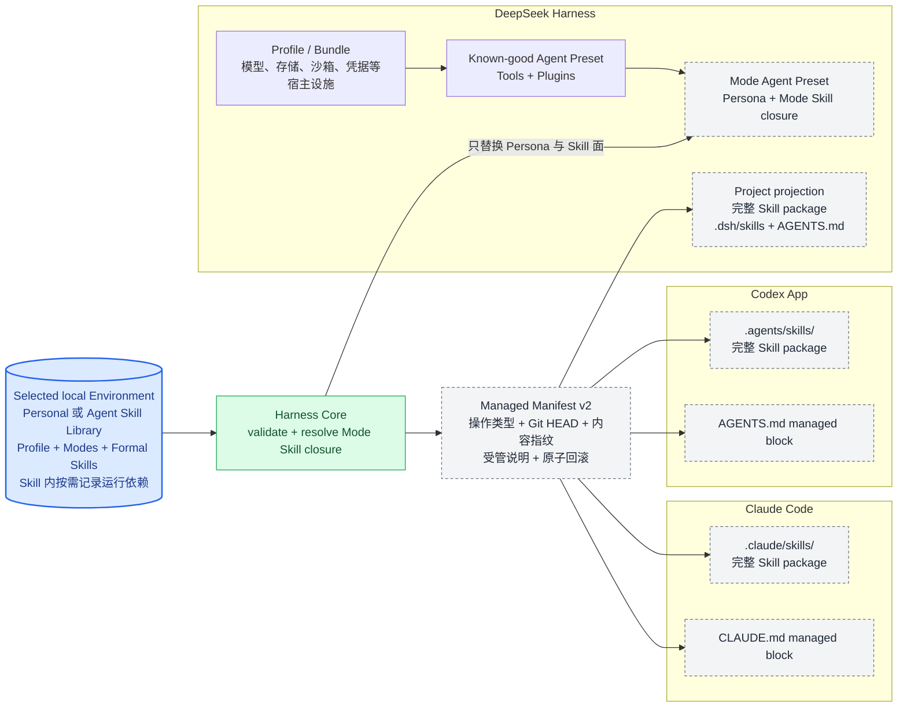

# View 8 · 三宿主部署与投影图

回答：同一份 Environment 怎样接入 Codex、Claude Code 和 DeepSeek Harness？

Codex 与 Claude 使用项目原生 Skill 目录和规则文件。DeepSeek 额外区分宿主级 Profile / Bundle 与会话级 Agent Preset；ASL Mode 对应 Agent Preset，不对应 Profile。三个 Host 都继续拥有自己的 Agent Loop、会话、工具、模型和授权，ASL 不复制这些 Runtime 能力，只生成它们能够原生发现的环境表面。投影切换会先在同盘临时区完成，再替换旧受管表面；失败时恢复旧投影。复制型投影与 Preset 逐 Skill 校验 SHA-256，链接型投影继续用 Environment 总指纹检查漂移。

MCP 的可移植性高于宿主 Plugin，因此当前架构优先让 Skill 声明 MCP 运行需要，再由 Host 使用自己的 MCP 配置和登录方式满足它。Hook 也采用相同原则：Harness 提供同一组 CLI 校验，Adapter 只负责接到 Codex、Claude 或 Cordis 的真实生命周期事件。未来接入其他 Agent 时复用这份 Adapter 契约，不修改 Environment 数据模型。

| 接入面 | Codex App / CLI | Claude Code | DeepSeek Harness | 其他 Agent / CI |
| --- | --- | --- | --- | --- |
| Skill | `.agents/skills/` + `AGENTS.md`，已实现 | `.claude/skills/` + `CLAUDE.md`，已实现 | `.dsh/skills/` 或 Agent Preset，已实现 | 有原生 Skill 目录时增加薄 Adapter |
| MCP | 使用 Codex 原生 MCP 配置、安装与登录 | 使用 Claude 原生 MCP 配置、安装与登录 | 使用 Cordis Profile / MCP client plugin | 支持 MCP 的 Host 复用同一服务；不支持则明确提示 |
| Hook | Plugin 接线代码已有；本轮未验收 App 原生调用 | 历史有 SessionStart 触发记录；本轮未重做真实会话 | v3 导出已固定 Preset 定位并校验配置；本机旧 Preset 尚未重建 | 没有 Hook 时手动调用 CLI；不宣称所有宿主已激活 |
| Tool / Agent / 权限 | 完全归 Codex | 完全归 Claude Code | 完全归 DeepSeek Harness | 完全归目标 Host |

---
