# ASL 总体架构与专项视图

> **唯一架构与项目状态真源。** 本文件是 ASL 当前架构、实现边界、验证结果和未完成事项的唯一权威文档。事实依据仍是代码与可复现的运行证据，不能用文档声明代替验证。发现实现、README、其他文档或图示不一致时，修正后优先更新本文件，再同步引用和发布检出；不得把待实现或待验收事项标成完成。开发仓库维护此文件，公开仓库只机械同步。

本文件用多种标准架构图解释 ASL。先看 Master 理解独立 App、可迁移环境和宿主的关系，再看 View 2D / 2E / 2F 理解使用、导入与模型配置，最后看 View 7C 的培养机制及 View 9 的真实状态。其余专项图展开已有底座，不把方案当成已发布功能。

> 更新：2026-09-10。当前验证数字、部署差异和后续执行路线集中在 View 9。自动测试通过不代表真实宿主已验收；外部仓库映射和交互方案不计入已实现能力。

## 颜色约定

- **蓝色**：用户已经明确确认，后续实现必须保持的架构边界；
- **绿色**：当前代码或真实 Environment 已实现并验证；
- **橙色**：尚未实现、当前生成面需要刷新，或仍有真实宿主运行验收；
- **红色**：当前错误分类或旧结构，迁移后删除；
- **灰色**：可删除重建的宿主生成面，或已经退出活动面的冻结归档；
- **紫色**：外部来源，不是本地运行真源。

颜色表达节点的当前主状态，不表达执行顺序。可重建投影即使已经验证仍保持灰色，并在节点文字中写明“已验证”；外部来源始终保持紫色。动态项目状态、验证数字和未完成项只在 [View 9](#view-9--当前项目状态) 的受管区域维护，README 和其他协议文档只链接这里。

## 怎么读这些图

| 图 | 类型 | 只回答什么问题 |
| --- | --- | --- |
| Master | 总体模块关系图 | 所有模块怎样组成一个系统，哪些关系形成反馈环 |
| View 1 | 系统上下文图 | 用户、Host、Harness、Environment、Case 和外部来源分别站在哪里 |
| View 2 | 组件图 | Harness System 与 Personal Environment 内部各自包含什么 |
| View 2B | Runtime 边界与同步图 | ASL 不复制哪些 Host 能力，以及两份 Environment 怎样显式同步完整 Skill |
| View 2C | Hook 接线图 | 宿主在什么时机调用哪些现有检查，什么时候提醒或阻断 |
| View 2D | App 入口与状态图 | 怎样管理工作环境、看见能力，并区分已配置与实际生效 |
| View 2E | 环境包与安装图 | 复杂技能、插件和资料怎样分享，怎样在指定 Mode 安装 |
| View 2F | 模型与应用时序图 | Mode 如何关联 Model，怎样应用到不同宿主而不携带秘密 |
| View 3 | 运行时序图 | 一个普通 Goal 从进入到交付怎样发生 |
| View 4 | 变更时序图 | Skill / Mode 的增删改查怎样与普通业务内容隔离 |
| View 5 | 生命周期状态图 | 外部能力从发现到采用、合并、依赖、变体、适配或归档怎样流转 |
| View 5B | 复杂仓库拆解图 | 一个外部仓库应该变成一个 Skill、多个 Skill、共享 Runtime 还是 Adapter |
| View 5C | 安装与 Mode 绑定时序图 | 用户明确要求引入时，如何直接安装并只绑定指定 Mode |
| View 6 | 能力图 | Mode 怎样选择 Skill 子图而不退化成固定 Workflow |
| View 7 | 决策图 | 用户明确反馈应该落在 Case、Skill、Mode 还是 Environment |
| View 7B | Mode 决策图 | 什么时候新建、修改、合并或退出一个 Mode |
| View 7C | 培养循环与研究映射 | 借鉴 EvoMap 的哪些经验机制，哪些不采用，怎样保持轻量 |
| View 8 | 部署图 | 同一真源怎样投影到 Codex、Claude Code 与 DeepSeek Harness |
| View 9 | 迁移图 | 当前已经完成什么、还差什么、哪些旧结构必须删除 |

## 核心对象边界

### 2026-09-09 同步与配置闭环（用户要求继续开发）

目标不是再交一个浏览器，而是让用户选定 Mode 后能安装、迁移、补齐依赖并复查。保持现有 App / 原生 Agent / 本地文件的边界；不新增业务调度器。

同步与配置沿用现有边界，验证范围统一见 View 9：

1. **用户级同步**：`user_projection.py`、CLI、桌面桥接和应用弹窗。Codex / Claude 分别使用真实原生用户目录，支持自定义配置目录；同步前展示新增、更新、移出及同名冲突。只更新 ASL 自己管理且未被另改的内容，保留其他技能和用户说明。测试：独立 home 中两宿主同步、重复执行、切 Mode、冲突、回滚与来源变更。
2. **本机配置检查**：根据所选 Mode 的完整 Skill、原生依赖声明和当前机器检测结果生成缺项清单。工具存在、配置存在、实际工作成功分开表达，未知不能显示为已就绪。测试：缺少运行时、MCP 未连接、工具路径变化、技能只提供说明的情形。
3. **Agent 配置助手**：用户点击后，把 Mode、技能原文位置、来源、安装说明与本机缺项交给已安装的原生 Agent；继续使用它自己的模型、权限和登录机制，不直连另一个模型 API。配置后回到 App 复查。第三方安装命令不由市场字符串直接执行，密钥和登录状态不放进分享包。
4. **交付**：沿用简洁界面接通同步状态、重试和配置入口，更新 Windows 便携 App，完成真实文件同步及原生 Agent 接收任务的检查；代码分步提交、同步公开仓库，当前真实状态仍集中在 View 9。

参考 [CC Switch 的 Skill 同步实现](https://github.com/farion1231/cc-switch/blob/main/src-tauri/src/services/skill.rs)：保留单份技能源、原生目标目录和受管同步；不搬入其数据库或全库启用策略。按当前 [Codex Skill 目录](https://learn.chatgpt.com/docs/build-skills) 和 [Claude 用户目录](https://code.claude.com/docs/en/claude-directory) 分别适配，不把两者的全局目录误认为同一个。

### 2026-09-09 产品改版执行约定（用户已确认，未完成项不得计为交付）

首版桌面入口仅有查看、ASL 快照往返和项目投影。本轮已补上 Mode / Skill 编辑、用户级同步、本机检查与原生配置助手入口，但**不等于完整工作环境管理产品已经完成**。配置助手能够启动与第三方模型实际完成配置是两件事；真实宿主会话、跨电脑及市场采用仍有缺口，验证范围只在 View 9 汇总。

- **产品结构：**真实技能库 → 工作模式 → 可展开的能力地图 / 技能列表 → 详情侧栏。另设发现与 Agent 配置页面。主界面不展示协议说明和运行日志；使用中文用途、原生状态控件和必要的操作反馈。示例始终显式标记，不冒充用户内容；连接技能库不等于给 Agent 应用配置。
- **数据边界：**地图是现有 Mode、Skill、明确依赖的视图，不是新 Workflow 或第二路由器。能力分组仅辅助人阅读，不能改变调用权限。App 的最近位置和界面偏好留在本机；业务内容继续留在原文件。
- **作用范围：**每次应用显示目标 Agent、实际位置、影响范围和变更预览。项目、当前用户的全部项目、DeepSeek Preset 分开表达；宿主不支持的范围不可伪装成可用。ASL 只管理自己的内容，不能宣称屏蔽了宿主原有全局技能。用户级能力和机器所有用户级能力不是同义词。
- **组合与市场：**区分可迁移 Skill / ASL Mode 包与 DSH 专用 Bundle；市场收录不代表跨宿主兼容。发现、内容采用、原生依赖安装、账号连接、Mode 引用是不同操作。复杂 CLI / Agent Reach 显示真实依赖与配置缺口；不把任意市场命令直接当成可执行 Shell。
- **交互实现参考：**借鉴 [CC Switch 的技能与 MCP 管理](https://github.com/farion1231/cc-switch/tree/main/src/components)、[React Flow 分组节点](https://github.com/xyflow/xyflow/tree/main/examples/react/src/examples/Subflow)、[DSH Market 的目录与安装分离](https://github.com/dsh-market/dsh-market/tree/main/src)。保留必要许可；借用成熟组件，不复制它们整个后端或用户目录同步策略。

实施顺序与验收：

1. `workspace.py` / 管理接口 / 回归测试：补齐 Mode 与 Skill 的增改、移出和归档预览，检查引用影响、并发修改、失败恢复；所有写入测试使用隔离目录，不改真实技能库。
2. `desktop/`：改为成熟组件驱动的桌面管理界面，接入真实库、能力图、编辑器和配置范围；用实际 4 个 Mode、37 个去重 Skill 检查，不用示例充当产品验收。
3. 市场与连接：先贯通可核实的目录发现和本地采用；各宿主原生安装 / 配置按实际支持接线。每项分别记录“已实现 / 待接入”，不以打开官网冒充自动安装。
4. 可用性验收：键盘、窄窗口、空态、失败重试、编辑后刷新、作用范围预览、冲突保护与导入往返；再同步本架构状态，分步提交。测试通过与宿主运行成功分别报告。

| 对象 | 它是什么 | 它不是什么 | 由谁改变 |
| --- | --- | --- | --- |
| Harness System | 确定性核心、维护保护、访问面和宿主适配 | 第二个 Agent、第二调度器、业务 Mode | Harness 代码与确定性规则变更 |
| ASL App（Windows 便携版） | Mode / Skill 管理、能力地图、包导入 / 分享、市场浏览、项目 / 用户级应用、本机检查与原生配置助手 | 另一个聊天 Agent、私有的第二份内容数据库 | 调用同一 Harness 核心，不另写业务真源 |
| 可迁移环境包（首版已实现） | 选定 Mode 与完整 Skill 闭包的目录 / ZIP 快照；运行依赖协调待补 | 整机备份、凭据包、已安装的 Runtime | 导出自动生成；接收方采用后独立维护 |
| Personal Environment | 用户本地 Git 管理的唯一运行真源 | 上游仓库的镜像、一次 Case、宿主缓存 | 用户授权下由当前 Host 经 Guards 修改 |
| Skill | 可以独立承担责任的完整本地能力包 | Prompt 碎片、一个 Workflow 节点、裸 MCP/API | 用户明确指定引入时可直接本地化；其余不确定变化可先隔离 Trial |
| Mode | 一种可反复进入的广域工作状态；选择显式 Skill 根 | Domain、固定顺序、个人能力全集、系统维护功能 | 用代表性 Case 验证最小 Mode diff |
| Case | 本次任务的材料与产物的概念性称呼，可以就是现有项目 | 强制目录名、独立工程层、长期技能库 | 按用户指定的项目与交付位置保存；工具缓存遵循责任 Skill |
| Candidate | 尚未决定是否采用的外部能力线索 | 必经审批状态、可以直接运行的正式能力 | 仅在来源或采用方向还不确定时记录 |
| Trial | 与正式 Skill 隔离的可选试验能力 | 每次引入都必须经过的关卡 | 仅在安全、重合、运行方式或价值仍不确定时使用 |
| Feedback | 用户明确表达、可能影响长期能力的证据 | 点击、沉默、耗时等含义不明的行为 | 只记录用户明确反馈 |
| Archive | 拒绝、退出、被替代或迁移后的追溯证据 | 活动能力面、待执行队列 | 经影响检查后归档 |
| Host Projection | 当前 Mode 在宿主原生目录中的生成视图 | 运行真源、兼容发行层 | Harness 从 Environment 确定性重建 |

**Skill 自主性（用户确认）：** A、B 两个业务 Skill 自身的规则保持不动；有冲突时，由当前 Host 根据用户目标、具体 Skill 和宿主约束判断。Harness 不统一规定读取多少文件、必须全部加载参考材料或怎样执行业务，也不通过改写 Skill 解决语义分歧。“完整本地包”描述存储与交付完整性，不等于“所有内容必须进入每次上下文”。

**持续保留的反馈边界：**保留 `SOURCE.md` 来源入口及上游追踪；Hermes 的技能与记忆关系图保留为参考，尚未实现。README / WORKSPACE 负责介绍和导航，采用路径统一见本文件 View 5 / 5C。当前文件结构以 SPEC 与校验器为准；App 和迁移包已开始实现，模型配置、原生依赖协调与培养增量仍是设计，详见 View 9。

2026-09-09 补充：此前已按授权退掉业务 Skill 中失效的调度器、索引与旧 domain 调用要求，保留业务方法、质量标准和来源追溯。本次在此基础上调研 DeepSeek 插件与 EvoMap，修订总图和产品实施路线；不安装外部运行时，不修改业务 Skill、宿主设置或模型账号。

---

## Master · 总架构图

回答：一个独立 App 怎样管理、分享并培养工作环境，又怎样让不同 Agent 真正使用它？

> **产品目标：切换的不是一组提示词，而是一套工作环境。** App 是用户入口；Environment 是可编辑、可带走的内容；Harness 是管理与适配底座；Codex、Claude Code、DeepSeek Harness 仍负责实际工作。下图的连线是所有权、数据与反馈关系，不是业务执行顺序。绿色为现有能力，橙色为本次补齐的设计、尚未实现的产品能力。

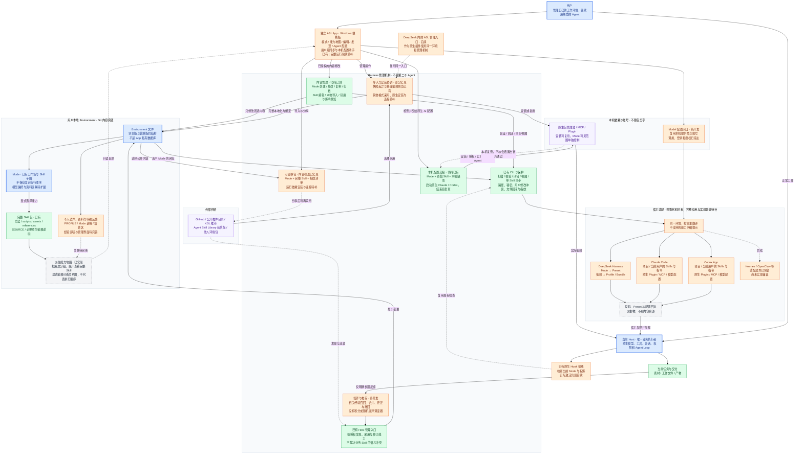

**总图中的四个循环：**工作循环产出结果；安装循环把外部能力放进指定 Mode；迁移循环把同一环境交给另一台机器或另一种 Agent；培养循环把明确反馈变成适用范围更清楚的能力。四者互相连接，但不要求每次任务都走一遍。

**不可混淆的边界：**

- 空白 Harness 和 Agent Skill Library 使用同一环境结构，区别在内容，不维护两个架构分支。
- 一个 Mode 是一种工作场，不是整个个人能力全集。环境内可以存很多能力，进入某 Mode 只提供它选择的 Skill 子图；这不是操作系统级安全隔离。
- 业务方法由完整本地 Skill 承载；插件执行代码、模型服务、登录与沙箱沿用宿主，不把基础设施硬包成伪业务 Skill。
- App 管理内容与接入，不替 Host 回答用户或调度业务。语义冲突归 Host 与具体 Skill，确定性结构错误才交 CLI / Hook。
- 本地文件是真源；宿主投影可重建；分享包是选定内容的快照。导入后成为接收者自己的环境，不持续依赖分享者的电脑。
- “一切皆市场”的首期实现是**可分享的环境与能力目录**，复用 GitHub、已有插件市场和来源记录，不先造交易平台、中心账号或积分。
- Mode、Model 分开：前者决定工作环境，后者决定哪个模型做事。切换 Mode 可以关联模型偏好，但不能假装所有宿主支持同一模型接口。

---

## View 1 · 系统上下文图

回答：ASL 在整个使用场景中处于什么位置，谁负责执行，什么是真源？

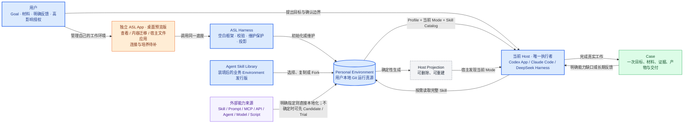

关键边界：Harness 不替 Host 执行业务 Goal。外部业务能力通过责任 Skill 本地化；宿主已有模型、工具和插件执行机制无需再包一层。用户明确要求“找来并融入”时，可以检查相关来源后直接采用，不必先跑 Trial 或效果 Case。具体阅读范围不由 Harness 统一规定。

---

## View 2 · Harness 与 Environment 组件图

回答：空白 Harness 内有什么，个人 Environment 内有什么，两者怎样分工？

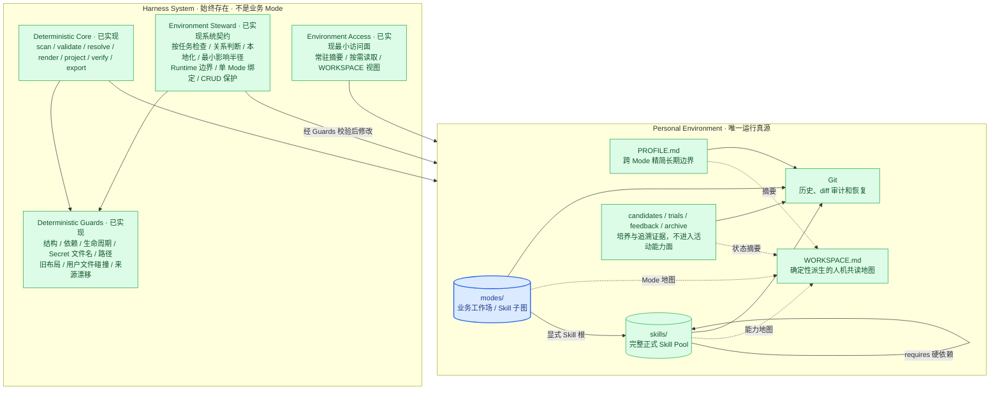

这里没有管理 Mode。能力发现、培养、增删改查保护和记忆访问属于 Harness 系统层；内容创作、产品分析和投资研究才属于业务 Mode。

Harness 的 Hook / Guard 只处理可确定的边界，不接管业务判断：

| 级别 | 处理方式 | 典型对象 |
| --- | --- | --- |
| 硬阻断 | 拒绝相应写入或投影，返回具体错误 | 结构非法、正式 Skill / Candidate 无来源、依赖缺失/循环、Trial 不完整、Secret 文件名、路径逃逸、覆盖非受管文件、受管内容指纹不符、固定 Workflow/Run 回流 |
| 软提醒 | 任务可继续，只提示应刷新或检查 | 缓存或可重建依赖、`WORKSPACE.md` 过期、宿主投影漂移、Candidate 未决定、上游出现新版本、两个 Skill 可能重合 |
| Host + 用户判断 | 不伪装成确定性规则；当前 Host 起草方案，高影响动作由用户授权 | 是否需要新 Mode、候选是否值得采用、Skill 应合并还是独立、是否发布或外部写入 |

这样既防止 Environment 漂移，也不会因为一个缺失字段、过期视图或语义不确定就阻断用户的普通 Goal。

---

## View 2B · 原生 Harness 边界与 Environment Sync CLI

回答：ASL 怎样更像原生 Harness，而不是再造一个 Codex、Claude Code 或 DeepSeek Harness？两份 Environment 又怎样同步？

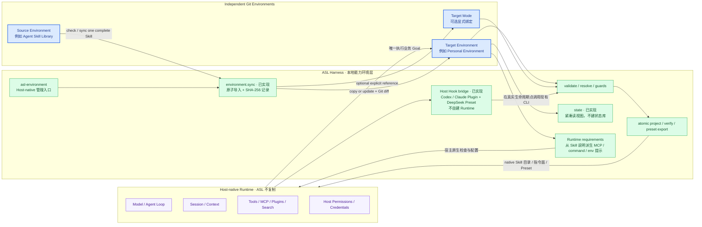

“更原生”不是让 ASL 拥有自己的 Agent Loop、会话数据库、工具执行器、权限系统或插件 Runtime，而是让 ASL 通过每个 Host 已经认可的 Skill、指令文件、项目目录和 Preset 接口工作。办公和研究场景里最常见的是 Skill、Tools、MCP、搜索和插件；模型、沙箱、凭据与授权继续使用宿主默认能力。ASL 只补宿主没有统一解决的个人能力环境、Mode、来源、本地采用、确定性校验和投影。

这套工作环境不是由一种技术单独完成，而是五个很薄的部分协作：

| 部分 | 在 ASL 中负责什么 | 不负责什么 |
| --- | --- | --- |
| Git Environment | 保存 Profile、Skills、Modes、来源和明确反馈，是可复制的个人能力真源 | 不运行 Agent |
| CLI | 安装、检查、同步、选择 Mode、生成或验证宿主视图 | 不理解业务、不调度工作流 |
| Host Adapter | 把同一 Mode 翻译成目标 Agent 能原生发现的 Skill、规则和 Preset | 不复制宿主已有 Tool、Agent、权限和模型 |
| Hook | 在会话开始、受管内容修改后或提交前调用现有 CLI 检查 | 不监控所有行为，不靠模型做 Review |
| GitHub Actions / CI | clone 或提交后运行同一组校验，保证仓库版本可用 | 不进入本地会话，不替代 Hook 或 Host |

以上是已有底座。产品入口已确定升级为独立 App：用户管理自己的多个工作环境，选择目标 Agent 并应用，或把培养过的环境分享出去。CLI 承担确定性操作，原生 Hook 提供检查时机，CI 守住仓库；它们是 App 复用的底层，不是要求普通用户自己操作的界面。

已有单 Skill 同步接口如下；本次仅更新架构设计，不增加后台服务：

```bash
asl-harness environment.sync \
  --source ./agent-skill-library \
  --target ./personal-harness \
  --skill x-post-card-studio \
  --mode creator-studio
```

| 行为 | 契约 |
| --- | --- |
| 来源与目标 | 都必须是可通过 `workspace.validate` 的本地 Environment；CLI 不负责全网搜索或 Git clone |
| 同步单位 | 一次同步一个完整 Skill package；不拆文件、不把 Prompt、脚本或 Runtime 裸同步 |
| Mode | `--mode` 可选；提供时只修改目标 Environment 的一个明确 Mode，其他 Mode 不变 |
| 相同内容 | 返回 no-op，不制造提交、投影或新版本号 |
| 目标不存在 | 完整复制 Skill，并保留 `SOURCE.md`、运行依赖说明、scripts、references、assets 与测试 |
| 目标已修改 | 默认拒绝静默覆盖并展示差异；只有用户显式选择替换时才更新 |
| 检查模式 | `--check` 只报告将新增、更新、冲突或保持不变的内容，不写文件 |
| 完成后 | 校验目标 Environment、刷新人机共读视图并输出来源/目标 HEAD、package SHA-256、受影响路径与 Git 状态；不自动 commit、push 或刷新所有宿主投影 |
| 失败 | Skill、Mode 引用与 `WORKSPACE.md` 作为一次事务回滚，不留下只复制一半的 Environment |

同步结束后，两份 Environment 仍是两个独立 Git 真源。再次运行命令可以显式吸收上游更新，但不会形成实时链接、共享 Skill 目录、后台 watcher 或自动升级关系。宿主投影仍由现有 `host.project` / `deepseek.preset.export` 单独负责。

### Skill 运行依赖与跨 Agent 接入

兼容信息留在责任 Skill 的正文和已有 package 文件内，不再保留独立连接层或空目录。跨 Agent 复用以完整 Skill、自带脚本、标准 MCP 服务为主。Skill 按需记录 MCP 名称、用途、检查方式、环境变量名称、宿主差异与缺失时处理。当前 Mode 的结构化配置只选择 Skill；后续 App 的可选模型偏好、内容关联与安装增量见 View 2E / 2F，不把设计中的配置说成目前可执行。

当前接入说明可识别 `SKILL.md` 的依赖/环境检查章节和 `SOURCE.md` 的 Runtime dependencies 记录，只提示去哪里看，不是依赖已安装、已登录或可执行的证明。Host 在实际使用某 Skill 时依据它自己的检查方法确认就绪；不批量安装，不运行集中式依赖调度器。尚未实现统一的自动就绪诊断。

Codex、Claude Code、DeepSeek Harness、OpenCode、Trae、ZCode 或其他 Agent 已经提供的模型、Tool、Agent、Plugin、沙箱和权限继续由各自管理。Harness 不复制它们，也不建立通用 Tool Registry。某个宿主能够原生接入 Skill 或 MCP 时，Adapter 只负责把同一份本地真源翻译到它认可的位置；不支持时给出可执行提示，不能伪装已经激活。GitHub Actions 不是交互式 Host，只复用 CLI 做仓库校验。

### 最小 Hook 接线

Hook 是宿主调用 Harness 检查的时机，不是新的工作流。会话开始、当前 Mode 相关文件写入后、停止前，复用当前 Mode 闭包校验与投影校验；全库 `workspace.validate` 留给维护与显式体检。候选、试验或无关 Skill 未写完不阻断日常 Mode。Codex 与 Claude Code 通过同一 Host Plugin 接线；DeepSeek Preset 装入官方 `@deepseek-ai/dsh-hooks-codex` 并通过命令参数指向自己的 Preset。没有 Hook 时可手动调用同一 CLI。

Hook 在写入工具完成后报告当前 Mode 的确定性结构错误，要求 Host 修复；不是事前撤销器，也不证明错误一定由本次写入造成。普通业务内容、可选 MCP、过期视图和语义问题不参与硬阻断。删除、发布、付费、登录、外部写入和权限继续由宿主原生门禁处理。

---

## View 2C · Host-native Hook 接线架构

回答：Hook 具体装在哪里、怎样找到当前 Environment / Mode、调用什么命令，以及结果怎样回到当前 Agent？

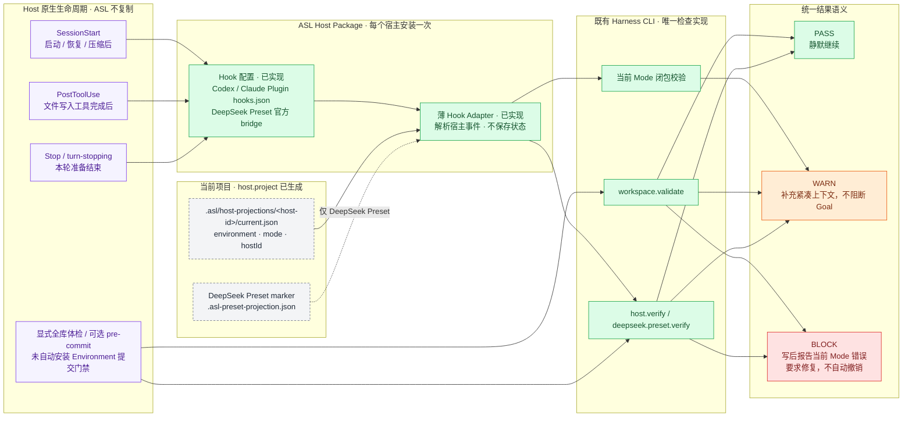

### 安装与激活边界

Hook 不属于业务 Mode，也不复制到每个 Skill。`asl-environment-host` 作为 Harness 的宿主包安装一次：Codex 和 Claude Code 由包内原生 Hook 配置调用同一薄 Adapter。DeepSeek Harness 不再重复实现一份 TypeScript Adapter；`deepseek.preset.export` 把同一命令 Hook 写进 Mode Preset，并用官方 `@deepseek-ai/dsh-hooks-codex` 将它接到 Cordis 生命周期点。Adapter 自身没有数据库、队列、事件日志或 Agent Loop。

项目入口从 cwd 向上查找 `.asl/host-projections/<host-id>/current.json`。DeepSeek Preset 导出时把已有 Preset 路径写入 Hook 命令的 `--preset` 参数，因此即使业务 cwd 在别处，也能读取 `.asl-preset-projection.json`；在 Preset 目录内也可直接发现该标记。没有项目标记时静默返回；显式指定的 Preset 标记缺失时提醒重建，不猜 Mode、不扫描电脑。仍只复用现有 environment、mode、hostId，不新增状态文件。

### 事件到检查的固定映射

| 原生时机 | Adapter 先判断什么 | 调用的既有命令 | 对当前 Agent 的结果 |
| --- | --- | --- | --- |
| `SessionStart`：启动、恢复、压缩后 | 项目标记或显式 Preset | 当前 Mode 闭包 + 对应 `verify` 函数 | 注入 Mode、Skill 数量和漂移提醒；失败不阻断启动 |
| `PostToolUse`：明确文件写入完成后 | 目标是否在当前 Mode 的 Skill、Mode、Profile、WORKSPACE 或投影 | 当前 Mode 闭包 + 对应 `verify` 函数 | 当前 Mode 确定性错误返回退出码 2；无关 Skill、培养区和普通产物不检查 |
| `Stop`：本轮准备结束 | 是否有 ASL 标记 | 一次当前 Mode 闭包 + 对应 `verify` 函数 | 只提醒，不循环阻止停止；没有跨事件状态、Shell 追踪或增量缓存 |
| 显式全库体检 / 用户自接 `pre-commit` | 用户主动运行 | `workspace.validate` | 仍严格检查全部正式与培养结构；未自动安装 Git Hook，现有仓库 CI 只运行 Harness 测试 |

不接 `UserPromptSubmit`、`PreToolUse`、`SubagentStart`、`SubagentStop`：意图识别和任务路由属于当前 Host；删除、Shell、发布与登录的授权属于宿主权限；子 Agent 继承项目表面即可。除非出现已经被真实任务证明无法覆盖的故障，否则不增加更多 Hook 点。

### 单次事件处理时序

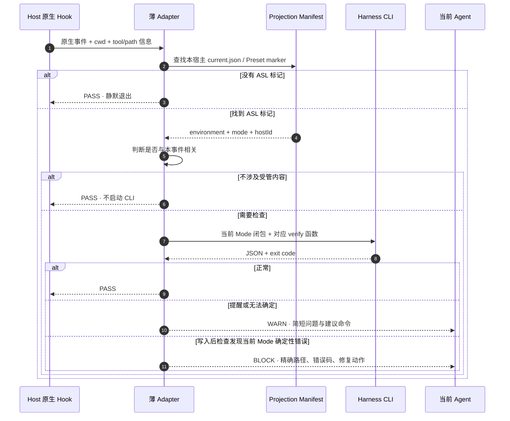

### 三宿主实现映射

| Host | 原生安装面 | ASL 使用的事件 | 实现约束 |
| --- | --- | --- | --- |
| Codex App / CLI | `asl-environment-host` Plugin 的 `hooks/hooks.json` | `SessionStart`、写入工具的 `PostToolUse`、`Stop` | 使用 Codex 原生信任与 matcher；Hook 命令只调用薄 Adapter，不写 `config.toml`，不接管 PermissionRequest |
| Claude Code | 同一宿主包的 Claude Plugin Hook | `SessionStart`、写入工具的 `PostToolUse`、`Stop` | 使用 Claude 原生项目目录与退出码语义；不安装全局后台进程，不改用户已有 Hook |
| DeepSeek Harness | Mode Preset 内的 `@deepseek-ai/dsh-hooks-codex` | `agent/session-start`、`tools/post-execute`、`agent/turn-stopping` | `deepseek.preset.export` 写入专用 `asl-hooks.json`，命令显式指定 `deepseek-harness`；每个 Preset 在加载时绑定自己的配置，不依赖尚未实现的跨 Session 自动发现 |
| 无 Hook 的 Agent | 无 | 无 | 用户或 CI 手动运行同一 CLI；Adapter 不伪装自动保护已经启用 |

Codex 与 Claude Code 的 Hook 包装只负责把原生 stdin / 环境变量转换为 Adapter 参数；DeepSeek 的官方 bridge 把 Cordis typed event 转成同一套 Codex 命令 Hook 载荷。三者共享“定位投影 → 选择既有检查 → 映射 PASS / WARN / BLOCK”这条逻辑，没有新造跨宿主 Hook 语言。

### 门禁与失败语义

| 情况 | 结果 | 理由 |
| --- | --- | --- |
| 没有 ASL 标记、CLI 暂时不可用、可选 MCP 未登录 | PASS 或 WARN | 不能因为辅助 Harness 让普通工作无法开始 |
| Environment 已改变但投影尚未刷新、视图过期 | WARN | 给出 `host.project` 或视图刷新命令，由当前 Agent 或用户决定何时执行 |
| 当前 Mode 相关写入后发现非法引用、路径逃逸、Secret、损坏受管投影 | 退出码 2，要求修复 | 写后校验，不撤销已写内容，也不做语义裁决 |
| 内容质量不好、是否创建 Mode、Skill 是否值得采用 | 不判定 | 属于业务与用户判断，不是机械 Hook 能证明的事实 |
| Hook 自身超时、命令缺失或异常 | 依宿主原生 Hook 机制处理 | 尚未逐宿主验证全部异常语义，不能宣称统一 WARN 已验收 |

Hook 不单独保存运行记录。Codex、Claude Code、Cordis 使用自己的 Hook / Session 日志；ASL 仍以现有 CLI JSON、Projection Manifest 和 Git diff 作为可追溯证据。实现依据以宿主原生接口为准：[Codex Hooks](https://developers.openai.com/codex/hooks)、[Claude Code Hooks](https://code.claude.com/docs/en/hooks)、[DeepSeek Harness Hook Bridge](https://github.com/deepseek-ai/deepseek-harness/blob/master/packages/hooks/hooks-claude-code/README.md) 与 [Cordis Plugin Primer](https://github.com/deepseek-ai/deepseek-harness/blob/master/docs/cordis-primer.md)。

### 状态与操作记录

`state` 只汇总当前 Environment 的 Git HEAD、Skill / Mode 数量、Mode 闭包规模、培养区、提醒和能力视图状态。导入命令的 stdout JSON 是导入记录；项目的 `current.json` 与 Preset 的 `.asl-preset-projection.json` 是导出记录。三者复用 Git 与现有 manifest，不增加事件日志、数据库、watcher 或第二状态树。

`host.project --mode <id>` 切换的是项目磁盘上的 Skill 面和指令块，不保证正在运行的旧会话清除了旧上下文。Git HEAD 只记录来源；只有当前 Mode 的内容指纹变化才提醒重建。当前 Host 能唯一判断时可选择 Mode，实质歧义才询问用户，但完整的自然语言选 Mode 与会话刷新体验尚未验收。

## View 2D · App 入口与 Mode 可见状态（同步及配置入口已有，完整运行验收与培养待补）

**用户不需要理解配置目录。** 打开 App 应先看到自己的工作场，以及每个工作场能做什么、有哪些资料和经验、哪个 Agent 能用、还缺什么连接。可以从空白环境开始，也可以导入已经培养过的 Mode；两者进入同一界面。

**当前桌面版实际可以做：**连接现有技能库或内置示例，显示真实 Mode、按用途分组的完整技能与引用关系；创建、编辑、复制、归档 Mode，编辑 Skill、导入本地完整 Skill 并加入 Mode。保存前显示涉及的模式，过期编辑拒绝覆盖，归档保留完整目录。还可预览并导入 / 导出 ASL 环境包；浏览 DeepSeek 社区插件目录和 GitHub 搜索结果；只读显示已识别的本机 MCP 名称及技能包内依赖声明；选择项目生成 Codex / Claude 文件投影，或基于已有 DeepSeek Preset 导出新 Preset。未检测的连接不显示为零，文件配置不等于会话生效。市场目前只能浏览和打开来源，不能一键安装；本地 Skill 导入仍要求现有 ASL 内容结构，任意上游 Skill 的自动补齐尚未实现。

**归类不是自动匹配。** 产品展示与验收使用真实 Agent Skill Library，不把人工准备的演示分类当成 App 的理解能力。以下机制必须分开：

| 用户看到什么 | 当前实际来源与检查 | 不代表什么 |
| --- | --- | --- |
| 一个 Mode 包含哪些技能 | 读取 `modes/<id>/mode.yaml` 的 `spec.skills`，再解析 Skill 的 `metadata.asl.requires`；核心检查技能存在、依赖完整与路径边界 | 不是 App 根据任务自动选好了技能；成员最初由人或被授权的 Agent 明确维护 |
| 技能列表、直接加入 / 依赖带入 | 原样呈现核心返回的成员与依赖关系；图上的依赖线只取声明关系 | 不推测执行顺序，不用关键词改变成员 |
| 能力地图中的研究、写作、视觉等分组 | `presentation.mjs` 按名称 / 标识优先、说明其次匹配关键词，未匹配进其他；界面明确标为“关键词辅助分组” | 是人工编写的展示规则，不是 AI 语义匹配，也没有业务正确性保证；可切换不分组的技能列表 |
| 本机能否使用 | 检查原始依赖声明、工具路径、配置文件和受支持的体检结果 | 不把文件存在、目录存在或导出成功等同于实际任务成功 |

例如真实 `creator-studio` 显式列出 19 个技能，包括 Agent Reach、宝玉配图及公众号排版；`product-lab` 列出 6 个技能，其中也有 Agent Reach。共享来自两份 Mode 的明确选择，不是 App 临时跨模式召回。当前没有“理解需求 → 自动归类 → 自动加入 Mode”的产品功能。内置小示例仅用于初次查看且只读；编辑前须导入为独立技能库，不在安装目录改示例。

**当前用户同步：**应用弹窗可选“仅这个项目”或“我的所有项目”；后者不是整台机器所有用户。一个宿主选择一个 ASL 默认 Mode，但项目显式 Mode 与用户当前请求优先，宿主已有其他技能不会被屏蔽。预览新增、更新、移出与冲突；只管理自己复制的完整包，切换或停用不删原技能源。同名未受管内容或被修改的副本会拒绝覆盖。修改技能源后需主动再同步，不运行后台全盘监听器。

**安装位置：**项目级选择项目文件夹，ASL 写入该项目的原生技能目录与指令文件；用户级显示当前 Agent 的真实用户技能目录，并允许另选文件夹。Codex 默认是 `~/.agents/skills`（共享原生目录，其他支持它的 Agent 也可能读取），Claude 默认是其配置目录下的 `skills`。`CODEX_HOME` / `CLAUDE_CONFIG_DIR` 用于识别宿主配置位置，不把项目路径当成用户配置。另选技能文件夹只改变 Skill 副本位置，原生指令仍在真实配置目录；界面显示“还需关联”，配置助手再核对宿主的原生关联方法。已有受管 Mode 时先停用原目录，避免静默留下两份启用副本。存放成功、原生可发现、实际可用是不同状态。

安装交互参考 [Vercel Skills](https://github.com/vercel-labs/skills)：先选 Agent，再选项目 / 用户范围；`npx skills add` 的项目范围默认是执行命令的当前目录，App 则用文件选择器明确选择，不要求用户掌握终端。目录识别参考 [CC Switch 的技能同步实现](https://github.com/farion1231/cc-switch/blob/main/src-tauri/src/services/skill.rs)，但不引入另一套技能登记库。原生目录依据 [Codex host roots](https://github.com/openai/codex/blob/main/codex-rs/ext/skills/src/host_roots.rs) 与 [Claude 配置目录](https://code.claude.com/docs/en/claude-directory)；不将“只选 Codex”承诺成共享目录的跨 Agent 强隔离。

**配置这台电脑：**同步后检查 Mode 对应的原始依赖声明、工具路径与 MCP 名称，支持 Agent Reach 的渠道 doctor；不会把“存在”当作“可用”。点击“让 AI 配置”后，用当前电脑已安装的 Claude Code / Codex CLI 打开独立原生会话，完整任务材料留在 App 本机配置会话目录，继承原来的模型、账号与原生权限。助手阅读原始 Mode / Skill，按本机情况安装或复用依赖、处理连接并实际验证；App 可重新检查。配置助手当前只实现 Windows 入口，不迁移秘密、不自动升级宿主、不接管登录、不直接请求另一个模型 API。原生会话可能因版本、账号或网络失败；失败与“已打开 / 已结束”分开，不记录成“就绪”。

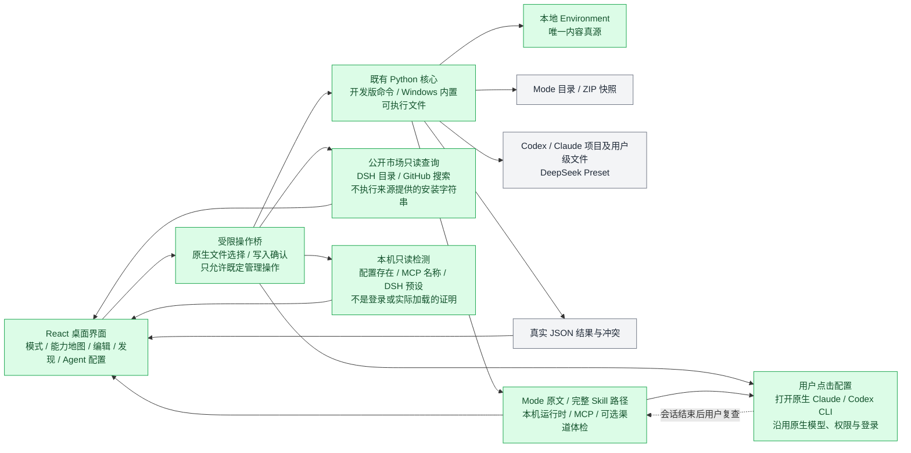

界面没有远程页面、Node 权限或任意 Shell 入口；主进程核对调用来源与用户选择的路径，业务执行仍归目标 Agent。无需一个常驻后端服务，也没有另建索引数据库。

| 界面 | 展示与操作 | 不让用户承担什么 |
| --- | --- | --- |
| 工作环境 | Mode 卡片、工作范围、当前项目；进入、复制、编辑、分享 | 不把工作环境强行画成顺序步骤 |
| 能力地图 | Mode 内 Skill、资料、明确经验；点开能看内容、来源、依赖和引用者 | 不展示后端事件树，不凭模型猜测生成关系 |
| 添加能力 | 粘贴仓库链接或描述所需能力；选择目标 Mode；预览安装、连接与影响 | 不要求手写每 Skill YAML；明确要求安装不先跑业务效果试验 |
| 模型与连接 | 识别宿主已有配置，选择可用模型，补缺失连接 | 不重新建立另一套账号或代理系统 |
| 分享与更新 | 选择内容、查看排除项、导出；更新看本地修改与上游差异 | 不导出整台电脑配置，不自动盖掉个人调教 |
| 培养记录 | 看见明确反馈改了哪里，接受、更正或撤回；按需寻找新能力 | 不把沉默、耗时或所有聊天变成永久记忆 |

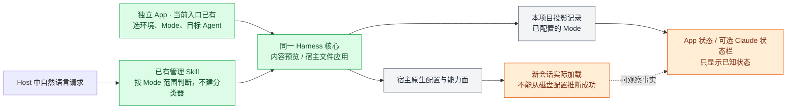

**显示不等于生效。** Ponytail 的本机状态栏通过插件标记展示级别，给 ASL 的启发是“让工作状态可见”，不是复制一个全局开关。ASL 从现有项目投影读取 Mode，不能再造一份互相打架的活动状态。Claude 可选追加原生 statusLine，保留已有状态栏；DeepSeek 使用原生 Preset 名称；Codex App 的同等常驻展示需实机验证。独立 App 是三者共同的管理入口，不依赖它们都有相同状态栏。[Ponytail 状态栏实现](https://github.com/DietrichGebert/ponytail/blob/main/hooks/ponytail-statusline.ps1)、[Claude 原生状态栏](https://code.claude.com/docs/en/statusline)。

**旧会话不强行改造。** DeepSeek 已开始的会话不能换 Preset；Codex 插件安装后需要新会话加载。App 应提供“用此环境开始新会话”，让旧任务继续保留；宿主不提供启动接口时打开对应项目并给最短操作提示。可以携带用户选择的交接摘要，不声称迁移全部聊天历史或强行控制现有对话。[DeepSeek Preset 边界](https://github.com/deepseek-ai/deepseek-harness/blob/master/packages/preset/agent-presets/README.md)、[Codex 插件](https://learn.chatgpt.com/docs/plugins)。

---

## View 2E · 可迁移环境包与复杂能力安装（内容往返已实现，原生安装待实现）

**分享的是“工作环境配方 + 用户选择的内容”，不是已安装电脑的备份。** 配方描述需要哪些能力以及怎样接到宿主；内容保留可编辑文件。接收者用自己的模型账号，在自己的电脑上装好实际依赖。

### 当前可运行的最小包

`mode.export`、`mode.inspect`、`mode.import` 已实现目录 / ZIP 往返。根目录采用 [Agent Plugins 1.0 的 manifest 与布局](https://agent-plugins.org/specification)：`plugin.json`、`skills/<id>/`；ASL 专有内容放入 `io.github.qihangzhang-272.asl/`，不污染通用字段。

```text
creator-studio.zip
├── plugin.json                 # 标准元数据；ASL 扩展记录版本、Mode、文件哈希和执行位
├── skills/<skill-id>/           # 仅当前 Mode 闭包，完整方法、来源、脚本与资产
└── io.github.qihangzhang-272.asl/
    ├── modes/creator-studio/    # MODE.md + mode.yaml
    └── PROFILE.md              # 默认没有；明确 --include-profile 才加入
```

```sh
asl-harness mode.export --workspace ./environment --mode creator-studio --output ./creator-studio.zip --check
asl-harness mode.export --workspace ./environment --mode creator-studio --output ./creator-studio.zip
asl-harness mode.inspect --source ./creator-studio.zip
asl-harness mode.import --source ./creator-studio.zip --target ./received --check
asl-harness mode.import --source ./creator-studio.zip --target ./received
```

- **内容不丢、默认少带：**依赖清单与脚本作为 Skill 内容保留；不打包 `.git`、`node_modules`、虚拟环境、缓存、其他 Mode、私人任务或 Mode 目录中的额外笔记。PROFILE 需显式选择，导入已有环境也不覆盖接收者自己的 PROFILE。导出预览列出文件、依赖描述和疑似本机路径，不偷偷改写技能。
- **读已有声明，不另造配置：**包预览直接解析 `package.json`、`pyproject.toml`、`requirements.txt` 与 `mcp.json` / `.mcp.json`，显示基础直接依赖、MCP 服务名、环境变量名称和准备脚本名称；不返回账号值、服务地址或安装脚本正文。未支持的包管理格式与锁文件保留原文件供查看；动态、构建和可选依赖不冒充已完整解析。声明损坏只显示提醒，不阻断完整内容迁移。所有结果仍标为“未检测安装状态”，不执行 `postinstall` 或自行启动服务。
- **预览与写入分开：**`--check` 不改目标；同名不同内容列为冲突，只有显式 `--replace` 才替换；报告受影响的其他 Mode。复用既有回滚保护，导入新目录先暂存，成功才落位；相同内容重复导入不制造变更。stdout JSON 是操作回执，不新增日志数据库。
- **可核对不等于可信：**逐文件 SHA-256 检查缺失、篡改和夹带；拒绝越界路径、符号链接、大小写冲突及明显秘密。ZIP 限 10,000 文件 / 512 MiB 展开内容，避免无界解包。哈希不是签名，文本秘密扫描也不是隐私认证；导出者仍需检查分享内容。
- **兼容范围不夸大：**这是 ASL 快照读写器，采用通用包装，不是完整 Agent Plugins 客户端认证。不直接把 ZIP 交给 DSH 或 Claude；导入为本地 Environment 后继续走现有宿主适配。当前未实现通用第三方插件采用、MCP 转换或原生运行依赖安装，`runtimeStatus` 明确是 `not-checked`。

参考 [Hermes plugin_packs.py](https://github.com/NousResearch/hermes-agent/blob/main/hermes_cli/plugin_packs.py) 的预览、已有配置优先、秘密与权限不随包迁移；保留 ASL 本地完整内容，不照搬其只凭 Git 安装记录导出的限制。没有复制 Hermes 源码或加入其运行依赖。

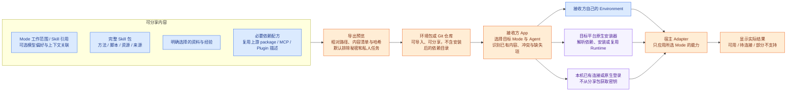

### 内容与安装怎样分开

| 遇到的东西 | 放在哪里、怎样迁移 | 不做什么 |
| --- | --- | --- |
| 普通 Skill | 方法、脚本、资源、来源完整进入本地 Skill；Mode 显式引用 | 不只复制 SKILL.md，丢掉脚本和图片 |
| Agent Reach 一类复杂能力 | 本地 Skill 说明负责业务用法；Python/Node 包、命令、MCP、登录需求复用原生声明和检查；App 编排安装与连接提示 | 不把 node_modules、venv、浏览器登录态打进分享包 |
| DeepSeek Bundle | 保留包名、版本与必要配置，交 DSH 插件管理和包管理器处理；按需要装入所选 Profile | 不把 Cordis 专用代码说成可在所有 Agent 运行 |
| 已有宿主 Plugin / MCP | 先检查目标宿主是否已有并可用；缺失才提议原生安装；项目相关配置关联责任 Skill | 不复刻宿主内置工具，不另造 Bindings 资产层 |
| 个人资料与经验 | 原位置编辑，导出时明确选择；包内使用相对路径，导入后重建本地引用 | 不默认包含所有历史 Case、聊天、私有路径和账号 |
| 模型 | 分享模型偏好及必要能力要求；接收方选择自己的提供商和账号 | 不分享 API Key，不承诺订阅账号可转成通用 API |

不新增每 Skill 必填 sidecar。优先读取现成的 package.json、pyproject、MCP / Plugin manifest；只有无法表达的必要宿主差异，才补进责任 Skill 的说明或原生配置片段。**自动安装不能靠任意自然语言直接变成 shell 命令**：管理 Agent 可起草安装方案，但执行端只接受已支持的包管理、配置和连接操作。未知安装方式显示“需人工步骤”，不编造成功。新包包含安装脚本时显示其本机执行影响；用户指定采用不需要先证明业务效果。

**同一个依赖可以装一次，但不因此在每个 Mode 都暴露。** 移除 Mode 中的能力先解除引用；仍有其他 Mode 使用的 Runtime 不随之卸载。对于只能全局启用的宿主插件，明确标为共享宿主能力，不能宣称已经实现 Mode 级强隔离。

**最小协议增量：**沿用 Environment / Mode / Skill，只补可选的内容关联、模型偏好及宿主扩展信息；导出时自动产生版本化清单、相对路径、必要包版本、内容指纹及支持情况。业务 Mode 不增加 plane 或人工 revision 字段。当前 mode.yaml 的机器可读 spec 仍只有 skills；这些增量尚未进入校验器，不能按已支持字段使用。分享者本机的投影、绝对路径与登录配置不是协议内容。

### DeepSeek 的天然优势与不能直接复用的部分

- **Bundle 是可发布的插件包，Profile 是运行时装配配置，Preset 是会话工作环境。** ASL Mode 最接近 Preset；不把一个人的全部 Environment 或每一个 Mode 都等同于 Profile。Profile 能供多个 Preset 共用，只有原生依赖确实冲突时才考虑拆分。
- 官方通过 npm 包中的 dsh.bundle.patch 贡献插件组合，Profile 的 bundle 列表和本地补丁完成装配；普通依赖包安装后不一定激活。配置行替换并非通用深合并，适配器需遵循原生语义。优先使用预构建发布包，减少用户本机编译。[官方发布与安装设计](https://github.com/deepseek-ai/deepseek-harness/blob/master/docs/user/develop/basic/publish.md)
- Preset 可以复制完整目录并隔离每会话的能力组合，但复制后是快照，不自动吸收原版修改；插件热插拔也不等于已开始的会话可以随意换 Preset。ASL 的增量是跨宿主环境管理、差异更新和迁移，而不是重写 Cordis。[官方 Preset 设计](https://github.com/deepseek-ai/deepseek-harness/blob/master/packages/preset/agent-presets/README.md)
- 社区市场将插件目录与 UI 分离，显示安装、兼容与更新状态。可借用其目录维护方式，但“被收录”不代表安全或业务质量认证；其配置备份可能含敏感信息，不能作为我们的默认分享格式。[dsh-market](https://github.com/dsh-market/dsh-market)、[社区插件目录](https://github.com/awesome-dsh-plugin/awesome-dsh-plugin)
- 本机社区 DSH Desktop 公开了 desktopProfiles 与 desktopPnpm。可以做一个原生 ASL 管理入口，但 Profile 切换会重启，不是静默热切；包操作接口也不自动替我们做回滚和结果验证。这些是该 Desktop 的接口，不是所有 DSH 发行版都有。[公开插件服务](https://github.com/anywhere-labs/deepseek-harness-desktop/blob/master/dsh-plugin-desktop/docs/plugin-services.zh.md)

**本机投影与分享包已经分开。** `deepseek.preset.export` 继续生成带本机路径的 Preset；`mode.export` 不复制这些投影标记。已验证分享包导入另一个目录后重新投影到 Codex 项目，引用接收目录而非发送目录；这是文件接入验收，仍不等于新会话运行或复杂依赖已就绪。

---

## View 2F · 模型配置与跨宿主应用时序（设计，待实现）

Mode 是“做什么工作、采用哪些能力”；Model 是“由哪个模型做”。用户在 App 里可以一起选，底层必须分清：

| 信息 | 归属 | 举例 |
| --- | --- | --- |
| 工作环境偏好 | Mode，可选随包分享 | 偏好某模型；确实需要看图或工具调用时说明 |
| 提供商、接口、可用模型与账号引用 | 本机连接，复用宿主既有配置 | 本机 DeepSeek API 或 Claude Code 已配置的提供商 |
| 当前会话实际模型 | 宿主会话，不靠 App 猜 | 未查询到就显示未知，不把“首选模型”标成“正在使用” |

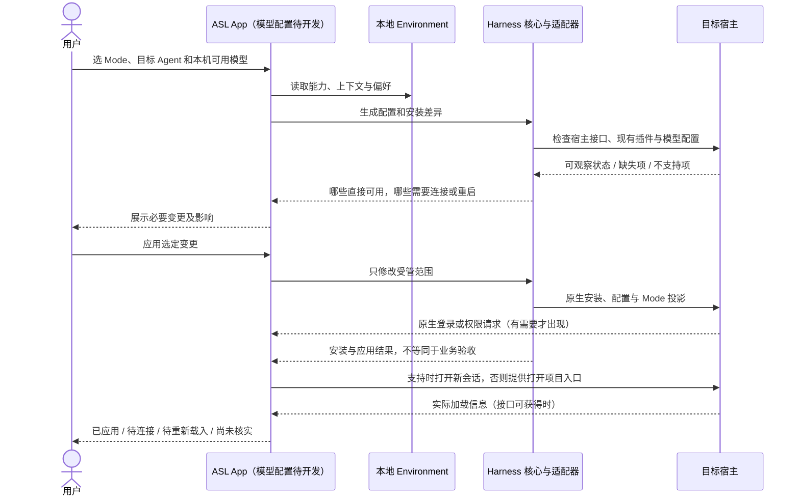

ASL 不代理模型推理，也不建立 API 网关。DeepSeek 官方自定义提供商支持多种 API 协议，凭据与普通设置分开；模型列表查询可能为空，某些 OAuth 提供商尚不能走同一路径。因此 App 必须按宿主适配，允许选择已有模型或手动填写受支持配置，不承诺任意套餐通用。[DeepSeek 模型配置](https://github.com/deepseek-ai/deepseek-harness/blob/master/docs/user/guide/providers.md)、[Claude Code 模型配置](https://code.claude.com/docs/en/model-config)。

与 CC Switch 等已有配置工具共存时，每个配置项只能有一个明确维护方。默认识别并采用已有配置；修改前显示差异，发现外部修改先提示，不来回覆盖。未支持的某个可选能力只标注该项，不冻结整个工作环境。安装导致的外部副作用未必能完整撤销，界面应区分“文件配置已恢复”和“运行依赖需另行处理”。

---

## View 3 · 普通 Goal 的执行时序

回答：用户只给一个目标时，系统怎样工作，什么时候会阻断？

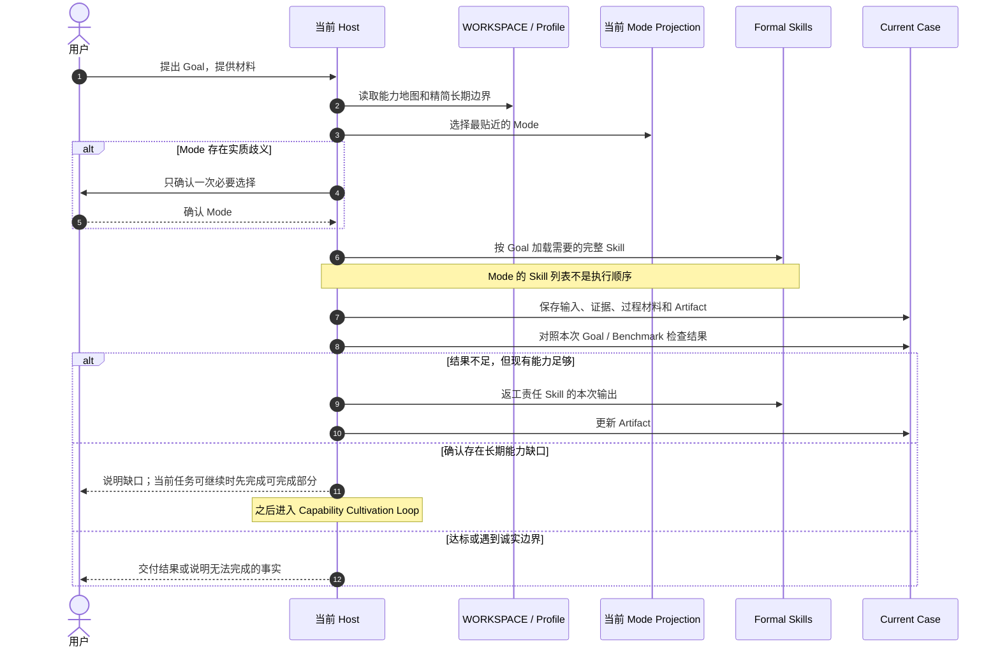

普通 Goal 不要求 Session key、Run token 或固定节点状态。视图和缓存提醒不阻断；确定的结构、Secret、路径与覆盖问题由 Harness 拒绝，高影响授权由当前 Host 的原生权限边界处理。

---

## View 4 · Skill / Mode 变更时序

回答：Mode 和 Skill 的增删改查如何与普通内容分开，谁负责起草、校验和授权？


AI 根据任务与具体 Skill 判断阅读深度，并起草完整本地能力包。用户明确指定引入时，可以直接进入正式 Skill Pool；确定性结构校验和高影响授权仍保留，但不再用 Trial、示例或效果测试拖延采用。普通任务材料不能在没有明确长期意图时自动修改正式 Skill 或 Mode。

---

## View 5 · 外部能力生命周期状态图

回答：一个外部能力怎样进入本地，最终可能得到哪些处理结果？

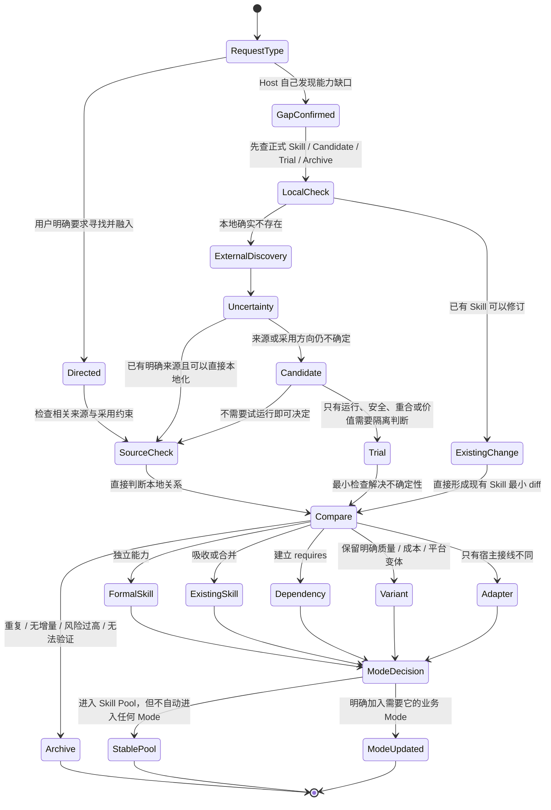

上游更新在没有用户明确采用时只形成新的 Candidate，不能自动覆盖本地正式 Skill。用户明确要求升级或引入时，可以在检查相关来源后直接修改本地真源，阅读方式由当前 Host 依据具体 Skill 决定。

外部发现有两个入口：用户明确指定寻找或融入时立即执行；否则只有真实 Case 证明现有能力不够、正式 Skill 长期失效、上游发生重要变化，或安全问题要求替换时才进入。一次输出偷懒、一次模型错误和含义不明的行为不会自动触发搜索。

| 查找顺序 | 去哪里看 | 这一层解决什么问题 |
| --- | --- | --- |
| 1 | 本地正式 Skill、Candidate、Trial、Archive | 避免重复搜索、重复安装和遗忘历史拒绝原因 |
| 2 | 用户明确指定的仓库、作者、帖子或工具 | 尊重已知来源，不擅自换题 |
| 3 | 公开真实使用反馈与可信从业者推荐 | 发现“有人实际用过”的候选，而不是只看宣传 |
| 4 | GitHub 等代码仓库 | 检查关注度、维护活跃度、Issue、许可证、版本与实现体量 |
| 5 | 官方文档、官方生态与已安装宿主能力 | 确认接口、支持范围、平台约束和是否已有原生能力 |

对于 Host 主动发现的来源，这些信号只决定“值不值得进入 Candidate”，不自动决定采用；对于用户明确指定的来源，默认目标就是直接纳入。两条路径都先比较本地关系：重叠则吸收或合并，责任边界独立才成为新 Skill，只有硬依赖存在时才声明 `requires`，只有宿主接线不同才保留 Adapter。

---

## View 5B · 复杂外部仓库拆解图（系统规则已实现，实例迁移按需）

回答：类似 Agent Reach 这种同时包含 Runtime、路由、安装器、多个后端和 Skill 入口的仓库，怎样融入 ASL 而不复制整仓、不污染所有 Mode？

> 本图的系统规则已经进入 Environment Steward。`environment.sync` 只负责在两个已合法的本地 Environment 之间显式同步完整 Skill，不负责搜索来源、自动拆仓或代替 Host 做语义关系判断。具体外部仓库是否迁移，不影响这套架构机制成立。

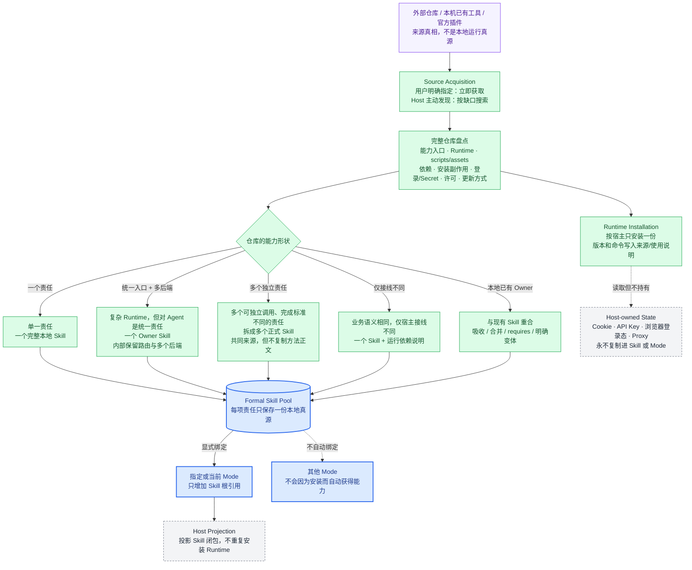

### Agent Reach 应该怎样映射

| 外部仓库里的内容 | ASL 中的位置 | 原因 |
| --- | --- | --- |
| Python CLI / library、channel 路由、doctor、installer | 一份宿主 Runtime；由 `agent-reach` Skill 说明如何安装和检查 | 这是统一的网络访问底座，不应复制到每个 Mode |
| 面向 Agent 的使用入口、平台选择、失败与回退规则 | `skills/agent-reach/SKILL.md` | 对 Agent 是一项完整的“公开网络发现与读取”能力 |
| 上游地址、观察到的 commit、许可、本地改动 | `skills/agent-reach/SOURCE.md` | 本地 Skill 是运行真源，上游只用于追溯和升级 |
| Twitter、GitHub、YouTube、小红书等后端 | `agent-reach` 内部路由，不拆成 Mode，也默认不拆成十几个 Skill | 它们共享同一责任和统一入口，只是访问表面不同 |
| Cookie、API Key、Proxy、浏览器登录态 | Codex / Claude / DeepSeek 的宿主设施 | Secret 和用户登录状态不能进入 Skill、Mode 或 Git |
| 四个业务 Mode 的使用权 | 每个 Mode 各自显式引用同一份 `agent-reach` | 一份能力、多处复用；Mode 不复制代码，也不隐式继承 |

如果复杂仓库确实包含多个可以独立交付、完成标准不同的能力，才拆成多个正式 Skill。仓库目录多、脚本多或支持平台多，本身都不是拆分理由。

---

## View 5C · 外部能力安装与单 Mode 绑定时序图（系统规则已实现，实例迁移按需）

回答：用户直接说“去找这个技能，融入当前 Mode”时，Host、Harness、Runtime 和 Mode 分别做什么？

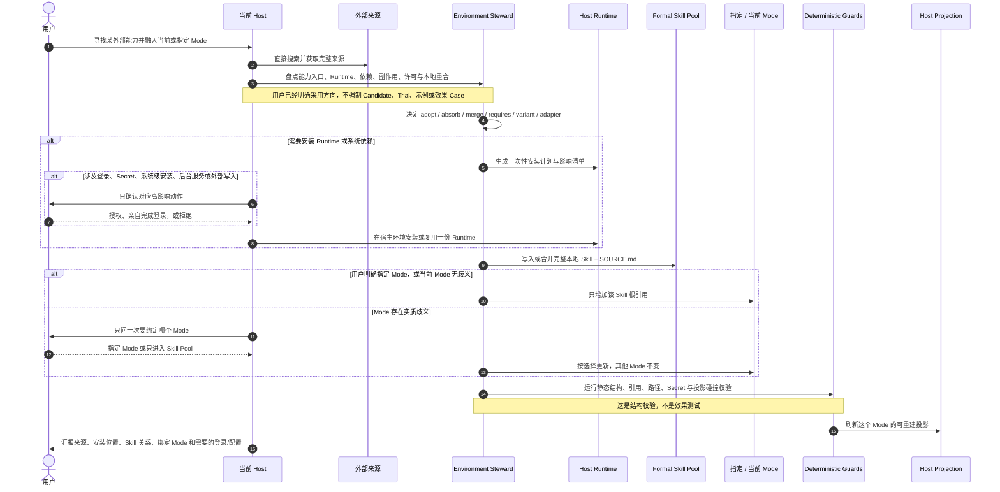

### 建议的硬门槛

| 门槛 | 必须保证 | 不应强制 |
| --- | --- | --- |
| 来源 | 保存可追溯 URL/路径、观察到的版本或 commit；不能假装知道未知版本 | 必须先建立 Candidate |
| 来源检查 | 根据具体 Skill 与任务检查相关说明、依赖、许可和安装副作用；不统一规定全部加载 | 跑作者提供的全部测试 |
| 本地能力 | 形成完整 `SKILL.md`；外部实现不能作为裸 Prompt/MCP/API 在业务中途偷跑 | 必须先跑示例或效果 benchmark |
| 重合关系 | 在 adopt、absorb、merge、requires、variant、adapter 中明确一个关系；同一责任只有一个 Owner | 因为仓库作者不同就保留重复 Skill |
| 安装安全 | Secret、Cookie、登录态不入 Git；系统安装、后台服务、外部写入和用户登录单独确认 | 因为缺少非关键配置就阻断整个 Goal |
| Mode 绑定 | 只修改用户指定或无歧义的当前 Mode；其他 Mode 不自动获得能力 | 安装后自动加入全部 Mode |
| 静态校验 | Skill/Mode 结构、依赖、路径、引用和宿主投影必须可解析 | 用真实 Case 证明写作、研究或业务效果后才允许采用 |

### 搜索入口与 Bootstrap

外部搜索优先使用当前 Host 已经可用的网络与代码仓库能力；如果 `agent-reach` 已安装，可以把它作为统一发现层。如果正在寻找或修复的恰好就是 `agent-reach`，Harness 不能形成“没有 Agent Reach 就不能寻找 Agent Reach”的死锁，此时直接使用 Host 原生 Web、GitHub、Git 或浏览器能力。

### 本地化重构的两条路线

| 路线 | 什么时候用 | 可以做什么 | 必须保留什么 |
| --- | --- | --- | --- |
| 派生式本地化 | 实际复制或修改了上游文字、代码、脚本、模板或独特资产 | 去掉个人触发词、绝对路径和上游工作区假设；按本地 Skill 契约重组 | 原作者、来源、commit、许可、第三方声明和本地修改 |
| Clean-room 重构 | 只确认“这个用户需求值得解决”，不需要上游实现 | 重新定义能力责任；从官方接口或许可清楚的公共基础能力独立实现 | 本地设计依据；不得把未复制的内容伪装成上游派生，也不得暗中搬运受限实现 |

两条路线都可以去作者耦合，但不能把“删除可调用界面里的个人品牌”误解为“删除实际使用过的来源”。没有复制实现时，外部个人仓库只是一份需求与组织方式的调研样本；复制了实现时，它的许可边界继续生效。

---

## View 6 · Mode 是能力子图，不是 Workflow

回答：不同 Mode 如何共享 Skill，又为什么不会跨 Mode 隐式调用？

```mermaid
flowchart TB
    AR["agent-reach<br/>共享底层研究能力"]
    DIAGRAM["baoyu-diagram<br/>共享结构表达能力"]
    VALUATION["investment-valuation-returns<br/>共享估值能力"]

    CREATOR["creator-studio<br/>业务 Mode"]
    PRODUCT["product-lab<br/>业务 Mode"]
    INVEST["investment-desk<br/>业务 Mode"]
    CAPITAL["capital-markets-desk<br/>业务 Mode"]

    WRITING["public-account-writing-style"]
    LAYOUT["qihang-wechat-layout"]
    PUBLISH["baoyu-post-to-wechat"]
    PRODUCT_JUDGMENT["ai-product-analyzer"]
    INVEST_RESEARCH["investment-research"]
    IC_MEMO["investment-ic-memo-writer"]
    COMPANY["financial-company-profile"]
    COVERAGE["public-equity-coverage-writer"]

    CREATOR --> AR
    CREATOR --> WRITING
    CREATOR --> LAYOUT
    CREATOR --> PUBLISH
    PRODUCT --> AR
    PRODUCT --> PRODUCT_JUDGMENT
    PRODUCT --> DIAGRAM
    INVEST --> AR
    INVEST --> INVEST_RESEARCH
    INVEST --> VALUATION
    INVEST --> IC_MEMO
    CAPITAL --> AR
    CAPITAL --> COMPANY
    CAPITAL --> VALUATION
    CAPITAL --> COVERAGE

    classDef mode fill:#dbeafe,stroke:#2563eb,color:#1e3a8a,stroke-width:2px;
    classDef shared fill:#dcfce7,stroke:#16a34a,color:#14532d;
    classDef skill fill:#f3f4f6,stroke:#6b7280,color:#1f2937;
    class CREATOR,PRODUCT,INVEST,CAPITAL mode;
    class AR,DIAGRAM,VALUATION shared;
    class WRITING,LAYOUT,PUBLISH,PRODUCT_JUDGMENT,INVEST_RESEARCH,IC_MEMO,COMPANY,COVERAGE skill;
```

蓝色节点是 Mode，其他节点是完整 Skill。箭头表示“这个 Mode 能看见这项能力”，不表示先后顺序。同一个正式 Skill 可以被多个 Mode 显式选择，但只保存一份正文。

---

## View 7 · 演化影响半径决策图

回答：收到明确反馈后，应该改当前 Case、Skill、Mode 还是整个 Environment？

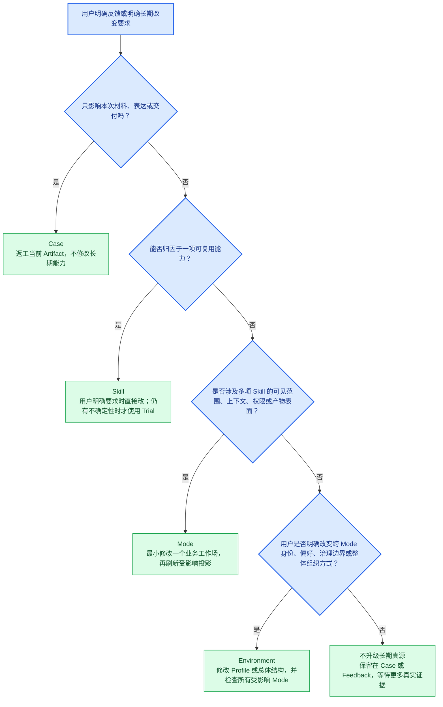

原则是最小范围优先。向上升级必须说明为什么较小一层已经不够，不能从点击、耗时、沉默或一次模型错误推断长期偏好。

---

## View 7B · Mode 新建、修改与退出决策图

回答：什么时候应该创建 Mode，什么时候只改现有 Mode，什么时候根本不应该碰 Mode？

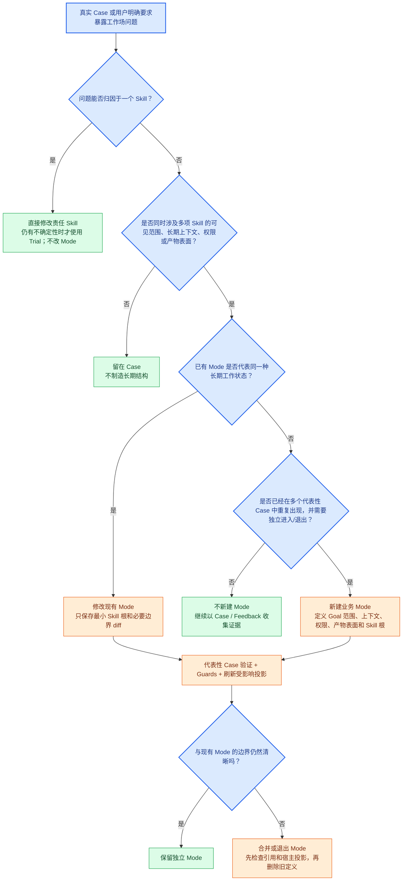

Mode 的判断单位是“长期工作状态”，不是主题名、项目名或一次任务。系统机制即使经常使用，也不能因此被包装成 Mode。

---

## View 7C · 工作环境怎样培养：EvoMap 的借鉴与边界（设计，待实现）

**这里的“培养”不是训练模型权重，而是持续改进工作环境：选对能力、记住适用经验、减少无用规则，并让这些改进能被带走。** EvoMap 值得借鉴的是“经验怎样形成可复用资产”，而不是把其完整进化 Runtime 再安装成 ASL 的第二调度器。

### 官网、研究、代码分别说明了什么

| 证据层 | 实际核对内容 | 对 ASL 的意义与限制 |
| --- | --- | --- |
| 官网功能与主张 | EvoMap 将能力经验发布、查找和复用组织成网络；GEP 区分策略、执行经验与演化记录。市场评分结合多个平台信号 | 借鉴可发现、可追溯、能反馈的能力供给；不把市场热度当个人适用性，也不自动上传私人环境 |
| 当前 Evolver 仓库 | 查看主分支 31b0691 的文件；selector、memoryGraph、solidify 等核心模块已混淆，所查历史快照也未取得可读实现 | 不能宣称完整审计了当前核心算法，或已复现服务端排名；本轮未运行 Evolver |
| 可读导出实现 | portable.js 将选定经验文件打包，生成统计与逐文件 SHA-256 清单；该文件只实现导出 | 可借鉴“内容自描述 + 可核对”，但它不等于 ASL 环境跨宿主导入实现 |
| 可读选择测试 | selector 与 memoryGraph 测试表达了相关性、记忆偏好、禁止项和重复失败抑制等预期；本轮阅读关键断言，未运行测试 | 说明设计意图，不代替当前源码验证；值得借用“不相关时不要强选”，不照搬阈值或随机探索 |
| AutoResearch 可读代码 | seed_ranking.py 保留未打分状态、返回评分覆盖情况，不把失败候选编成正常得分 | ASL 推荐可以说“尚未判断”，不能用默认高分营造优质市场 |
| Research 实验 | 策略经验可能改善特定科学编程任务；组合多条经验并不总比单条更好。LongWoF 的部分经验来自参考答案蒸馏 | 不把“规则更多”当进步；不能把含参考答案的成绩包装成自主学习或未知任务泛化 |

核对入口：[官网 Research](https://evomap.ai/research)、[GEP 定义](https://evomap.ai/wiki/16-gep-protocol)、[Evolver 源码](https://github.com/EvoMap/evolver/tree/31b0691acd97ba18878019312e646f1f2d970d43)、[导出代码](https://github.com/EvoMap/evolver/blob/31b0691acd97ba18878019312e646f1f2d970d43/src/gep/portable.js)、[选择测试](https://github.com/EvoMap/evolver/blob/31b0691acd97ba18878019312e646f1f2d970d43/test/selector.test.js)、[AutoResearch 排序实现](https://github.com/EvoMap/AutoResearch/blob/main/src/seed_ranking.py)。

Research 的可借鉴结论，不等于独立验证的产品效果：[策略经验论文](https://arxiv.org/html/2604.15097v1) 的实验对象主要是科学编程；[LongWoF 报告](https://evomap.ai/research/longwof-bench) 披露 778 项任务中，252 项经验来自成功轨迹、526 项使用参考答案回退蒸馏。两者都不能直接证明我们的公众号写作或全部办公任务会更好。[AutoResearch 研究说明](https://evomap.ai/research/autoresearch-evidence-loop) 对“本地检查通过不等于目标完成”的区分可保留，但不因此要求每次装 Skill 都跑多模型实验。

### 我们采用怎样的培养逻辑

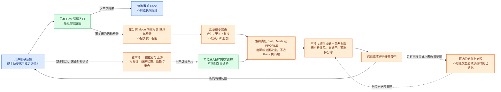

**算法建议保持可解释，而不是先造总评分：**

- **找能力时，先看适不适用，再看好不好。** Mode 范围、任务相关性、宿主兼容和依赖是首要条件；KOL 推荐、Stars、维护活跃度是发现线索。缺少信息明确标注，热门能力也不能越过 Mode 自动安装。
- **找经验时，先找同一类问题。** 优先当前 Mode / 责任 Skill 的明确经验，再按需要搜索用户允许使用的材料。记录“适用情境、有效做法、不适用情况、反馈依据”即可，这些可以是现有文档中的简短内容，不强制新文件或新执行单位。
- **改能力时，优先替换与合并，不无限累加。** 一次写作返工不推导出全环境新禁令；某个 API 临时掉线只记本次连接状态，不因此惩罚写作 Skill。明确反馈支持持久修改；客观诊断、沉默和运行耗时不自动成为个人偏好。
- **判断进步时，看新任务是否更好，不看改动有多少。** 只在用户要求评价“培养效果”时，选未用于改写的代表性任务做前后比较；评价者、预算和停止条件事先明确。安装验收、结构测试、业务效果是不同证据，不互相冒充。

**图结构可以有，图数据库先不需要。** Mode 与 Skill 的包含关系、Skill 的明确依赖、资料与经验的关联，已经能形成一张能力图；Mode 本身就把多种能力和上下文组合成一组关系，不需要为了“超图”再建运行节点系统。App 从真实文件生成视图，推测关系只能显示为建议。长期经验先本地 Markdown 与普通搜索；确有检索规模问题再增加可重建 RAG 索引，索引不是记忆真源。

**与市场结合：分享培养后的环境，不分享用户的隐私轨迹。** 用户可以发布一个 Mode 的精选能力和可公开经验；接收者本地采用后继续培养。上游更新展示差异，不覆盖个人改动。首期不自动加入 EvoMap Hub，不引入积分、繁殖、随机变异或全天候自修改机制；也不要求把现有 Skill 变成 GEP 才能运行。

---

## View 8 · 三宿主部署与投影图

回答：同一份 Environment 怎样接入 Codex、Claude Code 和 DeepSeek Harness？

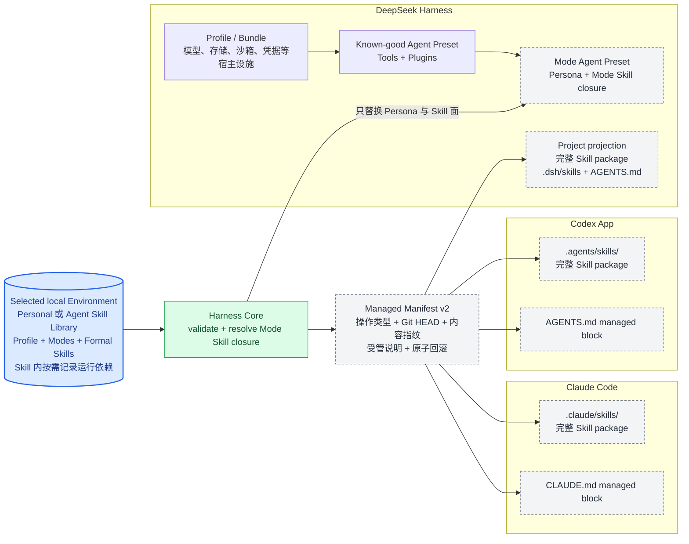

Codex 与 Claude 使用项目原生 Skill 目录和规则文件。DeepSeek 额外区分宿主级 Profile / Bundle 与会话级 Agent Preset；ASL Mode 对应 Agent Preset，不对应 Profile。三个 Host 都继续拥有自己的 Agent Loop、会话、工具、模型和授权，ASL 不复制这些 Runtime 能力，只生成它们能够原生发现的环境表面。投影切换会先在同盘临时区完成，再替换旧受管表面；失败时恢复旧投影。复制型投影与 Preset 逐 Skill 校验 SHA-256，链接型投影继续用 Environment 总指纹检查漂移。

MCP 的可移植性高于宿主 Plugin，因此当前架构优先让 Skill 声明 MCP 运行需要，再由 Host 使用自己的 MCP 配置和登录方式满足它。Hook 也采用相同原则：Harness 提供同一组 CLI 校验，Adapter 只负责接到 Codex、Claude 或 Cordis 的真实生命周期事件。未来接入其他 Agent 时复用这份 Adapter 契约，不修改 Environment 数据模型。

| 接入面 | Codex App / CLI | Claude Code | DeepSeek Harness | 其他 Agent / CI |
| --- | --- | --- | --- | --- |
| Skill | `.agents/skills/` + `AGENTS.md`，已实现 | `.claude/skills/` + `CLAUDE.md`，已实现 | `.dsh/skills/` 或 Agent Preset，已实现 | 有原生 Skill 目录时增加薄 Adapter |
| MCP | 使用 Codex 原生 MCP 配置、安装与登录 | 使用 Claude 原生 MCP 配置、安装与登录 | 使用 Cordis Profile / MCP client plugin | 支持 MCP 的 Host 复用同一服务；不支持则明确提示 |
| Hook | Plugin 接线代码已有；本轮未验收 App 原生调用 | 历史有 SessionStart 触发记录；本轮未重做真实会话 | v3 导出已固定 Preset 定位并校验配置；本机旧 Preset 尚未重建 | 没有 Hook 时手动调用 CLI；不宣称所有宿主已激活 |
| Tool / Agent / 权限 | 完全归 Codex | 完全归 Claude Code | 完全归 DeepSeek Harness | 完全归目标 Host |

---

## View 9 · 当前项目状态

回答：哪些已经能用，哪些只是设计完成，下一步怎样把底座变成可传播的 App？

<!-- ASL:PROJECT STATUS START -->

**2026-09-10 当前实施范围：**用户已批准只推进 ASL Harness，小步验证、提交并推送；Agent Skill Library、个人工作区及协议仓库不随本轮修改。局部校验、投影保护与 Hook 修正已提交；Mode 包导出、预览、导入已实现并推送；桌面预览版现已接入同一核心。本轮修复实机发现的问题，明确人工分类与 App 自动读取的边界；不以自动测试或目录识别替代宿主运行验收。

此前同日的规则清理：两份 Environment 中已定位的失效调度器、索引及旧调用引用由 42 条降为 0；各修改 5 个 Skill 的 10 个文件，10 次 Skill 结构检查通过。两份 Environment 全库校验通过；协议 21 份 Markdown 校验通过。这些是此前清理的结果，不证明所有业务冲突已经消失。

**前次验收遗漏与本轮修复：**此前隔离用户级测试使用临时 HOME，测试窗口未关闭，导致用户进入了临时用户环境：原生文件选择器指向不存在的 Desktop，也无法识别真实宿主配置。前次“原生文件选择入口已检查”不足以证明真实用户环境正常。现已关闭这两个测试实例；GUI 验收沿用真实 HOME，只隔离 App 偏好与写入目标，文件选择器使用真实且存在的 Documents / Home。另修复冻结后的 Python 核心按错误编码读取中文、空宿主目录被误报为配置、漏检 `.workbuddy-ai`、示例安装目录可被改写、忙碌时点击被静默丢弃，以及 DeepSeek 预设导出提示消失的问题。

当前本机回归：Python **92 项通过、3 项跳过**（Windows 符号链接权限与 POSIX 执行位）；桌面 **30 项通过**；Vite 生产构建通过。新增真实 IPC 取消 / 只读 / 路径回退检查，并将中文加 emoji 的读写加入冻结 EXE 的构建门禁，不只测试开发机 Python。本轮代码 `1051c33` 的 [Windows / Linux CI](https://github.com/qihangzhang-272/asl-harness/actions/runs/34438364187) 均通过。Windows 修正版以真实用户目录启动，交付包 `ASL-Workspace-Windows-2026-09-10.zip` 共 185 个文件、171,925,069 字节；CRC 与逐文件内容核对通过，不包含真实技能库、测试库或账号。包仍是未签名的预览版，不是多宿主完整验收后的正式发行。

| 本轮桌面验收 | 已观察结果 | 验收边界 |
| --- | --- | --- |
| 真实 Agent Skill Library | 4 Mode、37 个去重 Skill；界面列表逐项等于核心读取结果：Capital Markets 10、Creator Studio 19、Investment 13、Product Lab 6 | 各 Mode 可共享技能，不能把成员数相加当成去重总数；未改原库的未提交内容 |
| 原生目录与窗口 | Codex / Claude / DSH / WorkBuddy 真实配置均被找到；DSH 6 个预设可选；Windows Documents 与 Desktop 入口无原报错；最小 900×680 窗口无横向溢出 | 目录与配置识别不是模型、MCP 连接或 Mode 应用成功 |
| Mode / Skill 管理 | 从真实库副本创建、编辑、复制、归档 Mode；创建 / 编辑中文 Skill、加入 / 移出、归档；完整导入宝玉漫画 Skill；无效格式拒绝且原文件不变 | 修改只发生在隔离副本；完整来源与引用文件保留 |
| 包与应用按钮 | 分享 ZIP → 导入独立库 → 重开恢复；Codex 项目应用实际写入并回读；DSH 基于真实预设导出至测试目录，明确显示“尚未启用” | 文件选择路径在自动化中使用对话框夹具；Windows 原生对话框另行实看。未自动写真实全局技能、注册测试预设或切换模型账号 |
| 发现与配置入口 | DeepSeek 市场与 GitHub 搜索实际联网返回；配置页读取原始技能与已找到的工具；未接入宿主按钮明确不可用 | 市场不是一键安装；本轮未声称原生 AI 完成依赖配置 |

用户级同步另有隔离 home 的回归覆盖：两宿主切换 / 停用、非受管同名冲突、受管副本改动、过期预览、自定义目录与失败回滚。已有缓存、归档及来源不明文件未清理；不会把隔离测试窗口留给用户当作正式 App。

**原生 AI 配置尚未通过端到端验收。** 已用同一 `setup_brief` 给本机两种 CLI 下发独立项目配置夹具，未冒用业务结果：Codex CLI 0.124.0 返回当前 `gpt-6-astra` 需要更新 CLI；Claude Code 2.1.227 原生账号状态为已登录，但模型调用返回 ConnectionRefused。未自动升级用户 CLI、切换账号或修改系统代理。Windows 交接器本身已通过真实 PowerShell 启动和失败回执测试；这仅验证参数传递及状态，不证明 AI 已完成安装。不同电脑迁移、Agent Reach 渠道登录、全部 MCP 实际任务仍待成功验收。本机 Agent Reach doctor 可读出 15 个渠道的自报状态，其中 LinkedIn 未连接、雪球有警告；自报通过也不代替业务实测。

本轮使用生图生成产品方向参考，并结合 CC Switch 的分区管理与 React Flow 的关系呈现重做界面。实机发现树图会缩小文字，默认改为可展开的能力分组卡片；关系图仅解释明确依赖。生图里的示意技能、顺序连线与“已应用”状态没有当成真实产品数据。本地 DeepSeek Harness 已收到只读代码审查请求，但配置的模型返回 429 套餐限额，没有取得本轮第三方审查结论。

Windows 便携版在本机成功构建并启动；移除子进程 PATH 与系统 Python 路径后，内置核心仍可返回真实 Mode 与 Skill。展开目录实测约 387 MiB（主要为 Electron），不是“小体积应用”的证据；目前只有未签名预览构建，没有安装器、自动更新、另一台干净电脑验收或正式二进制发行。脚本保留 Electron / Chromium 许可并收集 Python / PyYAML 许可；正式二进制发布前仍须核对所选 Python 发行版的全部附带库许可。

总架构文档的 20 张 Mermaid 图在 2026-09-09 已渲染通过，本轮仅更新事实说明和验收表，未改图语法；绿色只表示所标注的代码能力，不表示所有 GUI 路径或宿主会话都已验收。

| 状态 | 模块 | 当前事实 | 尚缺的增量 |
| --- | --- | --- | --- |
| 🟢 已实现 | Environment 与 Mode | Personal / 公开 Skill Library 各 37 Skill、4 Mode；完整包与 SOURCE 留在本地，Mode 显式选择能力 | 结构化 Mode spec 当前只有 skills；上下文关联与模型偏好未加入 |
| 🟢 代码已测 | Harness CLI | 15 个命令；新增 `host.user.sync`、`host.setup.inspect`，复用闭包、视图与回滚 | 不重写 Agent Loop；GUI 自动回归范围继续补充 |
| 🟢 本机已测 | 用户级同步 | Codex / Claude 原生用户目录、预览、切换 / 停用、冲突保护与原子回滚；Codex GUI 写入链在隔离 home 已完成 | 全局原生其他技能仍可用，不是强沙箱；来源改变后需主动刷新；不自动接管已有同名技能 |
| 🟢 代码已测 | 局部保护 | 日常投影 / Hook 只检查当前 Mode 闭包；用户改动冲突不被静默覆盖 | 不相关候选不能阻断日常工作；不承担业务规则语义裁判 |
| 🟢 代码已测 | DeepSeek Preset 导出 | 完整能力复制、配置指纹、显式 Hook 定位已有实现 | 生成记录带本机绝对路径，是本机投影，不是通用迁移包 |
| 🟢 已收敛 | Skill 自主性与旧入口 | Harness 不要求统一全包加载；A/B 业务规则保持；已定位旧调度器与 domain 调用要求退出活动面 | 继续保留来源历史，不借产品化再造全局调度规则 |
| 🟠 部分实现 | 复杂依赖 | Mode 对应工具路径、原生依赖声明、MCP 名称、Agent Reach doctor、本机配置材料与原生 AI 交接入口已有 | 原生 AI 在本机版本 / 网络问题下未完成配置夹具；任意脚本、版本约束与可选渠道仍由助手读原文判断；不把存在标为就绪 |
| 🟠 待真实宿主验收 | 三宿主投影与 Hook | 函数有测试；本机 DSH Desktop 为 2.0.4，内置官方包 0.1.2-alpha.1；已核对其 Preset 切换限制 | 新会话、切 Mode、真实连接与 Hook 异常仍待实机验证；不能称三宿主成熟 |
| 🟠 待刷新 | 本机旧部署 | 四个 ASL Preset 仍属旧投影；本轮未重建 | 检查用户局部修改后，只更新选定生成面 |
| 🟠 部分实现 | 独立 App | Electron + React；真实库、能力地图、Mode / Skill 管理、包往返、项目 / 用户同步、本机检查、原生配置助手 | 任意上游技能补齐、市场采用与原生 AI 配置成功实测、跨电脑、签名发行仍未完成 |
| 🟠 部分实现 | 可迁移环境协议 | Mode 与完整 Skill 已可往返；新目录导入及重新投影已测；接收端可检查本机并交给原生助手 | 未做另一台电脑或新宿主会话成功验收；不承诺 MCP 任意格式自动转换或迁移登录 |
| 🟠 设计已修订 | Model 配置 | View 2F 定义 Mode 偏好、本机路由、实际会话模型的边界 | 尚无统一配置界面；不能切任意宿主现有会话 |
| 🟠 设计已修订 | 经验培养 | View 7C 记录 EvoMap 证据与轻量采用方案；本地可编辑、明确反馈优先 | 尚无推荐 / 经验合并界面和效果证据；不宣称“已自进化” |
| 🟠 后续适配 | DSH 管理插件、其他 Agent | 官方 Bundle / Preset 与社区 Desktop 接口已调研；WorkBuddy AI 5.1.0 的 `.workbuddy-ai` 已识别并显示真实路径 | WorkBuddy 尚无 Mode 应用适配；不是“找到配置就已接通”。未开发 DSH 管理插件，Hermes / OpenClaw 未验证兼容 |
| ⚪ 派生物 | 宿主投影与状态视图 | 从本地真源生成，安装 / 已投影 / 实际可用必须区分 | 不可将生成成功当作会话加载或业务质量成功 |

**当前判断：底座可复用，产品还未完成。** 新方向不是“把现有库放进 DeepSeek 用一下”，而是独立的工作环境管理 App，加上可分享的内容协议和原生宿主适配。DeepSeek 是功能更完整的优先适配对象，不是 ASL 的唯一运行入口。

**本轮 DeepSeek 协作：**在本机原有调研会话发送只读审查请求，未让它改仓库。采纳“标准包装不等于 DSH / Claude 直接加载”、命名空间隔离、沿用闭包 / 回滚 / JSON 回执、保留未知运行状态；没有采用把主产品降成只读静态页面的建议。它未在本次核实的规范判断仍由当前实现逐项核对，不当作独立验收。

### 接下来怎么执行（按阶段验证，不一次宣称完成）

| 开发工作 | 具体做什么 | 完成标准 |
| --- | --- | --- |
| 先贯通一条完整产品路径 | 从一个已有 Mode 出发，确定最小环境包；App 读取同一份环境文件，显示能力、资料、依赖与模型；粘贴链接导入一个复杂能力，预览必要安装与连接，应用到 DSH | 用户不写 YAML、不手配依赖目录；能解释各缺失项，真实新会话能使用所选能力。这个阶段必须有 App，而不是只跑 CLI 演示 |
| 在同一条路径验证可迁移 | 从 App 导出选定 Mode；在另一独立目录或干净用户环境导入，重新关联模型和依赖，分别做 Claude Code / Codex App 适配验收 | 环境内容不靠发送者绝对路径或账号；核心 Skill 行为可用，宿主专有能力明确提示；不支持或待登录不伪装成功 |
| 完成日常管理与市场入口 | 增删能力、Mode 复制与编辑、来源更新差异、模型配置共存、受影响 Mode 展示；复用公开目录，不自建市场服务 | 不静默覆盖调教，不卸载别人仍用的依赖；同一环境能分享、再采用、独立维护 |
| 再完善培养与知识视图 | 从明确反馈生成合并或修订建议，落到对应 Skill / Mode / Profile；本地可编辑与可撤回；需要时做未知任务效果比较 | 用户看得懂改了什么、为何适用于这个工作场；经验不会污染其他 Mode，也不会无限增长 |

这些是实现推进顺序，不是业务工作流。协议、App 与适配器围绕同一个真实操作闭环推进，不先造一个巨大的抽象协议，也不把可分享和模型配置拖成遥远的附加功能。

**当前工程形式：**独立桌面 App 使用 Electron + React + Vite，图标来自 Lucide，关系图使用 React Flow。复用成熟组件以支撑编辑器、弹窗、侧栏及图交互，不新增常驻 API 服务或数据库。`desktop/bridge.cjs` 把受限管理操作转成 CLI 参数，编辑内容通过 stdin 传入；`management.py` 执行内容管理；`user_projection.py` 只维护受管用户副本与一份同步记录；`readiness.py` 读原始 Skill 及机器条件；`assistant.cjs` 用固定程序和数据参数启动原生 CLI，任务文件与结束回执留在 App 本机目录，不存原生输出或密钥，也不创建 ASL Agent Loop。`library.cjs` 只保存最近路径与配置项目引用。`native.cjs` 只读检测，`market.cjs` 只读发现。Windows 构建内置 Python 核心；DSH 内的原生管理插件仍为后续入口。

这个选择的理由是减少重写：现有核心是 Python，而 DSH / 桌面 UI 生态主要是 JavaScript / TypeScript。仅做 DSH 插件会失去独立跨宿主管理能力；直接 Fork CC Switch 会继承本任务不需要的提供商与代理业务；先引入 Rust 后端也不会消除现有 Python 核心。先用一条产品路径验证，再决定是否有必要更换技术。

**保留与删减：**已有 CLI、Mode 边界、SOURCE、原子文件操作、指纹与必要 Hook 保留；不增加中心数据库、事件总线、第二调度器、跨 Mode 隐式记忆、每 Skill sidecar、积分或自动变异系统。App 关闭不影响宿主继续工作；用户也能直接用本地文件与 CLI 维护环境。

**对外展示的产品点：**“装进一种工作能力”“切换整套工作环境”“把培养过的环境交给别人”。宣传以真实导入、实际运行和迁移录像为证据，不以“所有平台无缝兼容”或“全自动自进化”代替验收。空白版与装填版共用上述路径，分别面向自行构建和开箱采用。

<!-- ASL:PROJECT STATUS END -->
