# ASL 总体架构与专项视图

本文件用多种标准架构图解释 ASL。每张图只回答一种问题，避免把系统上下文、内部组件、运行时序、生命周期和部署关系混在同一张图里。

> 状态快照：2026-08-31。架构边界来自当前 v0.3 协议；实现状态以本地 Harness 的 41 项测试、两份真实 Environment 校验，以及现有三宿主投影与 DeepSeek Mode Preset 的本次复核为依据。外部仓库逐项拆分只保留映射，不计入架构完成度。

## 颜色约定

- **蓝色**：用户已经明确确认，后续实现必须保持的架构边界；
- **绿色**：当前代码或真实 Environment 已实现并验证；
- **橙色**：尚未实现、当前生成面需要刷新，或仍有真实宿主运行验收；
- **红色**：当前错误分类或旧结构，迁移后删除；
- **灰色**：可删除重建的宿主生成面，或已经退出活动面的冻结归档；
- **紫色**：外部来源，不是本地运行真源。

颜色表达节点的当前主状态，不表达执行顺序。可重建投影即使已经验证仍保持灰色，并在节点文字中写明“已验证”；外部来源始终保持紫色。动态项目状态、验证数字和未完成项只在 [View 9](#view-9--当前项目状态) 的受管区域维护，README 和其他协议文档只链接这里。

## 怎么读这些图

| 图 | 类型 | 只回答什么问题 |
| --- | --- | --- |
| Master | 总体模块关系图 | 所有模块怎样组成一个系统，哪些关系形成反馈环 |
| View 1 | 系统上下文图 | 用户、Host、Harness、Environment、Case 和外部来源分别站在哪里 |
| View 2 | 组件图 | Harness System 与 Personal Environment 内部各自包含什么 |
| View 2B | Runtime 边界与同步图 | ASL 不复制哪些 Host 能力，以及两份 Environment 怎样显式同步完整 Skill |
| View 2C | Hook 接线图 | 宿主在什么时机调用哪些现有检查，什么时候提醒或阻断 |
| View 3 | 运行时序图 | 一个普通 Goal 从进入到交付怎样发生 |
| View 4 | 变更时序图 | Skill / Mode 的增删改查怎样与普通业务内容隔离 |
| View 5 | 生命周期状态图 | 外部能力从发现到采用、合并、依赖、变体、适配或归档怎样流转 |
| View 5B | 复杂仓库拆解图 | 一个外部仓库应该变成一个 Skill、多个 Skill、共享 Runtime 还是 Adapter |
| View 5C | 安装与 Mode 绑定时序图 | 用户明确要求引入时，如何直接安装并只绑定指定 Mode |
| View 5D | 真实仓库解耦图 | 怎样把一个个人技能仓库当作需求样本，去重后映射到不同 Mode |
| View 6 | 能力图 | Mode 怎样选择 Skill 子图而不退化成固定 Workflow |
| View 7 | 决策图 | 用户明确反馈应该落在 Case、Skill、Mode 还是 Environment |
| View 7B | Mode 决策图 | 什么时候新建、修改、合并或退出一个 Mode |
| View 8 | 部署图 | 同一真源怎样投影到 Codex、Claude Code 与 DeepSeek Harness |
| View 9 | 迁移图 | 当前已经完成什么、还差什么、哪些旧结构必须删除 |

## 核心对象边界

| 对象 | 它是什么 | 它不是什么 | 由谁改变 |
| --- | --- | --- | --- |
| Harness System | 确定性核心、维护保护、访问面和宿主适配 | 第二个 Agent、第二调度器、业务 Mode | Harness 代码与确定性规则变更 |
| Personal Environment | 用户本地 Git 管理的唯一运行真源 | 上游仓库的镜像、一次 Case、宿主缓存 | 用户授权下由当前 Host 经 Guards 修改 |
| Skill | 可以独立承担责任的完整本地能力包 | Prompt 碎片、一个 Workflow 节点、裸 MCP/API | 用户明确指定引入时可直接本地化；其余不确定变化可先隔离 Trial |
| Mode | 一种可反复进入的广域工作状态；选择显式 Skill 根 | Domain、固定顺序、个人能力全集、系统维护功能 | 用代表性 Case 验证最小 Mode diff |
| Case | 一次目标的材料、证据、过程文件、Artifact 与交付 | 长期架构真源、Mode、正式 Skill | 当前 Host 在任务中持续维护 |
| Candidate | 尚未决定是否采用的外部能力线索 | 必经审批状态、可以直接运行的正式能力 | 仅在来源或采用方向还不确定时记录 |
| Trial | 与正式 Skill 隔离的可选试验能力 | 每次引入都必须经过的关卡 | 仅在安全、重合、运行方式或价值仍不确定时使用 |
| Feedback | 用户明确表达、可能影响长期能力的证据 | 点击、沉默、耗时等含义不明的行为 | 只记录用户明确反馈 |
| Archive | 拒绝、退出、被替代或迁移后的追溯证据 | 活动能力面、待执行队列 | 经影响检查后归档 |
| Host Projection | 当前 Mode 在宿主原生目录中的生成视图 | 运行真源、兼容发行层 | Harness 从 Environment 确定性重建 |

---

## Master · 总架构图

回答：发行、系统机制、本地真源、四个循环、Case、能力演化和三宿主投影怎样组成同一个系统？

> 这是一张模块关系图，不是执行顺序图。A、B、C、D 四个循环根据真实信号独立进入；后续专项图分别展开每一部分。

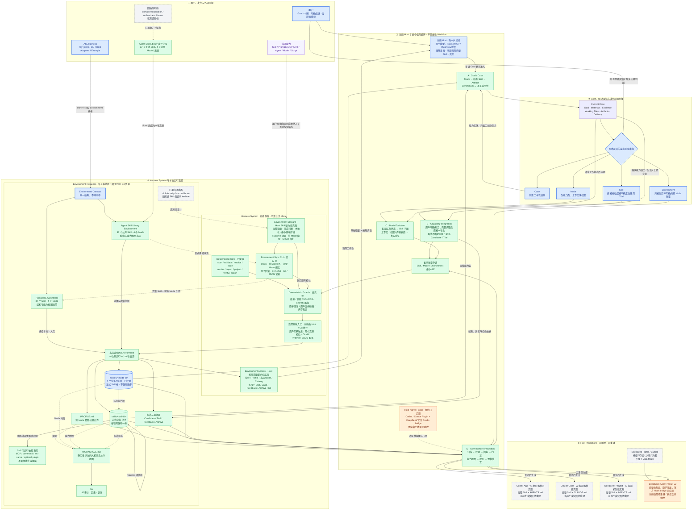

总图的核心关系：

1. 空白 Harness 与装填后的 Agent Skill Library 使用同一种 Environment Contract；
2. Harness System 管理 Environment，但系统能力不成为业务 Mode；
3. Environment 是本地 Git 真源，Case 和 Host Projection 都不反向成为真源；
4. 当前 Host 是唯一执行者，A/B/C/D 是信号触发的循环，不是中央调度的顺序节点；
5. 外部能力都必须完整本地化并保留来源；用户明确指定引入时直接纳入，Candidate、Trial 和效果 Case 不是必经关卡；
6. 用户明确反馈先判断 Case、Skill、Mode、Environment 四级影响半径；
7. 两份 Environment 之间的能力采用已由 `environment.sync` 收口为显式单 Skill 操作，不做后台订阅、共享目录或静默覆盖；
8. 三个宿主只得到当前 Mode 的可重建能力投影；MCP、命令、环境变量名称和必要插件只在责任 Skill 内声明，激活仍由宿主原生机制处理；
9. 安装空白 Harness 或 clone 一份 Environment 即完成初始化，当前不再增加重复的 `init` 命令。

---

## View 1 · 系统上下文图

回答：ASL 在整个使用场景中处于什么位置，谁负责执行，什么是真源？

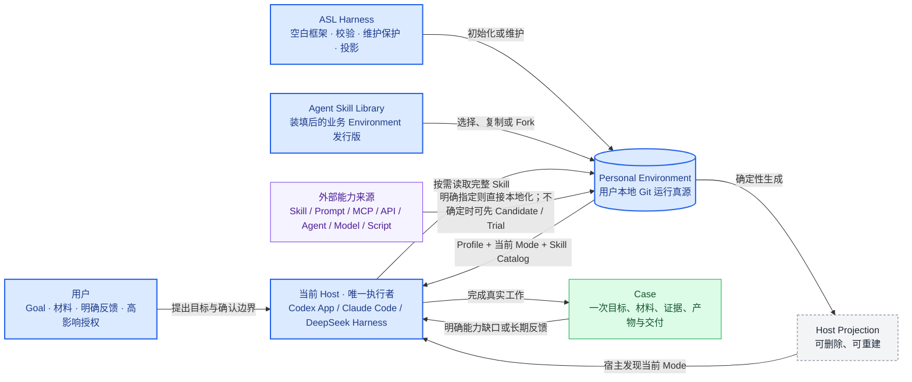

关键边界：Harness 不理解业务 Goal，也不替 Host 执行；外部能力不能裸调用，但用户明确要求“找来并融入”时，当前 Host 完整读取来源后可以直接写成正式本地 Skill，不必先跑 Trial 或效果 Case。

---

## View 2 · Harness 与 Environment 组件图

回答：空白 Harness 内有什么，个人 Environment 内有什么，两者怎样分工？


这里没有管理 Mode。能力发现、培养、增删改查保护和记忆访问属于 Harness 系统层；内容创作、产品分析和投资研究才属于业务 Mode。

Harness 的 Hook / Guard 只处理可确定的边界，不接管业务判断：

| 级别 | 处理方式 | 典型对象 |
| --- | --- | --- |
| 硬阻断 | 拒绝相应写入或投影，返回具体错误 | 结构非法、正式 Skill / Candidate 无来源、依赖缺失/循环、Trial 不完整、Secret 文件名、路径逃逸、覆盖非受管文件、受管内容指纹不符、固定 Workflow/Run 回流 |
| 软提醒 | 任务可继续，只提示应刷新或检查 | 缓存或可重建依赖、`WORKSPACE.md` 过期、宿主投影漂移、Candidate 未决定、上游出现新版本、两个 Skill 可能重合 |
| Host + 用户判断 | 不伪装成确定性规则；当前 Host 起草方案，高影响动作由用户授权 | 是否需要新 Mode、候选是否值得采用、Skill 应合并还是独立、是否发布或外部写入 |

这样既防止 Environment 漂移，也不会因为一个缺失字段、过期视图或语义不确定就阻断用户的普通 Goal。

---

## View 2B · 原生 Harness 边界与 Environment Sync CLI

回答：ASL 怎样更像原生 Harness，而不是再造一个 Codex、Claude Code 或 DeepSeek Harness？两份 Environment 又怎样同步？

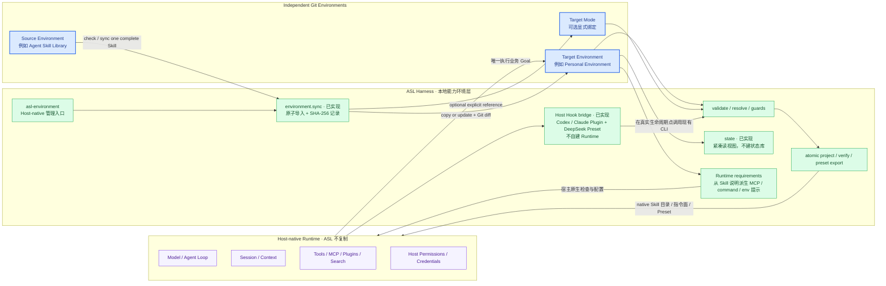

“更原生”不是让 ASL 拥有自己的 Agent Loop、会话数据库、工具执行器、权限系统或插件 Runtime，而是让 ASL 通过每个 Host 已经认可的 Skill、指令文件、项目目录和 Preset 接口工作。办公和研究场景里最常见的是 Skill、Tools、MCP、搜索和插件；模型、沙箱、凭据与授权继续使用宿主默认能力。ASL 只补宿主没有统一解决的个人能力环境、Mode、来源、本地采用、确定性校验和投影。

这套工作环境不是由一种技术单独完成，而是五个很薄的部分协作：

| 部分 | 在 ASL 中负责什么 | 不负责什么 |
| --- | --- | --- |
| Git Environment | 保存 Profile、Skills、Modes、来源和明确反馈，是可复制的个人能力真源 | 不运行 Agent |
| CLI | 安装、检查、同步、选择 Mode、生成或验证宿主视图 | 不理解业务、不调度工作流 |
| Host Adapter | 把同一 Mode 翻译成目标 Agent 能原生发现的 Skill、规则和 Preset | 不复制宿主已有 Tool、Agent、权限和模型 |
| Hook | 在会话开始、受管内容修改后或提交前调用现有 CLI 检查 | 不监控所有行为，不靠模型做 Review |
| GitHub Actions / CI | clone 或提交后运行同一组校验，保证仓库版本可用 | 不进入本地会话，不替代 Hook 或 Host |

因此，对用户来说的目标入口可以收敛为“把一个 Environment 的一个 Mode 接到当前 Agent 项目”。底层主要由 CLI 完成；原生 Hook 让检查自动发生，CI 只守住 Git 仓库。三者不是替代关系。

当前只增加了一个深接口，没有增加后台服务：

```bash
asl-harness environment.sync \
  --source ./agent-skill-library \
  --target ./personal-harness \
  --skill x-post-card-studio \
  --mode creator-studio
```

| 行为 | 契约 |
| --- | --- |
| 来源与目标 | 都必须是可通过 `workspace.validate` 的本地 Environment；CLI 不负责全网搜索或 Git clone |
| 同步单位 | 一次同步一个完整 Skill package；不拆文件、不把 Prompt、脚本或 Runtime 裸同步 |
| Mode | `--mode` 可选；提供时只修改目标 Environment 的一个明确 Mode，其他 Mode 不变 |
| 相同内容 | 返回 no-op，不制造提交、投影或新版本号 |
| 目标不存在 | 完整复制 Skill，并保留 `SOURCE.md`、运行依赖说明、scripts、references、assets 与测试 |
| 目标已修改 | 默认拒绝静默覆盖并展示差异；只有用户显式选择替换时才更新 |
| 检查模式 | `--check` 只报告将新增、更新、冲突或保持不变的内容，不写文件 |
| 完成后 | 校验目标 Environment、刷新人机共读视图并输出来源/目标 HEAD、package SHA-256、受影响路径与 Git 状态；不自动 commit、push 或刷新所有宿主投影 |
| 失败 | Skill、Mode 引用与 `WORKSPACE.md` 作为一次事务回滚，不留下只复制一半的 Environment |

同步结束后，两份 Environment 仍是两个独立 Git 真源。再次运行命令可以显式吸收上游更新，但不会形成实时链接、共享 Skill 目录、后台 watcher 或自动升级关系。宿主投影仍由现有 `host.project` / `deepseek.preset.export` 单独负责。

### Skill 运行依赖与跨 Agent 接入

兼容信息留在责任 Skill 的正文和已有 package 文件内，不再保留独立连接层或空目录。跨 Agent 复用以三种东西为主：完整 Skill、Skill 自带的脚本、标准 MCP 服务。Skill 在确有需要时记录 MCP 名称、用途、检查方式、环境变量名称、宿主差异和缺失时的处理；Mode 只选择 Skill，由 Harness 派生当前 Mode 的运行需求。

Codex、Claude Code、DeepSeek Harness、OpenCode、Trae、ZCode 或其他 Agent 已经提供的模型、Tool、Agent、Plugin、沙箱和权限继续由各自管理。Harness 不复制它们，也不建立通用 Tool Registry。某个宿主能够原生接入 Skill 或 MCP 时，Adapter 只负责把同一份本地真源翻译到它认可的位置；不支持时给出可执行提示，不能伪装已经激活。GitHub Actions 不是交互式 Host，只复用 CLI 做仓库校验。

### 最小 Hook 接线

Hook 是宿主调用 Harness 检查的时机，不是新的工作流。会话开始或恢复时调用紧凑状态与投影检查；受管 Skill、Mode、Profile 或投影被明确写入后调用 `workspace.validate` / `host.verify`；停止前只提醒，不制造死锁。Codex 与 Claude Code 通过同一 Host Plugin 安装；DeepSeek Preset 自动装入官方 `@deepseek-ai/dsh-hooks-codex` Cordis bridge 并指向同一份命令 Hook。没有 Hook 的宿主仍然可以手动运行 CLI。

Hook 只阻断本次修改造成的确定性结构错误。普通业务任务、缺失的可选 MCP、过期视图或无法判断的语义问题只提醒，不得形成死锁。删除、发布、付费、登录、外部写入和权限继续由宿主原生门禁处理。

---

## View 2C · Host-native Hook 接线架构

回答：Hook 具体装在哪里、怎样找到当前 Environment / Mode、调用什么命令，以及结果怎样回到当前 Agent？

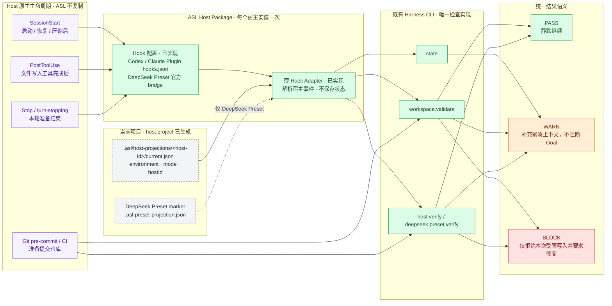

### 安装与激活边界

Hook 不属于业务 Mode，也不复制到每个 Skill。`asl-environment-host` 作为 Harness 的宿主包安装一次：Codex 和 Claude Code 由包内原生 Hook 配置调用同一薄 Adapter。DeepSeek Harness 不再重复实现一份 TypeScript Adapter；`deepseek.preset.export` 把同一命令 Hook 写进 Mode Preset，并用官方 `@deepseek-ai/dsh-hooks-codex` 将它接到 Cordis 生命周期点。Adapter 自身没有数据库、队列、事件日志或 Agent Loop。

进入项目后，Adapter 只做一次确定性定位：从宿主提供的当前工作目录向上寻找与本宿主匹配的 `.asl/host-projections/<host-id>/current.json`；DeepSeek Agent Preset 额外允许读取已有 `.asl-preset-projection.json`。标记不存在时说明当前项目没有进入 ASL Environment，Hook 必须静默返回，不扫描用户电脑，也不猜 Mode。标记存在时直接复用其中的 `environment`、`mode` 和 `hostId` 调用既有 CLI，不新增 Hook 专用配置字段。

### 事件到检查的固定映射

| 原生时机 | Adapter 先判断什么 | 调用的既有命令 | 对当前 Agent 的结果 |
| --- | --- | --- | --- |
| `SessionStart`：启动、恢复、压缩后 | 当前目录是否存在本宿主受管投影 | `state`，随后 `host.verify`；DeepSeek Preset 使用 `deepseek.preset.verify` | 只注入 Mode、Skill 数量和漂移提醒；即使检查失败也不阻断用户提出的普通 Goal |
| `PostToolUse`：`apply_patch`、`Edit`、`Write` 等明确文件写入完成后 | 宿主事件中的目标路径是否落在受管投影，或 Environment 的 `profile/`、`modes/`、`skills/`、培养区 | 修改 Environment 时运行 `workspace.validate`；修改投影时运行对应 `verify` | 本次写入造成确定性非法结构或破坏受管投影时返回 BLOCK，要求当前 Agent 修复；不相关写入静默通过 |
| `Stop` / `turn-stopping`：本轮准备结束 | 本轮是否运行过无法可靠解析副作用的 Shell，或受管 Git 工作树是否变化 | 最多运行一次 `workspace.validate` + 对应 `verify` | 只提醒未修复问题，不循环阻止 Agent 停止；避免 Stop Hook 死锁 |
| `pre-commit` / CI | 提交是否包含 Environment 或受管投影变化 | `workspace.validate` + 对应 `verify` | 结构错误拒绝提交；普通业务内容质量、可选 MCP 和用户语义不在检查范围 |

不接 `UserPromptSubmit`、`PreToolUse`、`SubagentStart`、`SubagentStop`：意图识别和任务路由属于当前 Host；删除、Shell、发布与登录的授权属于宿主权限；子 Agent 继承项目表面即可。除非出现已经被真实任务证明无法覆盖的故障，否则不增加更多 Hook 点。

### 单次事件处理时序

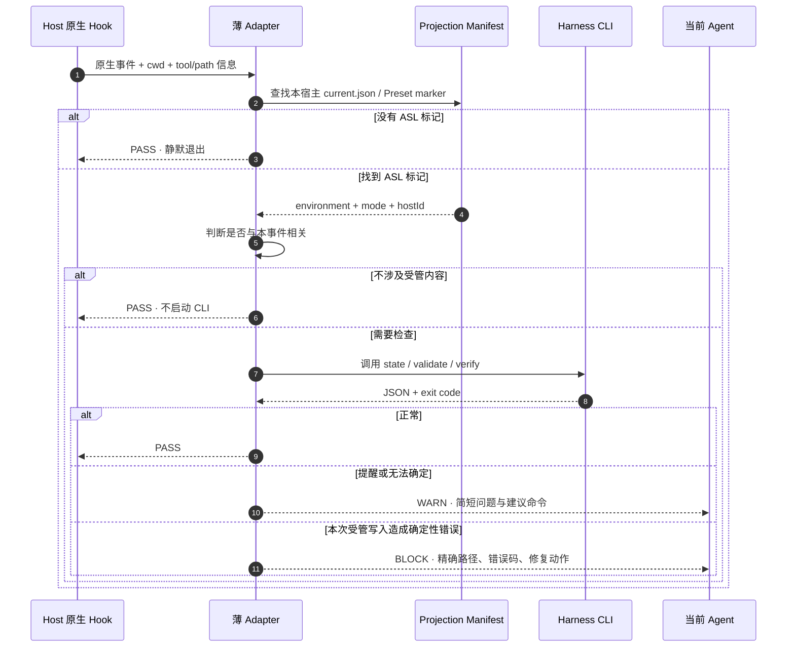

### 三宿主实现映射

| Host | 原生安装面 | ASL 使用的事件 | 实现约束 |
| --- | --- | --- | --- |
| Codex App / CLI | `asl-environment-host` Plugin 的 `hooks/hooks.json` | `SessionStart`、写入工具的 `PostToolUse`、`Stop` | 使用 Codex 原生信任与 matcher；Hook 命令只调用薄 Adapter，不写 `config.toml`，不接管 PermissionRequest |
| Claude Code | 同一宿主包的 Claude Plugin Hook | `SessionStart`、写入工具的 `PostToolUse`、`Stop` | 使用 Claude 原生项目目录与退出码语义；不安装全局后台进程，不改用户已有 Hook |
| DeepSeek Harness | Mode Preset 内的 `@deepseek-ai/dsh-hooks-codex` | `agent/session-start`、`tools/post-execute`、`agent/turn-stopping` | `deepseek.preset.export` 写入专用 `asl-hooks.json`，命令显式指定 `deepseek-harness`；每个 Preset 在加载时绑定自己的配置，不依赖尚未实现的跨 Session 自动发现 |
| 无 Hook 的 Agent | 无 | 无 | 用户或 CI 手动运行同一 CLI；Adapter 不伪装自动保护已经启用 |

Codex 与 Claude Code 的 Hook 包装只负责把原生 stdin / 环境变量转换为 Adapter 参数；DeepSeek 的官方 bridge 把 Cordis typed event 转成同一套 Codex 命令 Hook 载荷。三者共享“定位投影 → 选择既有检查 → 映射 PASS / WARN / BLOCK”这条逻辑，没有新造跨宿主 Hook 语言。

### 门禁与失败语义

| 情况 | 结果 | 理由 |
| --- | --- | --- |
| 没有 ASL 标记、CLI 暂时不可用、可选 MCP 未登录 | PASS 或 WARN | 不能因为辅助 Harness 让普通工作无法开始 |
| Environment 已改变但投影尚未刷新、视图过期 | WARN | 给出 `host.project` 或视图刷新命令，由当前 Agent 或用户决定何时执行 |
| 本次编辑制造非法 Mode 引用、路径逃逸、Secret、损坏受管投影 | BLOCK 当前写入结果 | 错误确定、与本次操作直接相关，而且继续会扩大破坏 |
| 内容质量不好、是否创建 Mode、Skill 是否值得采用 | 不判定 | 属于业务与用户判断，不是机械 Hook 能证明的事实 |
| Hook 自身超时或异常 | WARN 后放行 | Hook 是稳定性增强，不是新的单点故障 |

Hook 不单独保存运行记录。Codex、Claude Code、Cordis 使用自己的 Hook / Session 日志；ASL 仍以现有 CLI JSON、Projection Manifest 和 Git diff 作为可追溯证据。实现依据以宿主原生接口为准：[Codex Hooks](https://developers.openai.com/codex/hooks)、[Claude Code Hooks](https://code.claude.com/docs/en/hooks)、[DeepSeek Harness Hook Bridge](https://github.com/deepseek-ai/deepseek-harness/blob/master/packages/hooks/hooks-claude-code/README.md) 与 [Cordis Plugin Primer](https://github.com/deepseek-ai/deepseek-harness/blob/master/docs/cordis-primer.md)。

### 状态与操作记录

`state` 只汇总当前 Environment 的 Git HEAD、Skill / Mode 数量、Mode 闭包规模、培养区、提醒和能力视图状态。导入命令的 stdout JSON 是导入记录；项目的 `current.json` 与 Preset 的 `.asl-preset-projection.json` 是导出记录。三者复用 Git 与现有 manifest，不增加事件日志、数据库、watcher 或第二状态树。

Mode 切换已经由 `host.project --mode <id>` 完成；未来如需改善可读性，只增加 `mode.use` 这类薄别名，不增加 Mode Router。当前 Host 能唯一判断时直接选择，存在会改变结果的实质歧义时只问用户一个必要问题。

---

## View 3 · 普通 Goal 的执行时序

回答：用户只给一个目标时，系统怎样工作，什么时候会阻断？

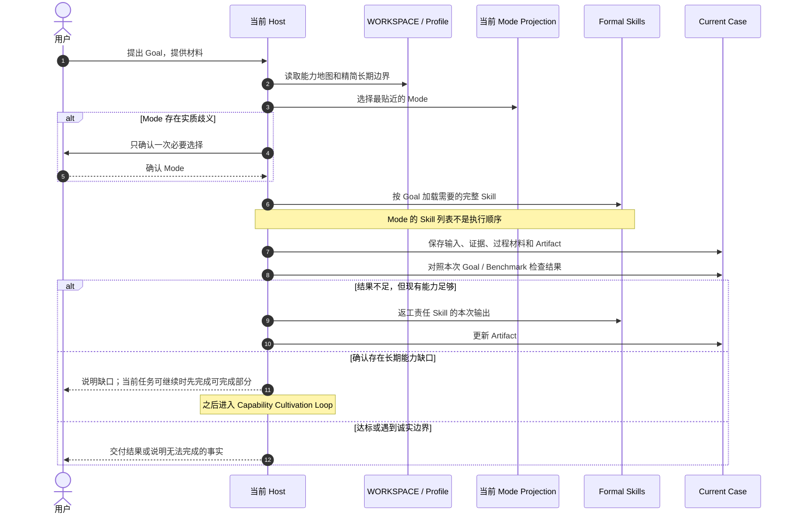

普通 Goal 不要求 Session key、Run token 或固定节点状态。视图和缓存提醒不阻断；确定的结构、Secret、路径与覆盖问题由 Harness 拒绝，高影响授权由当前 Host 的原生权限边界处理。

---

## View 4 · Skill / Mode 变更时序

回答：Mode 和 Skill 的增删改查如何与普通内容分开，谁负责起草、校验和授权？

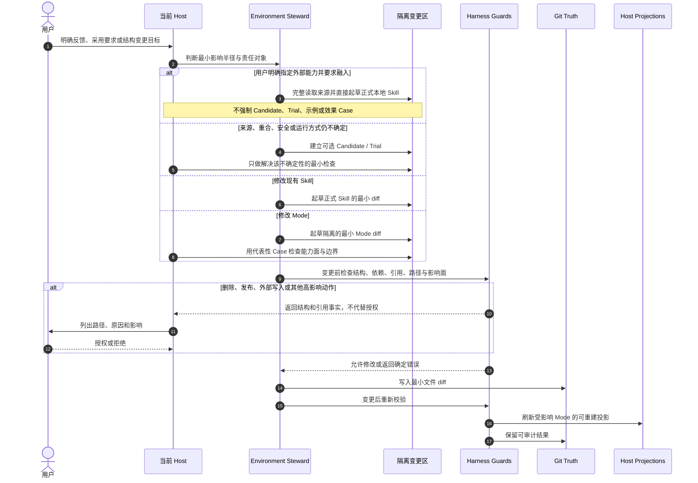

AI 负责完整阅读来源并起草完整本地 Skill。用户明确指定引入时，可以直接进入正式 Skill Pool；确定性结构校验和高影响授权仍保留，但不再用 Trial、示例或效果测试拖延采用。普通 Case 内容不能在没有明确长期意图时自动修改正式 Skill 或 Mode。

---

## View 5 · 外部能力生命周期状态图

回答：一个外部能力怎样进入本地，最终可能得到哪些处理结果？

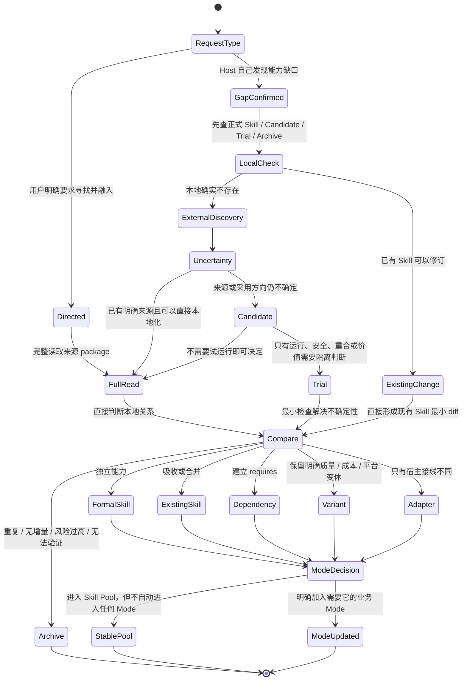

上游更新在没有用户明确采用时只形成新的 Candidate，不能自动覆盖本地正式 Skill。用户明确要求升级或引入时，可以在完整读取来源后直接修改本地真源。

外部发现有两个入口：用户明确指定寻找或融入时立即执行；否则只有真实 Case 证明现有能力不够、正式 Skill 长期失效、上游发生重要变化，或安全问题要求替换时才进入。一次输出偷懒、一次模型错误和含义不明的行为不会自动触发搜索。

| 查找顺序 | 去哪里看 | 这一层解决什么问题 |
| --- | --- | --- |
| 1 | 本地正式 Skill、Candidate、Trial、Archive | 避免重复搜索、重复安装和遗忘历史拒绝原因 |
| 2 | 用户明确指定的仓库、作者、帖子或工具 | 尊重已知来源，不擅自换题 |
| 3 | 公开真实使用反馈与可信从业者推荐 | 发现“有人实际用过”的候选，而不是只看宣传 |
| 4 | GitHub 等代码仓库 | 检查关注度、维护活跃度、Issue、许可证、版本与实现体量 |
| 5 | 官方文档、官方生态与已安装宿主能力 | 确认接口、支持范围、平台约束和是否已有原生能力 |

对于 Host 主动发现的来源，这些信号只决定“值不值得进入 Candidate”，不自动决定采用；对于用户明确指定的来源，默认目标就是直接纳入。两条路径都先比较本地关系：重叠则吸收或合并，责任边界独立才成为新 Skill，只有硬依赖存在时才声明 `requires`，只有宿主接线不同才保留 Adapter。

---

## View 5B · 复杂外部仓库拆解图（系统规则已实现，实例迁移按需）

回答：类似 Agent Reach 这种同时包含 Runtime、路由、安装器、多个后端和 Skill 入口的仓库，怎样融入 ASL 而不复制整仓、不污染所有 Mode？

> 本图的系统规则已经进入 Environment Steward。`environment.sync` 只负责在两个已合法的本地 Environment 之间显式同步完整 Skill，不负责搜索来源、自动拆仓或代替 Host 做语义关系判断。具体外部仓库是否迁移，不影响这套架构机制成立。

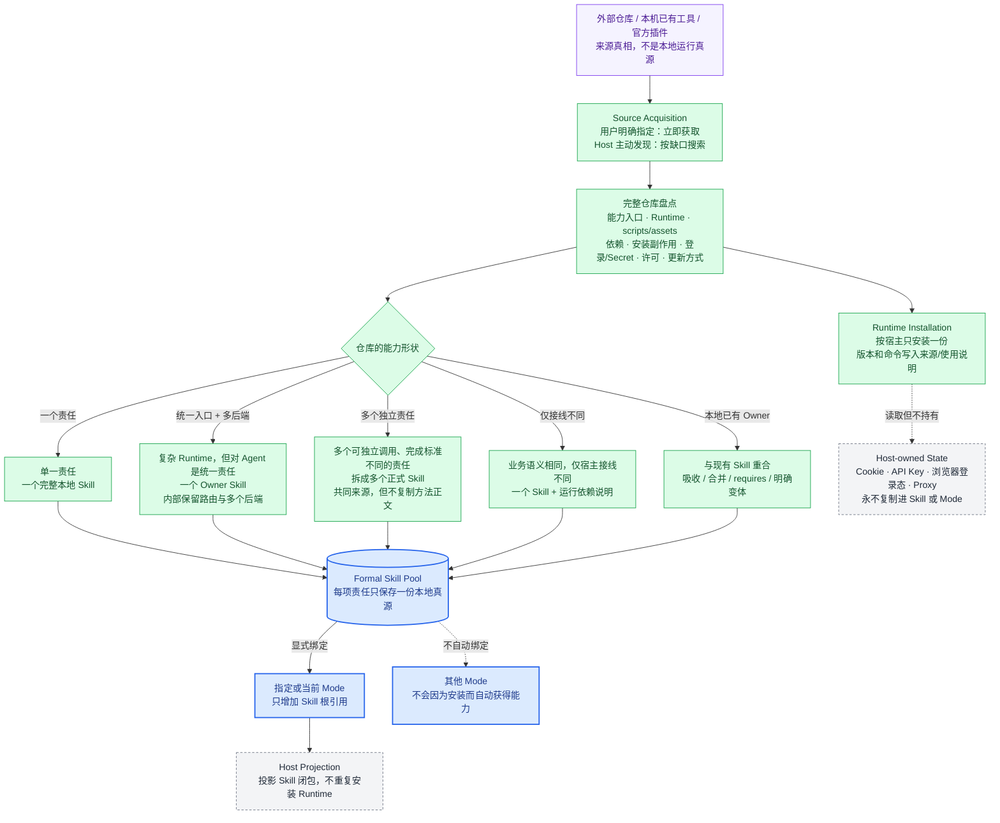

### Agent Reach 应该怎样映射

| 外部仓库里的内容 | ASL 中的位置 | 原因 |
| --- | --- | --- |
| Python CLI / library、channel 路由、doctor、installer | 一份宿主 Runtime；由 `agent-reach` Skill 说明如何安装和检查 | 这是统一的网络访问底座，不应复制到每个 Mode |
| 面向 Agent 的使用入口、平台选择、失败与回退规则 | `skills/agent-reach/SKILL.md` | 对 Agent 是一项完整的“公开网络发现与读取”能力 |
| 上游地址、观察到的 commit、许可、本地改动 | `skills/agent-reach/SOURCE.md` | 本地 Skill 是运行真源，上游只用于追溯和升级 |
| Twitter、GitHub、YouTube、小红书等后端 | `agent-reach` 内部路由，不拆成 Mode，也默认不拆成十几个 Skill | 它们共享同一责任和统一入口，只是访问表面不同 |
| Cookie、API Key、Proxy、浏览器登录态 | Codex / Claude / DeepSeek 的宿主设施 | Secret 和用户登录状态不能进入 Skill、Mode 或 Git |
| 四个业务 Mode 的使用权 | 每个 Mode 各自显式引用同一份 `agent-reach` | 一份能力、多处复用；Mode 不复制代码，也不隐式继承 |

如果复杂仓库确实包含多个可以独立交付、完成标准不同的能力，才拆成多个正式 Skill。仓库目录多、脚本多或支持平台多，本身都不是拆分理由。

---

## View 5C · 外部能力安装与单 Mode 绑定时序图（系统规则已实现，实例迁移按需）

回答：用户直接说“去找这个技能，融入当前 Mode”时，Host、Harness、Runtime 和 Mode 分别做什么？

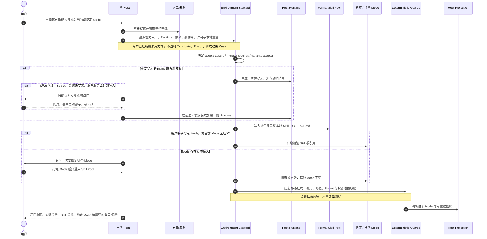

### 建议的硬门槛

| 门槛 | 必须保证 | 不应强制 |
| --- | --- | --- |
| 来源 | 保存可追溯 URL/路径、观察到的版本或 commit；不能假装知道未知版本 | 必须先建立 Candidate |
| 完整读取 | 读取入口说明、必要 references/scripts/assets、依赖、许可、安装与卸载副作用 | 跑作者提供的全部测试 |
| 本地能力 | 形成完整 `SKILL.md`；外部实现不能作为裸 Prompt/MCP/API 在业务中途偷跑 | 必须先跑示例或效果 benchmark |
| 重合关系 | 在 adopt、absorb、merge、requires、variant、adapter 中明确一个关系；同一责任只有一个 Owner | 因为仓库作者不同就保留重复 Skill |
| 安装安全 | Secret、Cookie、登录态不入 Git；系统安装、后台服务、外部写入和用户登录单独确认 | 因为缺少非关键配置就阻断整个 Goal |
| Mode 绑定 | 只修改用户指定或无歧义的当前 Mode；其他 Mode 不自动获得能力 | 安装后自动加入全部 Mode |
| 静态校验 | Skill/Mode 结构、依赖、路径、引用和宿主投影必须可解析 | 用真实 Case 证明写作、研究或业务效果后才允许采用 |

### 搜索入口与 Bootstrap

外部搜索优先使用当前 Host 已经可用的网络与代码仓库能力；如果 `agent-reach` 已安装，可以把它作为统一发现层。如果正在寻找或修复的恰好就是 `agent-reach`，Harness 不能形成“没有 Agent Reach 就不能寻找 Agent Reach”的死锁，此时直接使用 Host 原生 Web、GitHub、Git 或浏览器能力。

### 本地化重构的两条路线

| 路线 | 什么时候用 | 可以做什么 | 必须保留什么 |
| --- | --- | --- | --- |
| 派生式本地化 | 实际复制或修改了上游文字、代码、脚本、模板或独特资产 | 去掉个人触发词、绝对路径和上游工作区假设；按本地 Skill 契约重组 | 原作者、来源、commit、许可、第三方声明和本地修改 |
| Clean-room 重构 | 只确认“这个用户需求值得解决”，不需要上游实现 | 重新定义能力责任；从官方接口或许可清楚的公共基础能力独立实现 | 本地设计依据；不得把未复制的内容伪装成上游派生，也不得暗中搬运受限实现 |

两条路线都可以去作者耦合，但不能把“删除可调用界面里的个人品牌”误解为“删除实际使用过的来源”。没有复制实现时，外部个人仓库只是一份需求与组织方式的调研样本；复制了实现时，它的许可边界继续生效。

---

## View 5D · `yichen-skills` 需求样本解耦与 Mode 映射

回答：一个包含搜索、归档、私人数据、音视频、发布和记忆的个人仓库，怎样拆开、去重、重构后进入 ASL，而不是整体成为一个超级 Mode？

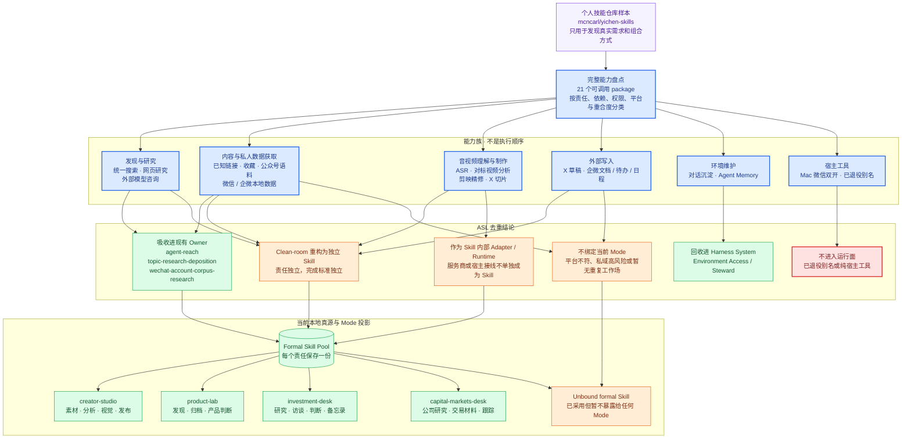

### 逐项解耦映射

下表只证明复杂外部仓库可以怎样解耦，不是待办清单，也不影响 Harness 架构完成度。当前目标不继续迁移这些 package。`Clean-room` 表示未来若有真实需求则重新定义并独立实现；`吸收` 表示由已有本地 Skill 承担，不再保留第二个同义入口。

| 样本 package | 它暴露的真实需求 | ASL 关系 | 目标位置 | 当前状态 |
| --- | --- | --- | --- | --- |
| `yichen-agent-memory` | 人机共读记忆、检索与收尾 | 吸收概念，不建业务 Skill | Harness `Environment Access` | 责任已归并；旧 Candidate 已归档 |
| `yichen-summary` | 把明确要求保存的对话沉淀为笔记 | 吸收 | `Environment Access` + 当前 Case | 不成为 Mode Skill |
| `yichen-unified-search` | 多平台公开发现和统一候选 | 吸收需求，不复制实现 | `agent-reach` | 已有 Owner；旧 Candidate 已归档 |
| `yichen-web-research` | 跨来源研究、纵横结构与证据综合 | 拆除总路由后吸收方法 | `topic-research-deposition`、`investment-research` | 仅保留映射；无当前迁移任务 |
| `yichen-chatgpt-web-research` | 调用另一个模型做研究或复核 | Clean-room 独立 Skill + Host Adapter | `product-lab`、`investment-desk`、`capital-markets-desk` | 仅保留映射；登录态归 Host |
| `yichen-grok-consult` | 外部模型第二意见与 X 原生搜索 | 作为外部模型 Skill 的 Adapter；X 发现仍归 `agent-reach` | 同上 | 仅保留映射；不建并行搜索 Owner |
| `yichen-content-archive` | 读取和归档已知内容 | 业务目标独立重构 | `known-content-archive` → `creator-studio`、`product-lab` | **已实现并绑定；旧私有实现已归档** |
| `yichen-bookmarks-export` | 当轮授权后导出私人收藏链接 | Clean-room 独立 Skill | `creator-studio`、`product-lab` | 仅保留映射；私人读取逐次授权 |
| `yichen-social-bookmarks-exporter` | 旧兼容别名 | 拒绝 | 无 | 不建立兼容层 |
| `yichen-wechat-mp-batch-exporter` | 公众号历史与批量语料 | 吸收公开能力和统计口径 | `wechat-account-corpus-research` → `creator-studio` | 已有 Owner，增量待核对 |
| `yichen-asr` | 在多个 ASR 后端间选择并转写 | Clean-room 独立 Skill | `creator-studio`、`product-lab`、`investment-desk` | 仅保留映射；无当前迁移任务 |
| `yichen-volc-asr` | 火山引擎 ASR 实现 | `media-transcription` 内部 Adapter | 不单独绑定 Mode | 仅保留映射；凭据归 Host |
| `yichen-video-content` | 对标视频结构、节奏与可迁移机制分析 | Clean-room 独立 Skill | `reference-video-analysis` → `creator-studio` | **已实现并绑定** |
| `yichen-jianying-editor` | 桌面视频精修 | Clean-room 独立 Skill | `creator-studio` | 仅保留映射；交互式桌面动作按次授权 |
| `yichen-x-slicer` | X 内容切片和视频输出 | 业务目标独立重构 | `x-post-card-studio` → `creator-studio` | **已实现并绑定；旧私有实现已归档** |
| `yichen-x-article-draft-uploader` | 把 Markdown 保存为 X Article 草稿 | 基于许可清楚的公共上游重做 | `creator-studio` | 仅保留映射；默认只保存草稿 |
| `yichen-wechat-local-vault` | Mac 微信私域解析 | 暂不接入 | Unbound / 未来私域工作场 | 当前 Windows Host 不适用且权限高 |
| `yichen-wechat-windows-reader` | Windows 脱机微信快照只读分析 | 可独立重做，但暂不绑定 | Unbound | 实验性 schema，待真实需求 |
| `yichen-wecom-local-vault` | Mac 企微私域解析 | 暂不接入 | Unbound / 未来私域工作场 | 当前 Host 不适用且权限高 |
| `yichen-wecom-operations` | 企微文档、待办、会议和日程 | 独立 Skill，但不硬塞现有 Mode | Unbound；重复使用后再判断 Mode | 依赖官方 CLI 和组织授权 |
| `yichen-mac-wechat-dual-open` | Mac 应用双开 | 拒绝进入当前业务能力面 | 无 | 纯宿主工具且平台不适用 |

### 已完成的独立迁移

`reference-video-analysis` 已作为 Clean-room Skill 写入本地 Environment，并且只绑定 `creator-studio`。它保留“对标视频需要细读”的用户需求，但没有复制原仓库的作者触发词、13 模块正文、标题公式、脚本或资产；分析重点改为受众承诺、叙事地图、上下文细读、认知负荷、证据和可迁移机制。

`known-content-archive` 把“已知输入归档”重新设计为无网络、不可覆盖的确定性本地封装；平台读取继续由当前 Host 和现有检索能力负责，因此没有第二个跨平台路由器。`x-post-card-studio` 使用新的 JSON handoff、HTML/CSS 和浏览器截图代码生成 1080×1440 卡片与可选 MP4，不包含原实现的脚本、模板或媒体管线。两项都已进入公开 Agent Skill Library，早期私有实现只在 Personal Environment 的 Archive 追溯。

这些迁移验证的是架构关系：外部个人仓库可以提供产品需求和组合样本；本地 Skill 必须拥有自己的责任、代码、完成标准和 Mode 归属。其余 package 继续按 Owner 判断吸收、独立重构、保持未绑定或拒绝，不按仓库目录批量复制。

---

## View 6 · Mode 是能力子图，不是 Workflow

回答：不同 Mode 如何共享 Skill，又为什么不会跨 Mode 隐式调用？

```mermaid
flowchart TB
    AR["agent-reach<br/>共享底层研究能力"]
    DIAGRAM["baoyu-diagram<br/>共享结构表达能力"]
    VALUATION["investment-valuation-returns<br/>共享估值能力"]

    CREATOR["creator-studio<br/>业务 Mode"]
    PRODUCT["product-lab<br/>业务 Mode"]
    INVEST["investment-desk<br/>业务 Mode"]
    CAPITAL["capital-markets-desk<br/>业务 Mode"]

    WRITING["public-account-writing-style"]
    LAYOUT["qihang-wechat-layout"]
    PUBLISH["baoyu-post-to-wechat"]
    PRODUCT_JUDGMENT["ai-product-analyzer"]
    INVEST_RESEARCH["investment-research"]
    IC_MEMO["investment-ic-memo-writer"]
    COMPANY["financial-company-profile"]
    COVERAGE["public-equity-coverage-writer"]

    CREATOR --> AR
    CREATOR --> WRITING
    CREATOR --> LAYOUT
    CREATOR --> PUBLISH
    PRODUCT --> AR
    PRODUCT --> PRODUCT_JUDGMENT
    PRODUCT --> DIAGRAM
    INVEST --> AR
    INVEST --> INVEST_RESEARCH
    INVEST --> VALUATION
    INVEST --> IC_MEMO
    CAPITAL --> AR
    CAPITAL --> COMPANY
    CAPITAL --> VALUATION
    CAPITAL --> COVERAGE

    classDef mode fill:#dbeafe,stroke:#2563eb,color:#1e3a8a,stroke-width:2px;
    classDef shared fill:#dcfce7,stroke:#16a34a,color:#14532d;
    classDef skill fill:#f3f4f6,stroke:#6b7280,color:#1f2937;
    class CREATOR,PRODUCT,INVEST,CAPITAL mode;
    class AR,DIAGRAM,VALUATION shared;
    class WRITING,LAYOUT,PUBLISH,PRODUCT_JUDGMENT,INVEST_RESEARCH,IC_MEMO,COMPANY,COVERAGE skill;
```

蓝色节点是 Mode，其他节点是完整 Skill。箭头表示“这个 Mode 能看见这项能力”，不表示先后顺序。同一个正式 Skill 可以被多个 Mode 显式选择，但只保存一份正文。

---

## View 7 · 演化影响半径决策图

回答：收到明确反馈后，应该改当前 Case、Skill、Mode 还是整个 Environment？

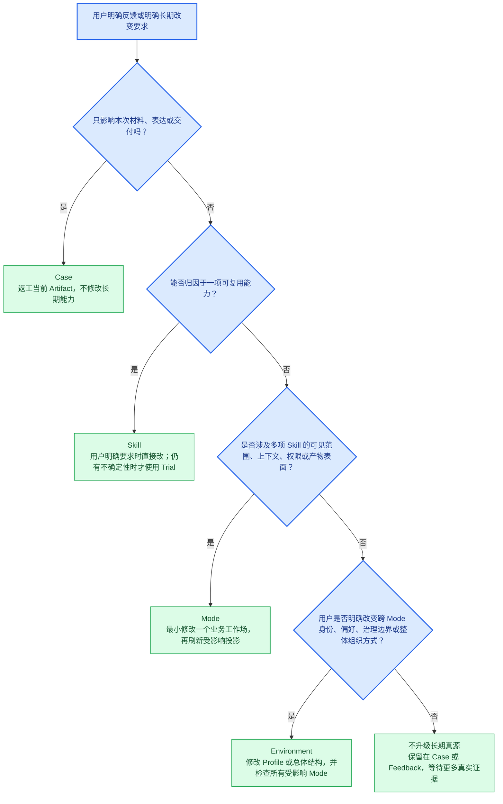

原则是最小范围优先。向上升级必须说明为什么较小一层已经不够，不能从点击、耗时、沉默或一次模型错误推断长期偏好。

---

## View 7B · Mode 新建、修改与退出决策图

回答：什么时候应该创建 Mode，什么时候只改现有 Mode，什么时候根本不应该碰 Mode？

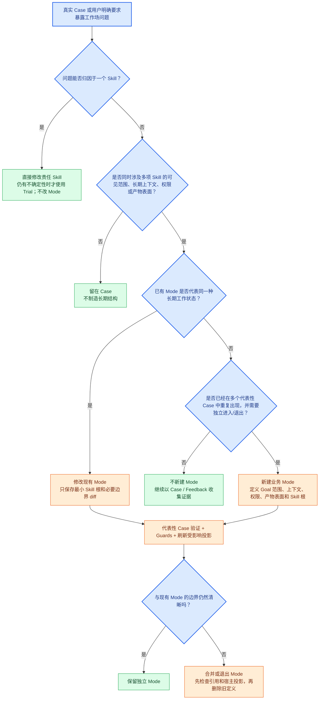

Mode 的判断单位是“长期工作状态”，不是主题名、项目名或一次任务。系统机制即使经常使用，也不能因此被包装成 Mode。

---

## View 8 · 三宿主部署与投影图

回答：同一份 Environment 怎样接入 Codex、Claude Code 和 DeepSeek Harness？

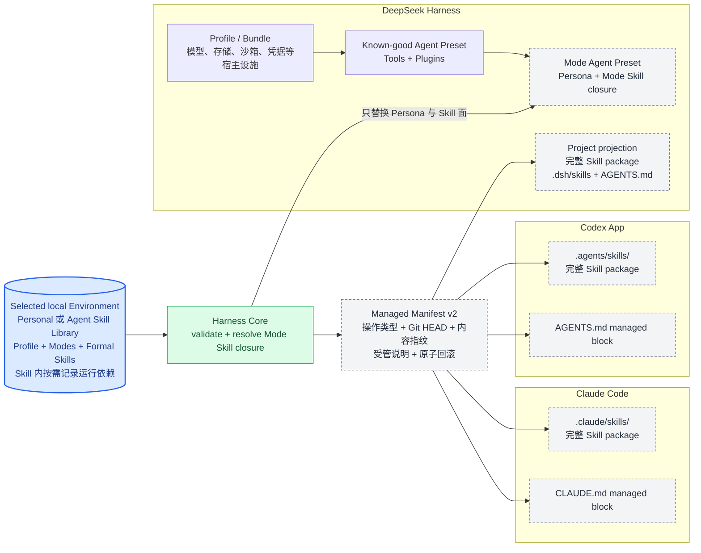

Codex 与 Claude 使用项目原生 Skill 目录和规则文件。DeepSeek 额外区分宿主级 Profile / Bundle 与会话级 Agent Preset；ASL Mode 对应 Agent Preset，不对应 Profile。三个 Host 都继续拥有自己的 Agent Loop、会话、工具、模型和授权，ASL 不复制这些 Runtime 能力，只生成它们能够原生发现的环境表面。投影切换会先在同盘临时区完成，再替换旧受管表面；失败时恢复旧投影。复制型投影与 Preset 逐 Skill 校验 SHA-256，链接型投影继续用 Environment 总指纹检查漂移。

MCP 的可移植性高于宿主 Plugin，因此当前架构优先让 Skill 声明 MCP 运行需要，再由 Host 使用自己的 MCP 配置和登录方式满足它。Hook 也采用相同原则：Harness 提供同一组 CLI 校验，Adapter 只负责接到 Codex、Claude 或 Cordis 的真实生命周期事件。未来接入其他 Agent 时复用这份 Adapter 契约，不修改 Environment 数据模型。

| 接入面 | Codex App / CLI | Claude Code | DeepSeek Harness | 其他 Agent / CI |
| --- | --- | --- | --- | --- |
| Skill | `.agents/skills/` + `AGENTS.md`，已实现 | `.claude/skills/` + `CLAUDE.md`，已实现 | `.dsh/skills/` 或 Agent Preset，已实现 | 有原生 Skill 目录时增加薄 Adapter |
| MCP | 使用 Codex 原生 MCP 配置、安装与登录 | 使用 Claude 原生 MCP 配置、安装与登录 | 使用 Cordis Profile / MCP client plugin | 支持 MCP 的 Host 复用同一服务；不支持则明确提示 |
| Hook | Host Plugin 已携带 `hooks.json` 与无状态 Adapter；本机 Marketplace 已注册，App 内安装后生效 | 同一 Host Plugin 的 `SessionStart` 已在真实 Claude Code 新会话触发 | 四个本机 Mode Preset 已装入官方 `dsh-hooks-codex` bridge 与专用配置；真实长会话仍待用户侧启动 | 没有 Hook 时手动调用 CLI；GitHub Actions 只跑校验 |
| Tool / Agent / 权限 | 完全归 Codex | 完全归 Claude Code | 完全归 DeepSeek Harness | 完全归目标 Host |

---

## View 9 · 当前项目状态

回答：哪些已经能用，哪些只是设计完成，哪些还需要继续实现？这里不重复总架构。

<!-- ASL:PROJECT STATUS START -->

| 状态 | 模块 | 当前事实 | 下一步 |
| --- | --- | --- | --- |
| 🟢 已实现 | Environment Contract | Personal Environment 与 Agent Skill Library 都是 37 个正式 Skill、4 个业务 Mode 的独立 Git 真源 | 按真实需求继续培养内容 |
| 🟢 已实现 | Harness CLI | 8 个命令；扫描、校验、`state`、视图刷新、单 Skill 同步、三宿主投影、激活说明和 Preset 导出均已实现；当前 41 个测试通过 | 保持轻量，不增加第二 Runtime |
| 🟢 已实现 | 结构保护 | 来源、依赖闭包、Secret、路径、用户文件碰撞、原子回滚和 SHA-256 漂移检查已有测试；协议 21 份 Markdown 校验通过 | 继续复用同一组检查 |
| 🟢 已验收 | 三宿主 Skill 投影 | `creator-studio` 已分别投影到 Codex、Claude Code、DeepSeek 临时项目，19 个完整 Skill package 均通过 `host.verify`，无漂移警告 | 用户在真实项目中选择 Mode 后按需重建投影 |
| 🟢 已实现 | 运行依赖边界 | MCP、命令、环境变量名称和必要插件只在责任 Skill 内按需说明；当前 37 个正式 Skill 中 12 个真实外部运行依赖已补充，Mode 仍只选择 Skill | 后续只随真实依赖变化维护，不批量造空章节 |
| 🟢 已实现 | Hook 接线代码 | 无状态 Adapter、Codex / Claude Host Plugin hooks、Marketplace 清单、DeepSeek Preset 官方 Cordis bridge 和激活说明均已实现；没有 ASL 投影时静默通过 | 保持三个事件点，不扩张成监控系统 |
| 🟢 已验收 | Claude Hook 激活 | 真实 Claude Code `SessionStart` 已运行 `asl-harness-hook`，正确注入 `creator-studio` 与 19 个投影 Skill；随后模型请求因本机火山 CodingPlan 到期失败，与 Hook 无关 | 用户修复模型套餐后可继续做完整业务会话 |
| 🟠 待用户侧验收 | Codex / DeepSeek Hook 激活 | Codex 实际只读会话已读取当前 Mode，Marketplace 已注册；DeepSeek 四个 Mode Preset 已刷新为 v2 并通过逐 Skill 指纹与 Hook Bridge 校验。Codex App 内 Plugin 安装和 DeepSeek 真实长会话仍需在各自 UI 中完成 | 用户亲手运行时观察 SessionStart；失败时回到宿主原生日志，不增加 ASL Runtime |
| 🟠 待扩展 | 更多 Agent Adapter | Adapter 契约可以覆盖 OpenCode、Trae、ZCode 等支持 Skill/MCP/项目规则的 Host | 有真实使用目标时逐个增加，不预造空适配器 |
| 🟠 待用户侧验收 | DeepSeek 长会话 | 四个业务 Mode 已从本机 `qihang` 已知可运行基础刷新为 v2 Preset，Skill、Persona、来源指纹和官方 Hook Bridge 均通过校验；本轮官方 npm 启动停在上游依赖解析，未进入 UI | 直接在已安装的 DeepSeek Harness 中选择 `ASL · <mode>` 运行；上游启动问题不下沉成 ASL 兼容层 |
| ⚪ 可重建 | Host Projection | 项目投影和 Preset 都是生成视图，不是真源 | Environment 变化后按需刷新 |
| ⚪ 已归档 | 旧结构 | foundation、orchestrator、skill-index、旧 domain/plugin 布局已退出活动面 | 只追溯，不恢复兼容层 |

当前结论：ASL v0.3 已达到可交付的 Developer Preview。Environment、Mode、Skill、CLI、三宿主投影、来源与漂移保护均已完成验收；Claude Hook 已真实触发，Codex 与 DeepSeek 的业务 Mode 已可运行，剩余工作只是用户在各自 UI 中安装或选择可选 Hook / Preset 并完成亲手体验。当前没有值得新增的架构层，后续只在真实 Host 或真实 Case 暴露缺口时增加最小 Adapter 或修订责任 Skill。

<!-- ASL:PROJECT STATUS END -->
